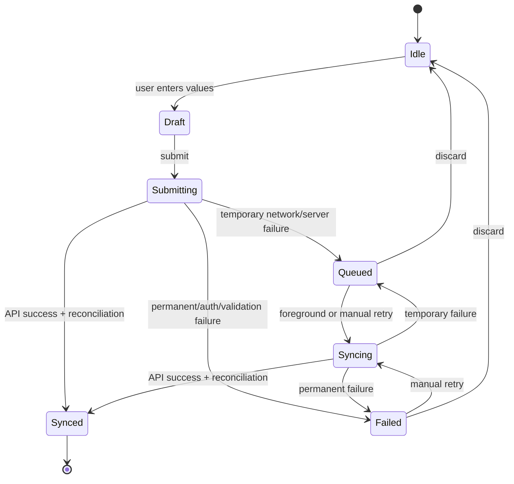

# Release 2.1 — Epic A1 Offline Resilience

## Executive Summary

Before Prompt 8, the mobile app had no Daily Check-in draft persistence, offline queue, or sync state. Its maturity was `NOT_PRESENT`. The implementation adds a narrow, feature-owned transport boundary using the already installed AsyncStorage package. It supports a partial draft, at most one pending submission, foreground/manual retry, idempotent replay and safe cleanup. It does not claim true background execution or automatic network-reconnect listeners because no supported connectivity abstraction exists in the repository.

After Prompt 8 the feature is `PARTIAL_QUEUE`: it is resilient to offline submission and app foreground recovery, but still requires device-level validation and a future connectivity/background strategy before it can be called `OFFLINE_READY`.

## Offline Maturity

| Capability                | Before        | After           | Evidence                                                                    |
| ------------------------- | ------------- | --------------- | --------------------------------------------------------------------------- |
| Draft persistence         | `NOT_PRESENT` | `DRAFT_ONLY`    | `apps/mobile/src/features/daily-check-in/offline/daily-check-in-storage.ts` |
| Pending submission        | `NOT_PRESENT` | `PARTIAL_QUEUE` | `daily-check-in-sync-service.ts`                                            |
| Foreground retry          | `NOT_PRESENT` | `PARTIAL_QUEUE` | `use-daily-check-in-offline.ts`                                             |
| Connectivity listener     | `NOT_PRESENT` | `NOT_PRESENT`   | No NetInfo/connectivity package found                                       |
| True background execution | `NOT_PRESENT` | `NOT_PRESENT`   | Expo/AppState does not guarantee background work here                       |

## Scope and Non-Goals

The implementation covers only the four existing signals, local draft/pending transport state, sync UI, retry, expiration, logout cleanup and tests. It does not add fields, endpoints, domain calculations, offline support for other features, background jobs, or a generic synchronization framework.

## Canonical Source of Truth

The backend remains the only source of truth for `localDate`, timezone, daily identity, create/update policy, Recovery and completion. A local `queued` item is an intention, not `completedToday`. After a successful submit, the sync service reads today's check-in and today's Recovery before clearing local state.

## Storage Strategy

`AsyncStorageDailyCheckInStorage` is the single storage boundary. It uses namespaced keys:

- `elev9.daily-check-in.v1.draft`
- `elev9.daily-check-in.v1.pending`

The repository already uses AsyncStorage for authentication and has no SecureStore, SQLite, MMKV or connectivity dependency. A future security hardening should replace the fixed key namespace with a stronger pseudonymous session scope; until then, logout cleanup is mandatory and implemented in `AuthProvider`.

## Data Classification

Persisted locally:

- the four 1–5 values, because they are required to resume or retry the user intention;
- schema version;
- local technical timestamps;
- attempt count;
- sync status and safe error category;
- an ephemeral local submission ID.

Never persisted by this boundary:

- access tokens, email, name or raw user/profile IDs;
- `localDate` or timezone;
- Recovery, readiness or Coach data;
- raw error messages, stacks, analytics session IDs or request payloads beyond the four required values.

## Draft Model

Drafts are partial and saved asynchronously after a small 150 ms debounce. They expire after 24 hours. A valid draft is restored only after authentication and is not allowed to overwrite a canonical backend response. A backend-completed day wins over an obsolete draft; a pending submission takes precedence because it represents an explicit unsynchronized intent.

## Pending Submission Model

There can be zero or one pending Daily Check-in item. Enqueue replaces the prior payload with the latest complete intent and resets its attempt count. The backend decides whether that intent creates or updates today's record. Pending items expire after 72 hours and are not automatically sent after expiry.

## State Machine

The implementation is represented by `DailyCheckInOfflineState` and `transitionDailyCheckInSyncState`; UI booleans are derived from this state rather than treated as independent truth.

## Sync Triggers

- `initial_load`: one safe attempt after authenticated hydration;
- `foreground`: when the Daily Check-in screen returns to active AppState;
- `manual`: retry button, including permanent failures;
- `connectivity`: supported by the service contract for a future listener, but no connectivity listener is installed because no library exists in the current workspace.

Foreground retry is not equivalent to guaranteed background execution.

## Retry Policy

Network and temporary server failures stay `queued` and can retry when the screen is foregrounded or the user selects retry. Authentication, profile, validation and Recovery-processing failures become `failed` and require manual action. The service serializes concurrent sync calls with one active promise and never runs an infinite timer or retry loop.

## Conflict Resolution

The service does not merge individual signals or calculate a local day. If another device changes the same backend day, the existing backend last-write/upsert policy applies. If the submit response is lost after persistence, replay is safe because the backend is idempotent; subsequent `today` and Recovery reads reconcile the client before local cleanup.

## Expiration

Draft TTL is 24 hours and pending TTL is 72 hours, measured only from technical local creation/save timestamps. These timestamps are never used as domain-day identity. Expired or unsupported/corrupt records are cleared safely and surfaced as a fresh flow rather than sent blindly.

## Logout and Account Isolation

`AuthProvider.signOut` clears both local Daily Check-in keys and then transitions the session to unauthenticated. The offline hook also drops in-memory state for unauthenticated sessions and AppState listeners are removed on unmount. Fixed namespaced keys mean multi-account isolation depends on successful logout cleanup; stronger session-scoped storage is a remaining production hardening item.

## Analytics

Offline analytics reuses the Prompt 7 typed allowlist and noop provider. It records only `daily_check_in_draft_restored`, `daily_check_in_queued`, `daily_check_in_sync_started`, `daily_check_in_sync_succeeded`, `daily_check_in_sync_failed` and `daily_check_in_pending_discarded`, with safe trigger/attempt/category/source properties. No signal values, payload, Recovery or identity are sent.

## Observability

The service exposes safe state/error categories to the existing UI and analytics boundary. No new raw-payload logging was introduced. Future technical logs should include only trigger, attempt count, duration, status and sanitized error category; the four values must never be logged.

## Privacy and Security

Local persistence is minimized and time-limited. Storage shape is validated at the boundary: drafts may be partial, pending submissions must contain exactly the four 1–5 fields, and domain-controlled fields such as `localDate` and timezone are rejected. Tokens remain owned by the existing auth storage and are not copied into this feature.

## Failure Scenarios

| Scenario                                       | Result                                                                |
| ---------------------------------------------- | --------------------------------------------------------------------- |
| Offline during submit                          | Complete intent is stored as `queued`; canonical success is not shown |
| Temporary server/network failure               | Pending item remains and can retry                                    |
| Validation/auth/profile failure                | Item becomes `failed`; manual intervention is required                |
| Submit response lost after backend persistence | Idempotent replay, then today/Recovery reconciliation                 |
| Concurrent foreground/manual retry             | One active sync promise; duplicate processing prevented               |
| Logout                                         | Draft and pending item cleared; no post-logout sync                   |
| Expired/corrupt/version-unknown storage        | Item is discarded safely and not submitted                            |

## Manual Test Matrix

| Case           | Steps                                                                       | Expected                                                        |
| -------------- | --------------------------------------------------------------------------- | --------------------------------------------------------------- |
| Offline submit | Fill online, disable network, submit, relaunch, restore network, foreground | Queued state first; later sync and canonical Dashboard/Recovery |
| Lost response  | Persist server-side, simulate client network error, retry                   | No duplicate record; today reconciliation clears pending        |
| Account change | Queue, logout, login as another user                                        | Previous local item is absent                                   |
| Expiration     | Seed old draft/pending, open feature                                        | Item is cleared and not sent                                    |
| Manual discard | Queue, select discard, confirm                                              | Local item is removed; Dashboard is not marked completed        |

These manual/device cases were not executed in the sandbox.

## Remaining Risks

- No real connectivity listener or guaranteed background execution is available.
- AsyncStorage is not a hardware-backed secure store; local data is minimized but still sensitive.
- Fixed namespaced keys rely on logout cleanup for multi-account isolation.
- Mongo-backed E2E/device offline validation remains external work.

## Future Evolution

Before calling this `OFFLINE_READY`, add a reviewed connectivity abstraction, device-level secure persistence decision, stronger session namespacing and bounded background/foreground reconciliation tests. Keep the feature-specific boundary; do not generalize it into a sync engine without evidence from additional product domains.
