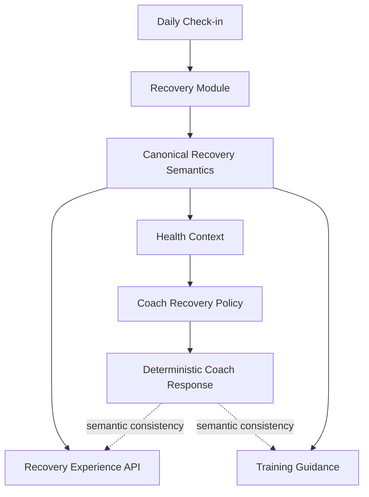

# Epic A2 Deterministic Recovery Coach

## Executive Summary

The Coach now receives the product-safe Recovery semantics produced by `RecoveryModule` through `BuildUserHealthContextService`. When this context is present, the Recovery expert does not derive category, trend, factor impact, freshness, or availability from raw snapshot/check-in data. It maps the canonical result into the existing deterministic Coach analysis shape. The legacy path remains only as a compatibility fallback for contexts that have not yet been assembled with the new read model.

## Scope

This change validates and consolidates Recovery semantics between the Recovery Experience, Health Context, Coach and Training consumers. It does not change Recovery scoring, weights, thresholds, mobile UI, contracts, API client, analytics, offline storage or generative AI.

## Architecture

The Coach uses `GetCurrentRecoveryReadModelUseCase` internally through dependency injection. It does not call the HTTP controller or the API client. `RecoveryModule` remains the owner of selection, freshness/rebuild and product-safe mapping.

## Recovery Context

The canonical Coach context contains the safe current read model:

- `availability`;
- `score` and `fatigueScore` when available;
- public `category`;
- public `freshness`;
- public factor impacts;
- deterministic insight action and tone;
- canonical trend.

The context does not carry `sourceContext`, weights, raw contributions, profile identifiers or raw check-in values for the canonical Coach analysis.

## Availability

The four Recovery availability states are preserved:

- `available`: deterministic explanation and action are available;
- `insufficient_data`: the Coach requests a Daily Check-in rather than inventing a score;
- `not_available`: the Coach uses a neutral unavailable fallback;
- `processing_failed`: the Coach recommends trying again later.

## Freshness

`current`, `stale`, `legacy` and `unknown` remain explicit in the context. Current results may be described in the present. Legacy or unknown results are not presented as today's confirmed result. The current read use case attempts the canonical stale rebuild before mapping.

## Category Guidance

The Coach consumes the backend category mapping:

| Category   | Deterministic guidance intent                               |
| ---------- | ----------------------------------------------------------- |
| `low`      | Prioritize recovery / reduce intensity                      |
| `moderate` | Keep intensity flexible                                     |
| `good`     | Planned activity is generally supported                     |
| `high`     | Planned activity is supported without promising performance |

The Coach does not calculate these categories from score thresholds.

## Factor Explanations

Only public impacts for `energy`, `sleep` and `muscle_soreness` are consumed. Explanations refer to factors as limitations or support, not proven medical causality. Motivation is not included as a Recovery factor and is never presented as the cause of the Recovery score.

## Motivation Boundary

`motivationLevel` remains Coach context only and is never presented as a cause of the Recovery score. The canonical Recovery branch deliberately omits raw sleep, soreness and motivation values from its analysis payload.

## Recovery Change Explanation

The current deterministic Coach path receives the canonical trend and can state that a result is improving, stable, declining or insufficient without recalculating trend. A detailed before/after explanation remains limited by the existing Coach conversation response model and is a follow-up; no new temporal causality was introduced.

## Training Consistency

The canonical Recovery insight action is mapped to the existing Coach training-impact vocabulary. This prevents a canonical `reduce_intensity` or `prioritize_recovery` action from being replaced by a score-derived full-session recommendation in the canonical path. Existing Training recommendation calculation remains unchanged and is not expanded in this prompt.

## Deterministic Policies

The existing `RecoveryInsightPolicy`, category policy, factor breakdown policy and trend policy remain owned by `RecoveryModule`. `RecoveryExpert` now has a canonical-context branch that consumes their output and maps only to the existing Coach result model. The pre-existing snapshot-based branch remains a compatibility fallback.

## LLM Independence

The defaults remain disabled:

- `AI_COACH_INTELLIGENCE_ENABLED=false`;
- `AI_LLM_ENABLED=false`.

The Recovery expert tests execute without an LLM provider and prove deterministic output from the canonical context.

## Error Handling

Technical errors are not converted to low Recovery, score zero or a fabricated category. When the canonical context cannot be assembled, the existing safe fallback path is retained. Processing failure and insufficient data remain semantically distinct when returned by the Recovery read model.

## Legacy Behavior

Legacy snapshots continue to be classified by the Recovery read model. They are not silently treated as current. If the canonical read model is unavailable in a compatibility context, the legacy Coach path may operate, but this is documented technical debt and not the preferred production path.

## Privacy

The canonical Coach analysis does not expose or log:

- `sourceContext`;
- `userProfileId`;
- snapshot IDs;
- weights or raw contributions;
- raw Daily Check-in values;
- generated prompts or internal policy names.

## Observability

No new sensitive payload logging was added. Existing deterministic metadata can identify the selected expert and fallback path without recording Recovery values. Dedicated Recovery Coach metrics remain a Prompt 7 concern.

## Content Safety

Guidance remains fitness/readiness-oriented and non-clinical. The implementation does not introduce diagnosis, injury confirmation, treatment, medical risk claims or absolute commands to rest/train.

## Test Strategy

Added regression coverage proves that a canonical `low` category remains `POOR` even when the numeric score would otherwise suggest a stronger state, and that factor semantics come from the public breakdown rather than raw check-in values. Existing Recovery and Health Context suites continue to cover the compatibility path.

## Remaining Gaps

- richer deterministic conversational response templates for explicit Recovery questions;
- final Recovery Coach observability and Product Analytics;
- offline read cache;
- production certification and external device validation;
- E2E execution outside the sandbox when MongoMemoryServer can bind its port.
