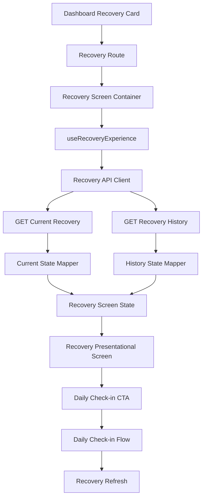

# Epic A2 Mobile Recovery Integration

## Executive Summary

A tela Recovery agora possui um container mobile que orquestra os read models públicos de current e history através do API client tipado. O Dashboard usa o current Experience para seu card e abre a rota dedicada `Recovery`.

## Scope

Inclui integração mobile de current/history, composição de estados, refresh, retry, navegação, CTA do Dashboard, retorno do Daily Check-in e correção do título do histórico legado.

Não inclui analytics, persistência offline, backend, contratos ou mudanças no API client.

## Data Flow

## Recovery Hook

`useRecoveryExperience` recebe uma API injetável para testes e expõe:

- `screenState`;
- `refresh()` para current e history;
- `retry()` para erro completo/current;
- `retryHistory()` para falha parcial de histórico.

O carregamento inicial dispara current e history em paralelo. Cada recurso possui estado próprio.

## State Composition

Current determina o estado principal da tela. Quando current está disponível, history pode estar `loading`, `available` ou `error` sem apagar score, insight ou fatores válidos.

Falhas HTTP/rede viram `error`; availability retornada pelo backend permanece `insufficient_data`, `not_available` ou `processing_failed`.

## Current Recovery

Usa exclusivamente `getCurrentRecoveryExperience()`. O mobile não calcula score, category, freshness, factors, insight ou trend.

## Recovery History

Usa exclusivamente `getRecoveryExperienceHistory({ days: 7 })`. O histórico de Daily Check-in não é usado como fonte.

Histórico vazio é tratado como ausência de dados, não como erro.

## Partial Failure Handling

Current disponível + history falha mantém a experiência principal. A seção de histórico mostra erro e retry específico.

Current falha produz erro da tela. Não há conversão silenciosa para score zero, ausência de Recovery ou `processing_failed`.

## Refresh

Pull-to-refresh atualiza current e history em uma operação serializada. O conteúdo existente é preservado durante refresh; o skeleton é usado somente no carregamento inicial.

Requests concorrentes são ignorados enquanto a operação atual está ativa. O retorno ao Recovery após Daily Check-in dispara refresh no próximo focus.

## Retry

- erro completo: current + history;
- falha de history: apenas history;
- availability `processing_failed`: current + history;
- availability sem dados: CTA para Daily Check-in.

## Navigation

A rota tipada `Recovery: undefined` aponta para `RecoveryScreenContainer`. O container injeta `onBack`, retry, refresh e callbacks de Daily Check-in.

## Dashboard Integration

O Dashboard agora carrega `getCurrentRecoveryExperience()` para o card de Recovery. O card apresenta a categoria recebida pelo backend e não usa thresholds locais nem `sourceContext`. O CTA principal abre `Recovery`.

O snapshot legado continua sendo carregado separadamente para consumidores A1 existentes de Coach/Training; não foi migrado neste prompt.

## Daily Check-in Return Flow

Estados sem Recovery navegam para `DailyCheckIn`. Ao retornar ao Recovery, o focus listener chama `refresh()` e recarrega current/history.

## Legacy Screen Naming

`DailyCheckInHistoryScreen` permanece a tela de histórico de check-ins, mas o título de navegação foi corrigido para `Daily Check-in History`. A nova rota Recovery não aponta para ela.

## Error Semantics

Mensagens técnicas são mapeadas para copy segura. Status HTTP, endpoints, payloads e mensagens internas não são exibidos.

## Privacy

Nenhum score, breakdown, insight, identificador ou resposta bruta é persistido ou registrado pela integração. Analytics e offline permanecem fora do escopo.

## Accessibility

Os labels do score, fatores, trend, loading, retry e estados vazios da tela presentational foram preservados. A rota possui título de navegação e a tela mantém botão Back acessível.

## Performance

Current e history são buscados em paralelo na abertura. History só é buscado pela tela Recovery. O Dashboard usa sua própria composição e não requisita history.

## Test Strategy

O mapper possui testes para success, history parcial, loading, availability explícita e erro técnico. A suíte mobile continua sem renderer de componentes; os testes de integração são baseados em mappers, fixtures e contratos injetáveis.

## Remaining Gaps

- validação do Coach determinístico após integração;
- Product Analytics;
- cache offline de leitura;
- E2E fora do sandbox;
- validação em dispositivos físicos;
- certificação de produção.
