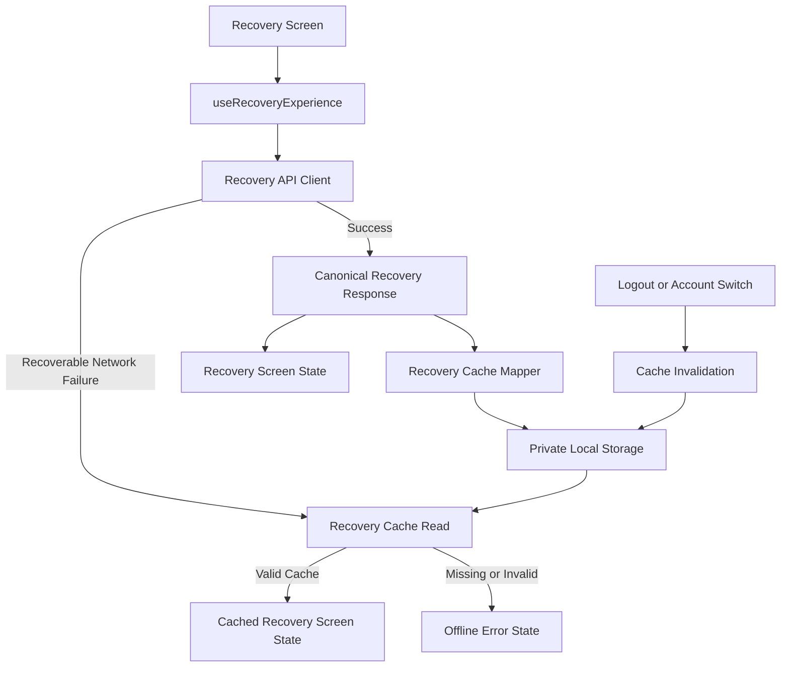

# Epic A2 Offline Recovery Read Cache

## Executive Summary

Prompt 8 adds a private, read-only Recovery cache to the mobile app. Network responses remain canonical; the cache is used only after a recoverable transport failure and is always presented with an explicit offline/last-saved notice.

## Scope

The cache stores the public Recovery Experience current and seven-day history read models. It does not store Daily Check-in mutations, Coach content, session credentials or internal Recovery context.

## Offline Principles

- RecoveryModule remains the source of truth.
- The device never calculates or rebuilds Recovery.
- Canonical `freshness` is preserved; local cache age is separate metadata.
- Cache fallback is limited to recoverable network failures.
- Authentication and contract failures remain visible as errors.

## Storage Decision

The implementation reuses the installed `@react-native-async-storage/async-storage` adapter. No dependency or second persistence framework was added. AsyncStorage is sandboxed to the application, but this implementation does not claim custom encryption or absolute at-rest protection; the cache is classified as private user wellness data.

## Cache Boundary

`recovery-cache-schema.ts` validates and allowlists the public response. `recovery-cache.ts` owns serialization, storage access, version checks and owner-key matching. The hook never manipulates JSON directly.

## Data Classification

Recovery read models are personal wellness data. Only the public fields required by the Recovery UI are persisted. No raw check-in values, identifiers, tokens or Coach content are persisted.

## Cache Schema

```ts
type RecoveryCacheRecord = {
  version: 1;
  ownerKey: string;
  savedAt: string;
  current: GetCurrentRecoveryExperienceResponse | null;
  history: GetRecoveryExperienceHistoryResponse | null;
  historySavedAt?: string;
};
```

`savedAt` is the device save time, not a Recovery calculation or freshness timestamp. Current and history can be written independently.

## Versioning

The key and record both use version `1`. Unknown versions and malformed records are removed and treated as cache misses; no silent migration is attempted. Future schema changes require an explicit mapper and version decision.

## Ownership

Each authenticated session receives an opaque locally generated owner key. It is not an email or `userProfileId`, and it is a namespace/isolation mechanism rather than a cryptographic identity. Logout removes the current owner’s Recovery cache and owner key. A new login receives a new namespace.

## Current Recovery

Valid current responses for `available`, `not_available` and `insufficient_data` may be cached. `processing_failed` is never written, so a temporary processing failure cannot replace the last useful result.

## History

The MVP caches only the seven-day history response. History writes preserve the current response and current writes preserve history. A missing history cache does not prevent a cached current result from rendering.

## Cache Age

Cache age is local infrastructure metadata:

- `recent`: up to 24 hours;
- `old`: over 24 hours through 7 days;
- `expired`: over 7 days, invalid or future-dated.

Expired data is not rendered. Cache age never rewrites the backend `freshness` value.

## Network Failure Policy

Fallback is allowed for transport/network failures only. `401`, `403`, validation failures, contract failures and ordinary server responses are not converted to cache results.

## Partial Data

Current and history are independent resources. A current network response can replace only current; a history response can replace only history. If history is unavailable offline, current remains visible with a history-unavailable state.

## Refresh and Retry

Refresh and retry always attempt the network first. Existing content remains visible while refreshing. Successful responses replace the corresponding cache entry; failed refreshes do not erase useful cached data.

## Logout

Auth logout clears Recovery cache before the local session namespace is removed. Cleanup is best-effort and cannot block sign-out state transitions.

## Account Switching

Session loading does not read a global cache. Recovery requests and state are tied to the authenticated session generation, preventing an older account’s response from updating the current screen.

## Corruption Handling

Malformed JSON, unknown versions, invalid timestamps, unexpected fields and forbidden fields are removed and treated as cache misses. Storage read/write/remove failures are isolated from the Recovery experience.

## Privacy

The allowlist excludes `sourceContext`, `userProfileId`, raw check-in fields, weights, internal IDs, database metadata, tokens, email and Coach messages. The public factor key `muscle_soreness` is allowed because it is not the raw check-in field.

## At-Rest Protection

AsyncStorage benefits from the application storage sandbox and platform protections available to the runtime. No custom cryptography was introduced. The remaining risk is documented for production certification and must be considered if the threat model requires stronger protection.

## Observability

No new product analytics events are emitted for cache state, score or health state. Storage failures are isolated and are not logged with payloads. Existing explicit retry analytics remain unchanged.

## Web Support

The selected adapter is already part of the mobile build and the web/mobile bundles compile successfully. Platform-specific storage behavior remains subject to external web/device validation.

## Test Strategy

Tests cover allowlisting, forbidden fields, version mismatch, age boundaries, independent current/history writes, processing-failure suppression, corruption, owner mismatch and storage failure isolation. Full mobile regressions and builds remain required before certification.

## Remaining Gaps

- physical iOS/Android validation;
- external E2E outside the sandbox;
- production storage threat-model review;
- final certification and rollout evidence.


