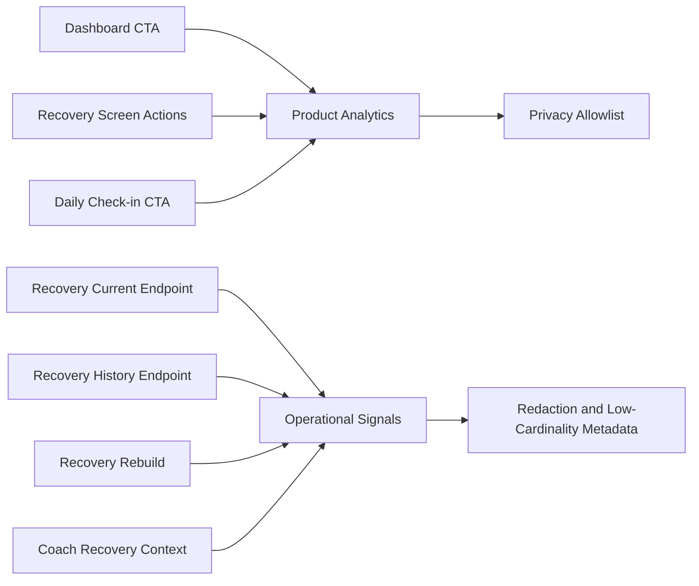

# Epic A2 Recovery Analytics and Observability

## Executive Summary

Prompt 7 adds a privacy-preserving Recovery product-event catalog and safe operational signals. It reuses the existing typed/noop mobile analytics boundary and the existing Nest structured logger. No external provider, dashboard, tracing backend, or dependency was added.

## Scope

Product Analytics covers intentional navigation and actions. Operational observability covers current/history request outcomes, rebuilds, legacy encounters, trend availability and read-model reliability. Recovery values are deliberately outside both payloads.

## Principles

- Product events describe user actions, not wellness state.
- Operational signals describe system outcomes, not response content.
- Analytics is best-effort and remains disabled by the default noop provider.
- Labels and properties are finite, low-cardinality values.

## Product Analytics versus Observability

| Layer                     | Examples                                          | Sensitive Recovery data |
| ------------------------- | ------------------------------------------------- | ----------------------- |
| Product Analytics         | CTA selected, screen viewed, refresh, retry       | Never included          |
| Operational observability | request result, duration, rebuild attempt/failure | Never included          |

## Existing Infrastructure

Mobile uses `apps/mobile/src/analytics/product-analytics.ts`, which provides a typed event map, an allowlist, a noop default and provider-failure isolation. Backend Recovery uses the existing Nest `Logger`; the new `RecoveryObservabilityService` is a thin safe adapter, not a second telemetry system.

## Event Taxonomy

Events follow the existing `domain_object_action` convention and are emitted only for explicit user actions or a real screen entry.

## Event Catalog

| Event                              | Trigger                       | Properties                      | Forbidden                     | Purpose                      |
| ---------------------------------- | ----------------------------- | ------------------------------- | ----------------------------- | ---------------------------- |
| `recovery_dashboard_cta_selected`  | Dashboard Recovery CTA        | `entryPoint: dashboard`         | score, category, availability | Measure entry intent         |
| `recovery_screen_viewed`           | Recovery container mount      | `entryPoint: unknown`           | score, freshness, factors     | Measure entry                |
| `recovery_refresh_requested`       | Pull-to-refresh               | `trigger: pull_to_refresh`      | response state                | Measure explicit refresh     |
| `recovery_retry_requested`         | Full retry                    | `resource: current_and_history` | error message                 | Measure retry intent         |
| `recovery_history_retry_requested` | History retry                 | `resource: history`             | history values                | Measure partial retry intent |
| `recovery_check_in_cta_selected`   | Recovery opens Daily Check-in | `entryPoint: recovery`          | availability, signals         | Measure product handoff      |

No history-range event is emitted because the current UI exposes only the seven-day range. No automatic low/stale/declining/factor events are emitted.

## Product Funnel

```text
Dashboard CTA → Recovery screen → Daily Check-in CTA → Daily Check-in → Recovery refresh
```

The catalog supports reconstructing intent through these transitions without recording the user’s Recovery state.

## Mobile Instrumentation

Instrumentation is placed in the Dashboard CTA and Recovery container callbacks. Screen view is emitted once per container mount; rerenders and background refreshes do not emit it. Analytics is never awaited by navigation, refresh or retry flows.

## Backend Metrics

The existing logger adapter emits safe operational events for:

- `recovery_current_request` with `result` and `durationMs`;
- `recovery_history_request` with `result` and `durationMs`;
- `recovery_rebuild_attempt`, `recovery_rebuild_success`, `recovery_rebuild_failure`;
- `recovery_legacy_snapshot_encountered`;
- `recovery_trend_computed` and `recovery_trend_insufficient_data`;
- `recovery_read_model_mapping_failed`;
- `coach_recovery_context_available`, `fallback` and `failure` as integration hooks.

Results are limited to `success`, `expected_empty`, `technical_failure` where applicable. No item counts, dates or semantic trend direction are logged.

## Structured Logging

Recovery operational records contain only `event`, `operation`, `result` and, for request signals, `durationMs`. The existing stale-snapshot log was redacted to remove profile and date identifiers.

## Tracing

No tracing exporter exists in the Recovery boundary, so no new spans were created. Existing tracing remains unchanged and is not populated with Recovery payloads by this prompt.

## Recovery Rebuild

Rebuild attempts are recorded around the canonical current Recovery rebuild path. Success and failure are separate signals; the check-in payload, profile, old/new score and source context are not included.

## History

History request success, expected empty, technical failure and insufficient-data trend signals are recorded without dates, scores, item counts or direction.

## Coach Observability

The Recovery observability adapter exposes safe outcome methods for future/compatible Health Context integration. Existing Coach intelligence traces remain an older infrastructure boundary and are not expanded with Recovery payloads here; their identifier-retention policy remains a production follow-up.

## Privacy

Analytics, logs and operational signals do not include score, category, freshness, trend direction, factor keys/impacts, insight, Daily Check-in values, `sourceContext`, `userProfileId`, email, token, request body or response body. Public domain fields may remain in domain code and tests only.

## Data Minimization

Only finite action names, resource names, result classes and durations are emitted. No raw query, headers, payload, local date or user identity is used.

## Retention

No global retention policy was changed. Product events follow the existing analytics provider policy; logger retention remains the environment’s existing operational policy. The default provider remains noop.

## Consent and Opt-out

Recovery uses the global analytics boundary. With the default/noop or disabled provider, no product event leaves the app and the feature continues normally.

## Failure Isolation

Provider exceptions are swallowed by `SafeProductAnalytics`. Operational recording is non-blocking logger output and does not alter Recovery responses, rebuild behavior or Coach fallbacks.

## Test Strategy

Mobile tests cover the typed safe event set, allowlist rejection and provider isolation. Backend tests cover operational signal shape and absence of identifiers, scores, categories, source context and response data. Full API/mobile regressions remain required after this prompt.

## Operational Questions

The instrumentation can answer entry, refresh/retry intent, current/history technical reliability, rebuild failures, legacy frequency and trend-data sufficiency once a compatible collector is configured. It cannot answer how low/high a user’s Recovery was, by design.

## Remaining Gaps

- external metrics/dashboard and alert configuration;
- offline read cache;
- production certification and physical-device validation;
- external E2E where MongoMemoryServer is unavailable;
- final audit of legacy Coach trace identifier retention.


