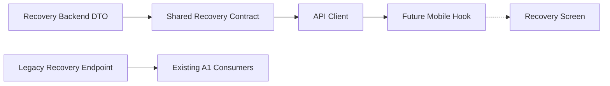

# Epic A2 Recovery Contracts and API Client

## Executive Summary

Os contratos públicos de Recovery Experience agora refletem os read models reais do backend, sem expor `sourceContext`, `userProfileId`, sinais brutos, pesos ou metadados Mongo. O API client adiciona métodos explícitos para a nova fronteira e mantém os métodos legados do A1.

## Scope

Current Recovery, availability, freshness, category, factor breakdown, deterministic insight, bounded history, trend, query parameters e métodos tipados do API client.

## Public Contract Boundary



O snapshot interno continua existindo em `packages/types/src/recovery/index.ts` para compatibilidade A1. Os tipos `RecoveryExperience*` são a fronteira canônica para A2.

## Backend Endpoints

- `GET /recovery/experience/current`
- `GET /recovery/experience/history?days=7`

Os endpoints legados `/recovery/today`, `/recovery/current` e `/recovery/history` permanecem sem alteração.

## Current Recovery Contract

```ts
type GetCurrentRecoveryExperienceResponse = {
  availability: RecoveryExperienceAvailability;
  recovery: RecoveryExperienceCurrent | null;
};
```

`RecoveryExperienceCurrent` contém `score`, `fatigueScore`, `category`, `freshness`, `lastUpdatedAt`, `trend`, `breakdown` e `insight`.

## Availability

Valores exatos: `available`, `not_available`, `insufficient_data`, `processing_failed`. O client preserva o valor retornado e não converte falhas HTTP em disponibilidade.

## Freshness

Valores exatos: `current`, `stale`, `legacy`, `unknown`. A semântica não é reduzida a `isFresh`.

## Category

Valores públicos: `low`, `moderate`, `good`, `high`. Os valores internos `recovery`, `light`, `moderate`, `hard` não aparecem no novo contrato.

## Factor Breakdown

Keys públicas: `energy`, `sleep`, `muscle_soreness`. Impacts: `positive`, `neutral`, `negative`, `unavailable`. Cada fator contém somente `key`, `impact`, `labelKey` e `explanationKey`.

`motivationLevel` não faz parte do breakdown Recovery; permanece contexto do Coach.

## Deterministic Insight

O contrato transporta `tone`, `titleKey`, `bodyKey` e `action`. Não transforma keys em copy e não gera texto no client.

## History

```ts
type GetRecoveryExperienceHistoryResponse = {
  range: { days: number };
  items: RecoveryExperienceHistoryItem[];
  trend: RecoveryExperienceTrend;
};
```

Cada item contém `localDate`, `score`, `category`, `availability` e `freshness`. `localDate` é string canônica; não é `Date`.

## Trend

Directions: `improving`, `stable`, `declining`, `insufficient_data`. O client não recalcula tendência; apenas transporta `direction` e `comparedDays`.

## API Client Methods

Em `packages/api-client/src/recovery-api.ts`:

- `getCurrentRecoveryExperience()` → `GET /recovery/experience/current`;
- `getRecoveryExperienceHistory({ days? })` → `GET /recovery/experience/history`.

`days` é omitido quando indefinido e validado estruturalmente entre 1 e 90 quando fornecido.

## Error Semantics

401, 403, 400, 500 e network failures continuam `ApiClientError`. `processing_failed` é somente o estado explícito retornado pelo backend; não é criado pelo client.

## Compatibility

Preservados os tipos e métodos A1: `RecoverySnapshot`, `GetTodayRecoveryResponse`, `GetCurrentRecoveryResponse`, `GetRecoveryHistoryResponse`, `getTodayRecovery`, `getCurrentRecovery` e `getRecoveryHistory`.

## Privacy

Os contratos A2 não contêm `userProfileId`, `sourceContext`, `energyLevel`, `sleepQuality`, `muscleSoreness`, `motivationLevel`, `weights`, `rawContribution`, `_id` ou `__v`.

## Contract Drift Prevention

Foi usada uma fixture type-only no pacote `types` com `satisfies` e `@ts-expect-error` para validar campos públicos e rejeitar motivation/source context. O API client possui testes de rota, query, erro e compatibilidade. A paridade runtime completa continua dependente de E2E, pois os pacotes não possuem targets Nx de teste próprios.

## Test Strategy

- `types`: build TypeScript e fixture compile-time;
- `api-client`: teste direto do novo Recovery API client;
- regressão: API/mobile builds e testes existentes;
- E2E: permanece coberto pelo teste do Prompt 2, sujeito ao bloqueio ambiental do MongoMemoryServer.

## Remaining Gaps

- Mobile Recovery UI e hook.
- Dashboard CTA/integration.
- Analytics e offline read cache.
- Accessibility de tela/dispositivo.
- Validação E2E externa.

