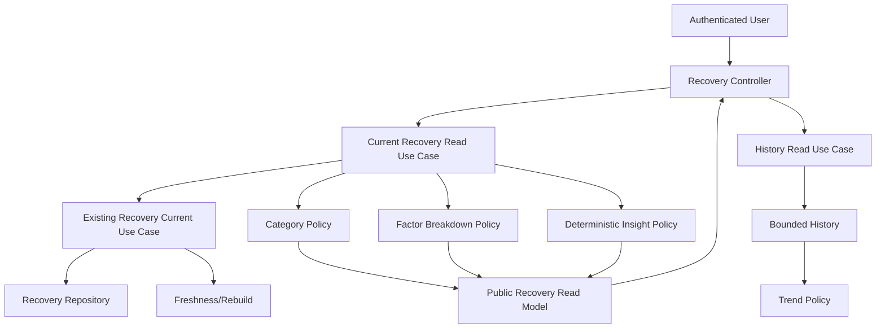

# Epic A2 Recovery Read Models

## Executive Summary

O Recovery agora possui uma fronteira pública separada dos snapshots internos. Os endpoints legados continuam disponíveis para compatibilidade A1; a nova experiência usa read models seguros em `/recovery/experience/current` e `/recovery/experience/history`.

## Scope

Esta etapa cobre leitura pública, disponibilidade, freshness, categoria, breakdown seguro, insight determinístico, histórico e trend. Não altera o algoritmo, contratos compartilhados, API client ou mobile.

## Domain Ownership

`RecoveryModule` permanece responsável pelo cálculo, persistência, seleção, freshness e apresentação pública. `ProgressModule` continua disparando o rebuild. O controller apenas valida/autentica e delega aos use cases.

## Internal Snapshot versus Public Read Model

`RecoverySnapshot` contém `userProfileId`, `sourceContext`, formula version, influências técnicas e contexto interno. Esses campos permanecem internos. `RecoveryCurrentReadModel` e `RecoveryHistoryReadModel` expõem somente score, fatigue, category, freshness, data, fatores seguros, insight, disponibilidade e trend.



## Availability Model

- `available`: snapshot com contexto utilizável e check-in recente.
- `not_available`: reservado para ausência real de snapshot.
- `insufficient_data`: snapshot neutro/sem check-in suficiente; não retorna score de produto.
- `processing_failed`: rebuild/consulta técnica não pôde concluir o modelo público.

O cálculo legado pode criar um snapshot neutro sem check-in. O mapper não promove esse snapshot a Recovery disponível.

## Freshness Model

- `current`: `sourceContext.generatedAt` válido após o use case canônico resolver stale/rebuild.
- `stale`: estado reservado para futuras respostas quando rebuild não puder ser concluído sem ocultar a situação.
- `legacy`: snapshot sem contexto suficiente para provar freshness.
- `unknown`: contexto presente, mas timestamp inválido ou incompleto.

O endpoint público atual tenta reconstruir antes de mapear. Snapshots legados são retornados apenas com `freshness: legacy`, nunca silenciosamente como `current`.

## Category Model

`RecoveryCategoryPolicy` mapeia os valores existentes de `recommendedIntensity` sem alterar os thresholds do calculator:

| Existing intensity | Public category |
| ------------------ | --------------- |
| `recovery`         | `low`           |
| `light`            | `moderate`      |
| `moderate`         | `good`          |
| `hard`             | `high`          |

O mobile não recebe thresholds.

## Factor Breakdown

O MVP expõe apenas `energy`, `sleep` e `muscle_soreness`, com `positive`, `neutral`, `negative` ou `unavailable`, além de translation keys. Não expõe valores, pesos, contribuições numéricas, códigos internos ou `sourceContext`.

`motivationLevel` não é fator de Recovery: permanece contexto do Coach.

## Deterministic Insight

`RecoveryInsightPolicy` retorna tone, translation keys e action. As regras dependem de availability, freshness e categoria. Não há texto clínico, LLM ou Agent Runtime.

## Current Recovery Use Case

`GetCurrentRecoveryReadModelUseCase` delega a seleção e rebuild a `GetCurrentRecoveryUseCase`, mapeia estados e converte falha interna em `processing_failed`, mantendo autenticação e ausência de perfil como erros HTTP.

## History Use Case

`GetRecoveryHistoryReadModelUseCase` aceita `days` entre 1 e 90, default 7, delega a query limitada existente, remove campos internos e calcula trend. Não há query ilimitada nem paginação complexa nesta etapa.

## Trend Model

`RecoveryTrendPolicy` usa somente snapshots com `generatedAt` válido. Exige pelo menos dois pontos, divide a série ordenada em duas metades e compara médias. Diferença `>= 5` é `improving`, `<= -5` é `declining`; caso contrário `stable`. Menos de dois pontos resulta em `insufficient_data`.

## Legacy Snapshot Policy

Não há migração automática. Snapshot sem `sourceContext` é classificado como `legacy`; não entra no trend e não recebe freshness `current`. O inventário físico dos documentos Mongo continua pendente para validação externa.

## Authorization

Os novos endpoints usam `AuthSessionGuard` e resolvem o perfil pelo `authUserId`. Nenhum `userProfileId` é aceito por query/body. Repository filtering permanece no use case existente.

## Privacy

Os novos DTOs não contêm `userProfileId`, `sourceContext`, `_id`, `__v`, sinais brutos, weights, rawContribution ou formula internals. Os endpoints legados ainda preservam o shape anterior por compatibilidade e permanecem candidatos a depreciação após migração dos consumers.

## Observability

Esta etapa não adicionou payload logging. O resultado público contém apenas estado de produto; os logs existentes permanecem no fluxo interno. Métricas dedicadas ficam para etapa posterior.

## Performance

O histórico reutiliza a query limitada e ordenada existente. Breakdown é produzido apenas para current. Não foi introduzido N+1, novo índice ou lock distribuído.

## Compatibility

Mantidos sem alteração:

- `/recovery/today`;
- `/recovery/current`;
- `/recovery/history`;
- `packages/types`;
- `packages/api-client`;
- consumidores backend existentes.

Novos endpoints públicos:

- `GET /recovery/experience/current`;
- `GET /recovery/experience/history?days=7`.

## API Endpoints

Current response:

```json
{
  "availability": "available",
  "recovery": {
    "score": 78,
    "fatigueScore": 32,
    "category": "good",
    "freshness": "current",
    "lastUpdatedAt": "2026-07-28T10:15:00.000Z",
    "trend": "stable",
    "breakdown": [],
    "insight": {}
  }
}
```

History response contém `range.days`, `items` limitados e `trend.direction/comparedDays`.

## Error Semantics

Sessão inválida retorna unauthorized; perfil inexistente retorna not found; range inválido retorna bad request; falha interna de leitura/rebuild vira `processing_failed` no current read model. Nenhuma falha vira score zero.

## Test Strategy

Cobertura adicionada: mapper/privacy, category mapping indireto, fator sem raw fields, legacy availability/freshness, trend boundaries e E2E A1→Recovery/read model. E2E não pôde executar neste sandbox por `MongoMemoryServer`/`EPERM`.

## Remaining Gaps

- alinhamento em `packages/types` e `packages/api-client` no Prompt 3;
- migração dos consumers para os novos endpoints;
- mobile UI e Dashboard;
- analytics, offline read cache e device validation.
