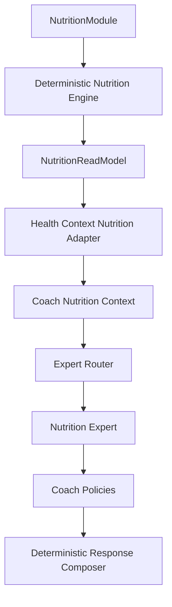

# Release 2.1 — Epic A3: Coach Nutrition Intelligence

## 1. Context and objective

Nutrition owns the meaning of daily nutrition through `NutritionReadModel`, served by the existing Nutrition application boundary. Prompt 4 connects that model to the Coach without introducing an HTTP self-call, a second nutrition engine, or an LLM dependency.

## 2. Before

Health Context loaded `NutritionProfile` directly. Coach loaders also loaded raw plans, logs and the daily read output independently. Nutrition Expert then rebuilt meal and macro assessments from those raw values. This created a second interpretation path and exposed more sensitive data than the Coach requires.

## 3. After

`BuildUserHealthContextService` optionally obtains the canonical daily Nutrition output through `GetTodayNutritionUseCase`. A pure adapter produces `CoachNutritionContext`, containing only safe facts needed for conversational explanation. The projection is propagated through chat and Agent Runtime contexts. Nutrition Expert prefers this projection and produces deterministic responses using canonical values, availability, freshness, focus, insight and actions.

Legacy fields remain additive for compatibility with other experts and existing consumers. They are not used by the canonical Nutrition Expert path and are scheduled for removal after the broader integration audit.

## 4. Ownership and boundary

Nutrition owns targets, consumption, meal progress, adherence, focus, insight, actions, availability, freshness and UTC day semantics. Health Context owns safe context composition and failure isolation. Nutrition Expert explains canonical facts and applies conversational safety boundaries. Agent Runtime owns routing and policy enforcement. None of the Coach layers recalculates Nutrition.

The adapter deliberately excludes raw meals, food items, restrictions, allergies, plan documents, persistence identifiers and algorithm parameters. The next meal projection contains only its public type and title. Canonical actions remain semantic; clients decide navigation.

## 5. Canonical context contract

`CoachNutritionContext` includes:

- `source` and `contractVersion`;
- `availability`, `freshness`, `lastUpdatedAt` and UTC timezone;
- canonical calorie progress, including remaining/excess and state;
- canonical macro progress with explicit units and nullable targets;
- planned/completed/pending meal counts and canonical next meal;
- neutral adherence status;
- canonical focus, insight and actions.

Missing read data becomes an explicit unavailable context. It is not converted into zero consumption or a fabricated recommendation.

## 6. Deterministic Nutrition responses

The expert selects a small response template based on the user request while reading only canonical fields:

- summary: calorie and meal facts;
- calories: canonical remaining or excess;
- macros/protein: canonical consumed and target values;
- meals: canonical counts and canonical next meal;
- adherence: neutral canonical status;
- focus: canonical focus message;
- setup and unavailable states: canonical availability and action.

The expert never calculates `target - consumed`, percentages, meal counts or next-meal ordering. Explainability reports only `source = nutrition_read_model` and the names of facts used; it does not contain values, thresholds or chain-of-thought.

## 7. Availability and freshness

All canonical availability states are preserved. `not_configured` and `insufficient_data` are normal user states, while `not_available` and `processing_failed` use safe operational responses. `current`, `stale`, `legacy` and `unknown` are passed through unchanged. Coach time and memory cannot overwrite them.

## 8. Safety and scope

Clinical, allergy and prescription-style questions receive a bounded response explaining that the Coach can explain configured targets and logged progress but cannot diagnose or prescribe. The implementation does not infer food safety, supplements, weight-loss prescriptions or medical conditions. Training and Recovery remain presentation context only and cannot alter Nutrition facts.

## 9. LLM, flags and observability

No feature flag was changed. Existing equivalents remain disabled by default (`AI_AGENT_RUNTIME_ENABLED=false` and `AI_LLM_ENABLED=false`). The canonical path is deterministic and does not call an external provider. No new sensitive logging or analytics was added. Explainability metadata is sanitized so nutrition values, payloads, IDs, restrictions and prompts are not emitted as operational metadata.

## 10. Errors, performance and dependencies

Nutrition application failures are converted to an unavailable projection so Recovery, Training and other Health Context domains can continue. The integration uses an application use case rather than an internal HTTP request and does not add a module cycle or `forwardRef`. The read is performed once by the canonical Health Context path; legacy loaders still have independent compatibility reads pending migration.

## 11. Compatibility and risks

Existing Coach context fields, `TodayNutrition`, routes, flags and expert interfaces remain compatible. The main remaining risk is that legacy Coach loaders and non-Nutrition experts still carry raw Nutrition fields. Removing those fields safely requires a wider integration audit and parity work, deferred to Prompt 8.

## 12. Tests

Added coverage verifies adapter projection, explicit unavailable state, canonical calorie parity, canonical boundary metadata and absence of canonical response text from sanitized expert metadata. Existing Health Context and Nutrition Expert suites remain green. Full API, E2E and broader runtime validation must be reported from the actual workspace run.

## 13. Gaps and next steps

- Migrate legacy plan/log/recommendation loading from Coach chat and source adapters.
- Remove direct `nutritionProfile` reads from non-Nutrition experts after parity tests.
- Add dedicated Health Context integration coverage with a real `GetTodayNutritionUseCase` mock.
- Complete Prompt 5 privacy-safe operational observability and Prompt 8 cross-module integration audit.
