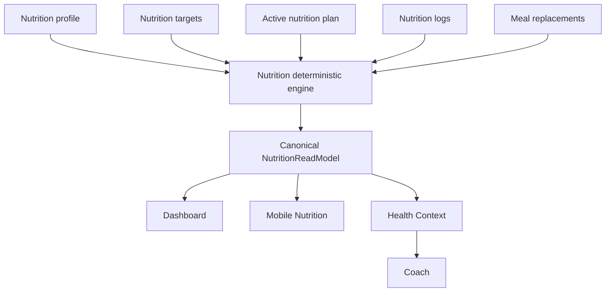

# Release 2.1 — Epic A3: deterministic Nutrition engine

## Context and objective

Prompt 1 established `NutritionModule` as the owner of Nutrition meaning and `/nutrition/today` as the compatible current-day read endpoint. The former use case still contained aggregation, progress classification, next-meal resolution, and focus logic in one application file. Prompt 2 extracts that policy into a pure deterministic engine and extends the public read model additively.

No LLM, hydration mock, new persistence, target-generation algorithm, or broad consumer refactor is introduced.

## Architecture before and after

Before, the application use case directly reduced logs and produced a small calorie-adherence result. Consumers still had a few presentation-level semantic fallbacks.

After, the application use case loads the UTC day and delegates meaning to `calculateNutritionDeterministicState`. The engine has no Nest, MongoDB, clock, or transport dependency. The controller maps its output to JSON and Mobile formats only canonical values.

## Ownership and deterministic pipeline

`NutritionModule` owns profile, targets, active plan, logs, replacements, daily aggregation, progress states, adherence, focus, insight, availability, and freshness. The pipeline is:

1. Load the authenticated user profile.
2. Load the active Nutrition plan and its UTC day snapshot.
3. Load logs for that exact UTC date.
4. Discard invalid negative/non-finite macro logs.
5. Deduplicate by `mealId`, selecting the record with the latest valid `updatedAt`, then `createdAt` timestamp.
6. Sum valid consumed and partial macros; skipped logs contribute no macros.
7. Calculate calories, macro progress, meal completion, next meal, adherence, focus, and insight once.
8. Map the result through the HTTP DTO without exposing persistence documents.

The operation is idempotent for the same persisted inputs. Additional unplanned logs contribute to consumption but do not inflate planned meal completion; they are exposed only as a count.

## Canonical contract

`NutritionReadModel` now includes additive `targets`, `calories`, `macros`, `focus`, `insight`, and `actions` fields. `TodayNutrition` remains a deprecated compatibility alias. Existing `macroTargets`, `progress`, `mealProgress`, `nextMeal`, and `nutritionFocus` fields remain available during migration.

The new action union expresses intent (`log_meal`, `open_today_meals`, `create_plan`, etc.); Mobile owns navigation mapping. No internal route, Mongoose identifier, algorithm weight, or raw persistence payload is part of the new semantic fields.

## Domain rules

### Targets

Targets are explicit and remain sourced from the active plan day. Invalid or absent targets produce null target progress inside the pure engine; the current endpoint keeps its existing active-plan compatibility behavior.

### Calories

Calories expose consumed, target, remaining, excess, bounded display percentage, raw percentage, and state. Target must be positive for percentage semantics. `remaining` is never negative; excess preserves above-target information. States are `not_started`, `in_progress` (<80%), `near_target` (80% to below target), `target_reached`, and `above_target`.

### Macros

Protein, carbohydrates, and fat expose grams, target, remaining, bounded percentage, raw percentage, and the same deterministic state policy. No implicit unit conversion or micronutrient calculation exists.

### Meals

Planned, available, completed, pending, completion percentage, next meal id, and additional logged count are computed by the engine. Planned meals are not automatically completed. Skipped meals do not complete a plan item. The current plan array order is the canonical next-meal order; consumers must not replace it with local time inference.

### Adherence

Adherence is neutral and operational: `unavailable`, `not_started`, `below_range`, `within_range`, or `above_range`. It is based on valid calorie targets and recorded consumed/partial logs. A day with no recorded intake is `not_started`, not a failure judgment. The within-range threshold is 80% through 100%; above-target is explicit.

### Focus and insight

Precedence is intentionally small: unavailable targets → next planned meal → protein progress → maintain current plan. Focus and insight use typed kinds and actions. They do not use LLM or clinical language. Generated recommendation resources remain separate from the canonical daily insight.

## Availability, freshness, and timezone

The successful current-day state remains `available`. The shared contract reserves `insufficient_data`, `not_configured`, `not_available`, and `processing_failed`. Existing HTTP errors for missing profile/plan/day remain compatibility behavior and are not silently changed.

Freshness is backend-owned. The current active-plan path reports `current` when the plan has an update timestamp and `unknown` otherwise. `stale` and `legacy` require explicit future mapping rules.

The user profile and Nutrition plan currently use UTC. The day is `new Date().toISOString().slice(0, 10)`, logs are queried by that exact date, and no local-device or DST conversion is introduced. Local-timezone support remains a future coordinated change.

## Partial data, legacy, hydration, and restrictions

The pure engine safely represents absent targets and invalid logs without manufacturing progress. The current application boundary still preserves legacy HTTP errors for missing required resources. There is no real hydration persistence, target, unit, or log source in the repository, so hydration remains outside the read model. Existing plan generation/replacement rules remain the source for dietary restrictions; this prompt does not create a second clinical restriction engine.

Legacy mapping is not fabricated: no new legacy document mapper was found or added. Legacy/stale values remain reserved for an explicit compatibility mapper in a later integration pass.

## Privacy and observability

The engine has no logging side effects. No new observability event records calories, macros, meals, food names, restrictions, user IDs, plan IDs, insights, or actions. If operational instrumentation is added later, it must be limited to operation, outcome, availability, freshness, contract version, duration bucket, safe error code, and deduplication/failure category without persistent identifiers.

## Performance and consistency

The current flow performs one profile lookup, one active-plan lookup, and one exact-day log lookup. The pure engine performs one deduplication pass and bounded in-memory reductions. It does not add N+1 queries or persistence writes. Concurrent writes are represented by the repository state observed by the read; distributed locking is not introduced. The existing unique log index remains the persistence-level protection against duplicate meal/date records.

## Tests, risks, and gaps

The engine unit tests cover complete data, exact target, above-target consumption, invalid negative logs, duplicate precedence, absent targets, and idempotence. Existing use-case and controller tests were updated for the additive contract. Mobile no longer derives adherence, meal pending count, focus, or overview insight.

Remaining gaps are normal-state HTTP compatibility, full Dashboard/Health Context/Coach migration, explicit legacy document mapping, local timezone support, privacy-event tests, hydration, and cross-module integration audit. These belong to later A3 prompts and are not marked complete.
