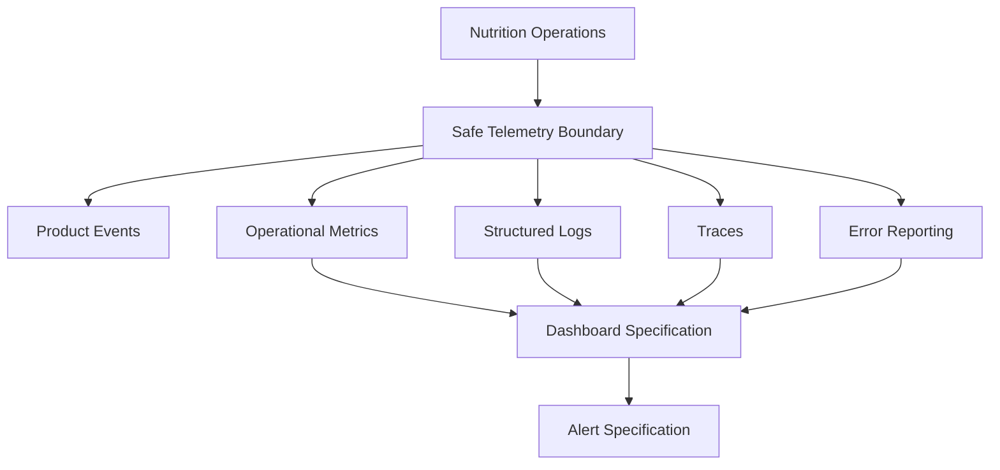

# Release 2.1 — Epic A3: Nutrition Analytics & Observability

## Context and inventory

Prompt 5 adds privacy-safe visibility around Nutrition operations without copying Nutrition payloads into telemetry. The repository contains a structured Nest logger, bounded in-memory Coach observability, and a typed mobile analytics boundary whose default provider is noop. It does not contain an active OpenTelemetry exporter, metrics backend, Sentry integration, or versioned dashboard/alert definitions.

## Architecture and taxonomy

`NutritionObservabilityService` creates allowlisted backend events and bounded-dimension counters. Mobile reuses `ProductAnalytics` and its noop/failure-isolated provider. Added signals are:

- `nutrition_today_load_success`;
- `nutrition_today_load_failure`;
- `nutrition_today_load_unauthorized`;
- `nutrition_coach_context_success`;
- `nutrition_coach_context_failure`;
- `nutrition_dashboard_card_viewed`;
- `nutrition_dashboard_load_result`;
- `nutrition_dashboard_retry_selected`;
- `nutrition_dashboard_action_selected`.

Only operation, outcome, availability, freshness, contract version, duration bucket and safe error code are allowed. No adherence, focus, insight, macros, meals, foods, targets, IDs or response content is recorded.

## Metrics, logs and traces

Counters use low-cardinality operation/outcome/availability/freshness/error dimensions. Duration uses bounded buckets: under 50 ms, 50–100 ms, 100–250 ms, 250–500 ms, 500–1000 ms and over 1000 ms. No custom sampling or new tracing dependency was introduced. No exporter, OpenTelemetry or error-reporting provider is configured in this repository.

Recommended SLIs are valid read responses, engine processing success, contract validity, successful Coach projections, successful Dashboard loads, and p50/p95/p99 endpoint latency. No numeric SLO threshold was invented because no Nutrition baseline or global SLO target exists.

## Dashboard, Health Context and Coach

Dashboard telemetry records controlled card exposure, load result, retry selection and generic action intent. Health Context records only projection outcome and canonical availability/freshness. Nutrition Expert remains deterministic; no question, response, context, prompt or detailed explainability facts are sent to analytics.

## Privacy, cardinality, consent and retention

Events are built with allowlists rather than copying and deleting fields. Prohibited data includes calories, macros, meals, foods, targets, remaining/excess, percentages, adherence, focus, insight, restrictions, allergies, weight, goals, user identifiers, payloads, prompts and Coach content. The mobile provider remains disabled by default and provider failures are swallowed.

No new retention or deletion store was introduced. Existing global consent/deletion policy remains authoritative. A formal repository-wide retention policy and external provider governance are production gaps.

## Dashboards, alerts and rollout

No versioned dashboard or alert provider exists. The runbook specifies safe panels and alerts for request volume, valid success rate, failures, latency, availability/freshness, contract failures, partial/legacy results, Dashboard failures and Coach failures. Alerts must exclude expected `not_configured` and empty-day states.

Telemetry is fail-open and cannot change domain, Dashboard or Coach behavior. `AI_LLM_ENABLED=false` remains unchanged.

## Tests, risks and next steps

Tests cover event allowlists, duration buckets, bounded counters, mobile Nutrition events, forbidden fields and provider isolation. Remaining work is provider integration, approved retention/SLO baselines, versioned dashboards/alerts and full deletion/consent validation. Prompts 6–9 remain pending.
