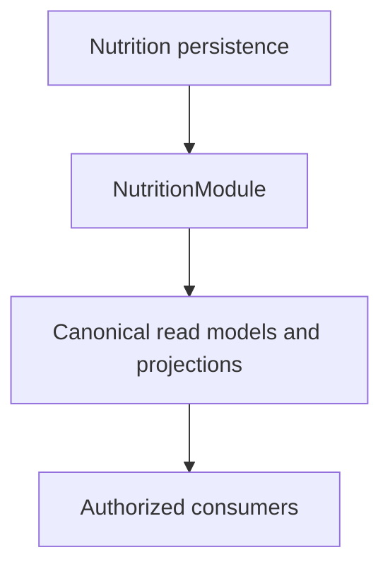

# Release 2.1 — Epic A3 Nutrition Intelligence Certification

## Scope

Prompt 9 certifies the implementation delivered by Prompts 1–8B.3 across Nutrition, API, API Client, Mobile, Dashboard, Coach, Health Context, History, Trends, cache, privacy and observability. This is a certification record; no new product feature or runtime architecture was introduced by Prompt 9.

## Architecture summary

Nutrition persistence is owned by `NutritionModule`. Canonical application use cases produce `NutritionReadModel`, history/trend read models and minimal consumer projections. Consumers use application ports and do not access Nutrition repositories or Mongoose models.

## Canonical boundaries

Validated boundaries are:

- Nutrition persistence → Nutrition application/domain.
- Nutrition application → `NutritionReadModel`, `CoachNutritionContext`, `TrainingNutritionSignals`, `GoalNutritionSignals`, `NotificationNutritionSignals` and history/trend contracts.
- Coach, Dashboard, Recovery, Training, Goals, Notifications, Health Context, Agent Tools and Mobile → approved contracts only.
- No external repository or Mongoose imports were found by the passing boundary suite.

## Public contracts

`GET /nutrition/today`, history and trend contracts, `NutritionReadModel` and `CoachNutritionContext` remain compatible with the current implementation. Normal onboarding absence is represented by canonical availability states in the use case. Authentication and technical failures retain their distinct error handling.

The public `TodayNutrition` alias is isolated as compatibility-only, deprecated, and has zero internal consumers. It is not part of the canonical runtime.

## Consumer integrations

Dashboard and Mobile present canonical read models. History and Trends use backend projections and deterministic aggregation. Health Context, Coach, Training, Goals and Notifications consume minimal application projections. Nutrition Expert accepts canonical Coach context only and remains deterministic.

## Privacy

Allowlisted telemetry excludes Nutrition payloads, values, meals, foods, targets, identifiers, Coach content and history dates. Error and debug contexts are sanitized. Existing persisted historical fields are not written by the new runtime and are not exposed through new projections.

## Authorization

Endpoints derive scope from the authenticated user. History, Coach context, application ports and Mobile cache are user-scoped. Logout/account-switch handling prevents reuse of prior-user cache state. The existing authorization and isolation tests remain green.

## Reliability

Missing profile, missing plan and insufficient data are handled as normal domain states by the canonical use case. Processing, authorization and infrastructure failures remain distinct. Nutrition failure is partial for cross-domain consumers where appropriate and does not trigger raw fallback.

## Performance

The migration removed duplicate consumer repository loads and uses bounded projections, pagination and existing indexes. No speculative optimization was added during certification. The main remaining operational limitation is the environment-blocked E2E setup.

## Observability

Operational signals cover outcome, availability, freshness, safe error code, consumer/operation, duration buckets and contract version with low-cardinality allowlists. Payloads are not included. LLM telemetry remains disabled for Nutrition runtime behavior.

## Testing evidence

| Validation | Result |
| --- | --- |
| API full suite | `PASSED` — 215 suites / 1,352 tests |
| Mobile full suite | `PASSED` — 22 suites / 104 tests |
| Nutrition boundary suite | `PASSED` — 1 suite / 3 tests |
| API build | `PASSED` |
| Mobile build | `PASSED` |
| API Client build | `PASSED` |
| API Client lint | `PASSED` |
| Types lint | `PASSED` |
| API lint target | `NOT_CONFIGURED` |
| E2E | `ENVIRONMENT_BLOCKED` — MongoMemoryServer bind EPERM |
| `git diff --check` | `PASSED` |

## E2E condition

`npm exec nx test:e2e api --skip-nx-cache` was executed. Setup fails before functional assertions because MongoMemoryServer cannot bind `0.0.0.0` (`listen EPERM: operation not permitted`). This is an environment limitation, not an application assertion failure. Re-run in CI or a compatible host before broad rollout.

## Compatibility

| Contract | Status | Consumer | Removal condition |
| --- | --- | --- | --- |
| `NutritionReadModel` | preserved | API, Dashboard, Mobile | none for current release |
| `CoachNutritionContext` | preserved | Coach, Health Context | none for current release |
| History/trend contracts | preserved | History, Mobile | none for current release |
| `TodayNutrition` alias | compatibility-only | external/legacy boundary | external clients migrate |
| Historical persisted legacy fields | existing documents only | persistence compatibility | safe lifecycle migration |
| `AI_LLM_ENABLED` default | disabled | AI runtime | explicit future product decision |

## Rollback strategy

The release is backward-compatible at the public contract boundary. Rollback must use the existing deployment/feature controls, preserve compatible API responses and avoid destructive data migration. Existing historical documents remain readable by their established compatibility lifecycle; the new runtime does not write legacy fields.

## Findings

| ID | Severity | Area | Finding | Required action |
| --- | --- | --- | --- | --- |
| F-001 | P2 | E2E | MongoMemoryServer binding is blocked by the environment | Re-run E2E in compatible CI/host |
| F-002 | P2 | Tooling | API lint target is not configured in Nx | Configure in a future tooling pass |
| F-003 | P3 | Compatibility | Public `TodayNutrition` alias remains | Remove after external migration |
| F-004 | P3 | Persistence | Legacy historical fields may exist in old documents | Retire through a future safe lifecycle migration |

## Conditions

P0 = 0 and P1 = 0. Production rollout is conditional on E2E re-execution in an environment that permits MongoMemoryServer binding, reinforced monitoring, and preservation of the documented compatibility boundaries.

## Certification decision

`EPIC_A3_CERTIFIED_WITH_CONDITIONS`

## Production readiness

`READY_FOR_PRODUCTION_ROLLOUT_WITH_CONDITIONS`

## Sign-off checklist

- [x] Canonical Nutrition ownership validated.
- [x] Consumer boundaries validated.
- [x] Raw runtime and external repository access remain zero.
- [x] Public compatibility reviewed.
- [x] Privacy and authorization reviewed.
- [x] API and Mobile suites green.
- [x] Builds and boundary tests green.
- [x] E2E executed and classified honestly.
- [x] P0 and P1 findings are zero.
- [ ] E2E rerun in a compatible environment before broad rollout.
