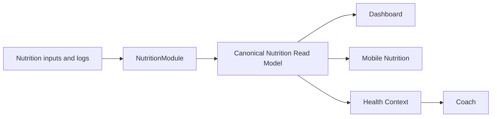

# Release 2.1 — Epic A3: Nutrition domain and canonical model

## Context and objective

The repository already has a NestJS `NutritionModule`, deterministic macro-target and plan services, Mongoose repositories, `/nutrition/today`, shared Nutrition types, and Mobile Nutrition/Dashboard consumers. Prompt 1 establishes the durable boundary for the current Nutrition experience with the smallest compatible change set. Nutrition owns meaning; clients display and explain it.

## State before

`GetTodayNutritionUseCase` assembled the active plan day and logs, but returned a domain-shaped daily payload without explicit availability, freshness, timezone, macro-level progress, or meal-progress semantics. The controller mapped domain entities to transport DTOs. Mobile derived remaining meals, adherence labels, and nutrition focus from workout context and meal arrays. Health Context exposed the NutritionProfile directly; the Nutrition Expert still consumes its existing context contract and is intentionally deferred from migration to the read model.

The current public endpoints are retained: profile, macro-target calculation, current plan, today, logs, meal replacement, and recommendations. There is no hydration implementation in the audited Nutrition domain, so hydration is not represented as invented data.

## Findings and ownership map

| Responsibility                                                                  | Owner / classification                                                                        |
| ------------------------------------------------------------------------------- | --------------------------------------------------------------------------------------------- |
| Profile, targets, plan, logs, meal replacement                                  | NutritionModule exclusive ownership                                                           |
| Daily consumption, macro progress, meal completion, adherence, next meal, focus | NutritionModule exclusive ownership                                                           |
| Dashboard and Mobile rendering                                                  | Consumers; no semantic recalculation after Prompt 1                                           |
| API client serialization and TypeScript types                                   | Shared contract consumer                                                                      |
| Coach explanation                                                               | Consumer of existing Health Context; migration to the canonical read model is a follow-up gap |
| Training adaptive signals and notification thresholds                           | Integration consumers; existing duplicate semantic inputs, deferred pending integration audit |
| Hydration, history, offline cache, analytics, LLM                               | Deferred to later A3 prompts                                                                  |

### Priority risks

- **P0:** none discovered in the audited current read path.
- **P1:** Health Context/Nutrition Expert still use profile and Nutrition entities rather than the canonical daily read model; this is documented and deferred to Prompt 4 because changing it now would expand the AI contract.
- **P2:** historical UTC-only date semantics are hard-coded in user profiles and Nutrition use cases; the canonical rule is documented, but timezone generalization is deferred.
- **P2:** several downstream adaptive/notification paths accept nutrition adherence values independently; Prompt 8 must audit and converge these integrations.
- **P3:** public legacy profile/plan responses expose more fields than the current read model needs; no breaking removal is made in Prompt 1.

## Canonical language and architecture

The public current-day contract is `NutritionReadModel`, currently served as the compatible `todayNutrition` member of `GET /nutrition/today`. Its explicit states are `availability`, `freshness`, `lastUpdatedAt`, and `timezone`. The daily state includes targets, planned meals, domain-computed progress, meal progress, next meal, and deterministic focus. `NutritionProgress` contains bounded calorie adherence and bounded percentage progress for protein, carbohydrates, and fat. `NutritionMealProgress` distinguishes planned, consumed, completed, and remaining meals.

Controllers transport and map. Application use cases coordinate. Domain/application services calculate. Shared packages describe JSON contracts. Mobile formats and presents only values supplied by Nutrition.

## Availability, freshness, and timezone

The successful current-day state is `available`. The contract reserves `insufficient_data`, `not_configured`, `not_available`, and `processing_failed` for the next compatibility-safe normalization of normal onboarding and partial-data states. Existing HTTP error codes for missing user profile, active plan, and plan day remain unchanged in Prompt 1 to preserve clients.

Freshness is backend-owned. Existing active plans with an update timestamp are `current`; a missing update timestamp is represented conservatively as `unknown`. `legacy` and `stale` are reserved for explicit mapping rules and are not inferred by Mobile or cache layers.

The repository's user profile timezone is currently the literal `UTC`, and Nutrition date selection, plan generation, log defaults, and the current read model use UTC calendar dates (`YYYY-MM-DD`). This prevents server/device-local drift. DST and user-local timezone support require a future domain change and are not silently introduced here.

## Invariants

The current read path rejects or avoids negative semantic values through existing input/domain validation, bounds all percentages to 0–100, avoids division by zero, does not treat missing logs as an error or as missing targets, distinguishes skipped/partial/consumed logs, deduplicates repeated meal logs by latest repository order, keeps date filtering explicit, and derives `lastUpdatedAt` from the plan/log source. Hydration is absent because no real support exists. Mongoose documents and algorithm parameters are not returned by the canonical read model.

## Integrations, privacy, and compatibility

Dashboard and Mobile now consume backend-provided meal progress, adherence classification, and focus. Existing visual behavior and navigation remain intact. The API client continues to call `/nutrition/today`; the shared `TodayNutrition` type is retained as the compatible alias shape while `NutritionReadModel` names the architectural owner.

Nutrition data is potentially sensitive. The canonical response excludes internal persistence metadata and calculation parameters. Existing Nutrition observability should log only operation/outcome/safe error code and never full profiles, meal descriptions, restrictions, macros, or Coach payloads. A dedicated privacy test suite and full event audit remain gaps because no new logging or analytics path was introduced here.

## Decisions, risks, and next steps

No new endpoint, dependency, collection migration, cache, LLM flag, or visual redesign was introduced. `AI_COACH_INTELLIGENCE_ENABLED` and `AI_LLM_ENABLED` were not changed. Prompt 2 should harden the deterministic Nutrition engine and invariants; Prompt 4 should adapt Health Context and Nutrition Expert to consume only the canonical read model; Prompt 5/6/7 should address observability, offline cache, and history; Prompt 8 must audit adaptive integrations; Prompt 9 certifies production.

## Tests and gaps

The changed use case requires unit updates for canonical state, bounded macro progress, deduplicated logs, and timezone. Shared types/API client/build/lint targets are validated through the workspace targets that exist. Mobile has no standalone Nx typecheck target; its `test` target is the available validation. MongoMemoryServer-dependent E2E is classified honestly if the environment blocks it.
