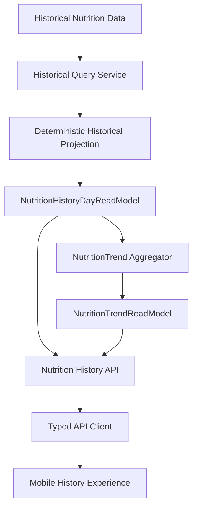
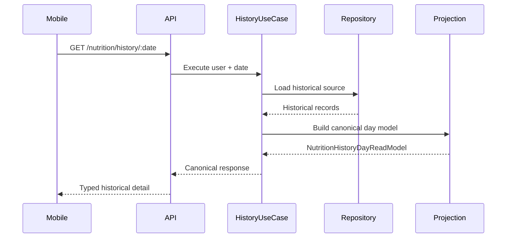

# Release 2.1 — Epic A3: Nutrition History and Trends

## Context and decision

The current Nutrition implementation stores plans and meal logs, but it does not store immutable daily Nutrition snapshots. Plans are replaceable and logs retain the `nutritionPlanId` and UTC date. Therefore Prompt 7 uses a bounded deterministic reconstruction for days with valid historical logs and the plan referenced by those logs.

Days without logs are not invented. Snapshot materialization, historical backfill and reconstruction from an immutable plan/version store remain deferred.



## Ownership and historical semantics

NutritionModule owns date boundaries, historical projection, availability, data quality, source classification, aggregation and denominators. Mobile only renders the returned values.

- `available`: a single historical plan and valid log source support the day.
- `partial`: the source is ambiguous or incomplete.
- `no_data`: no historical logs exist for the requested day.
- `not_configured`, `not_available` and `processing_failed` remain reserved for explicit application states.
- `complete`, `partial`, `legacy` and `unknown` describe data quality, never user behavior.
- `reconstructed` is used for current-shape historical projections; `legacy_projection` marks ambiguous or compatibility data.
- Historical guidance (`focus` and `insight`) is not regenerated. It is returned as `null` because no reliable persisted historical value exists.
- The canonical timezone is UTC, matching `GET /nutrition/today`.

No current plan or current targets are applied retroactively. When multiple plan IDs occur on one date, the deterministic projection chooses the plan with the most associated logs and marks the day partial/legacy.

## Contracts and API

Shared contracts are defined in `packages/types/src/nutrition/index.ts`:

- `NutritionHistoryDayReadModel` for daily detail;
- `NutritionHistoryDaySummary` for the paginated list;
- `NutritionHistoryPage` with opaque cursor and bounded period;
- `NutritionTrendReadModel` with coverage, valid series and adherence distribution.

Endpoints:

```text
GET /nutrition/history?from=YYYY-MM-DD&to=YYYY-MM-DD&cursor=...&limit=...
GET /nutrition/history/:date
GET /nutrition/trends?from=YYYY-MM-DD&to=YYYY-MM-DD
```

Requests are authenticated and user-scoped. Periods are limited to 90 UTC days, limits to 50 items, and cursor contents contain only an opaque date position.



## Trends and coverage

Trend aggregation happens in the backend. Missing days are excluded from value series and exposed through coverage. A seven-day window with three valid days reports `availableDays = 3`, `missingDays = 4`; it does not divide values by seven or turn missing days into zero.

Calorie series use canonical daily percentage values and meal series use canonical completion percentages. Adherence distribution uses the historical day status without introducing a score or moral classification. Legacy and partial days are not silently mixed into a complete-data claim.

## Persistence, indexes and consistency

The existing log index `{ userProfileId: 1, date: -1 }` supports the bounded range query. Historical plans are loaded in one batch through `findByIds` where the repository supports it; the fallback is retained for compatibility. No new collection or index is introduced.

The result is reconstruction-consistent with the persisted plan referenced by each log, not immutable snapshot-consistent. Corrections to historical logs can change a reconstructed response; current configuration changes do not change historical logs or apply current plans to the past.

## Mobile experience

`NutritionHistoryScreen` consumes the typed list and trends endpoints. `NutritionHistoryDayScreen` consumes the detail endpoint. The experience includes:

- bounded 30-day default period;
- coverage summary;
- paginated list with refresh and retry;
- daily detail navigation;
- explicit partial/no-data states;
- textual trend and accessibility summaries;
- no local calculation or raw log access.

Historical persistent cache is intentionally deferred. Only request state exists in memory; logout/account switching therefore cannot expose a persisted historical namespace.

## Privacy and observability

Historical dates, payloads, values, meal names, adherence details and cursor contents are excluded from analytics and logs. History observability uses only operation, outcome, period/result buckets, data quality, source, duration buckets and safe error codes. No new provider, dashboard, alert platform or retention store is configured by this prompt.

## Tests, risks and gaps

Unit coverage verifies reconstruction, no-zero semantics, coverage denominators, user scope, date/range validation and cursor validation. API client and Mobile builds validate the public boundary.

Known gaps:

- immutable daily snapshots and backfill are not implemented;
- historical plan versioning is not available;
- historical focus/insight cannot be faithfully recovered;
- MongoMemoryServer E2E remains environment-dependent;
- formal retention/deletion integration depends on the global lifecycle policy.

## Next steps

Prompt 8 should audit all history consumers and legacy data. Prompt 9 should certify snapshot fidelity, deletion lifecycle, production query performance and operational thresholds.
