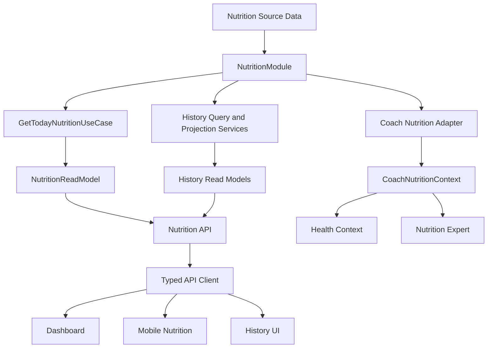
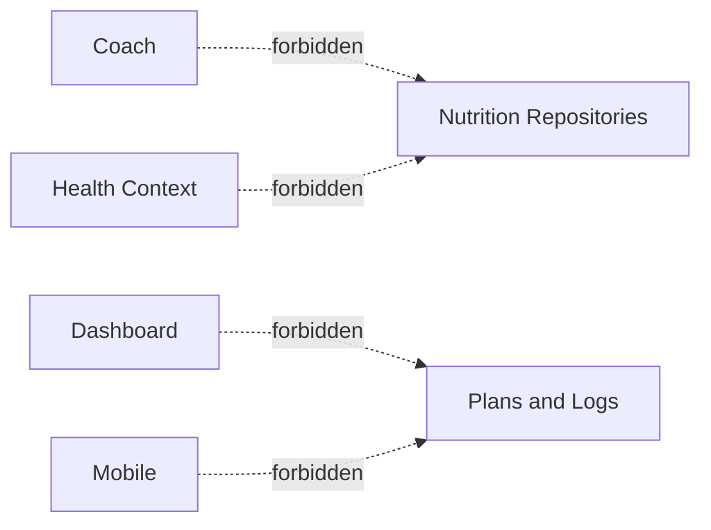

# Release 2.1 — Epic A3: Nutrition Integration Audit

## 1. Context and methodology

Prompt 10 closure update: compatible-host API E2E passed 16 suites / 56 tests after a minimal `NutritionModule` provider-registration fix. The sandbox `MongoMemoryServer` bind failure is classified as `SANDBOX_RESTRICTION`, not a remaining application condition. Direct Nutrition route E2E is not separately configured; Today/History/Trends behavior remains covered by targeted application, controller, and API-client validation.

This audit searched `apps/api`, `apps/mobile`, `apps/web`, `packages`, tests and documentation for Nutrition entities, contracts, repositories, endpoints, calculations, cache, analytics and Coach context fields. Nx projects and available targets were inspected with `npm exec nx show projects`; the API and Mobile suites were used as regression baselines.

Occurrences were classified as canonical, authorized consumer, compatibility-only, duplicate, test-only, documentation-only or deferred. Domain and persistence references inside `apps/api/src/modules/nutrition` are intentional. References outside that module are architectural findings unless they are explicit compatibility loaders.

## 2. Official ownership

| Concern                                 | Owner                        |
| --------------------------------------- | ---------------------------- |
| Profile, plan, targets and logs         | NutritionModule              |
| Daily deterministic calculation         | NutritionModule              |
| Availability and freshness              | NutritionModule              |
| Adherence, focus and insight            | NutritionModule              |
| History projection and trends           | NutritionModule              |
| Cache eligibility and storage lifecycle | Mobile infrastructure        |
| Coach explanation and policy            | Coach                        |
| Safe Health projection                  | Health Context adapter       |
| UI presentation and navigation          | Mobile                       |
| Analytics transport                     | Analytics infrastructure     |
| Operational telemetry transport         | Observability infrastructure |

No second semantic owner is approved.

## 3. Final dependency architecture



Forbidden paths:



## 4. Reference inventory

### Canonical

- `NutritionReadModel` and `GET /nutrition/today`.
- `NutritionHistoryDayReadModel`, `NutritionHistoryPage` and `NutritionTrendReadModel`.
- `GetTodayNutritionUseCase`.
- `NutritionHistoryQueryService` and `NutritionHistoryProjectionService`.
- `CoachNutritionContext` projection.
- Typed methods in `packages/api-client/src/nutrition-api.ts`.
- Dashboard hook/card and the current Nutrition History screens.

### Authorized mutations

Profile, plan creation, meal logging, meal replacement and recommendations continue to use command-specific DTOs and use cases. They are not read-model replacements.

### Compatibility-only

- `TodayNutrition` alias.
- Raw Nutrition fields retained in `UserHealthContext` and Coach chat/debug contracts.
- Coach chat and Coach Intelligence legacy loaders that still carry plan/log/profile fields.
- Training, Goals and Notifications calculations that consume Nutrition repositories or recommendation repositories.
- Older Mobile screens that type read responses as `TodayNutrition`.

### Documentation/test-only

Older ADRs, domain blueprints, fixtures and Coach debug/history contracts describe previous shapes. They are not public runtime sources of truth, but remain migration evidence.

## 5. Consumer audit

| Consumer           | Contract/boundary                                       | Finding                                                                   |
| ------------------ | ------------------------------------------------------- | ------------------------------------------------------------------------- |
| Dashboard          | `NutritionReadModel` through `useDashboard`             | Canonical presentation; no new domain calculation found.                  |
| Nutrition Overview | `GET /nutrition/today`                                  | Presents canonical progress; still uses deprecated alias typing.          |
| Nutrition History  | history list/detail/trends endpoints                    | Canonical; no current-plan reinterpretation or local trend calculation.   |
| Mobile mutations   | command endpoints plus today read                       | Legitimate command/read split; legacy type names remain.                  |
| Health Context     | canonical today use case plus legacy profile repository | Canonical projection exists, but raw profile compatibility path remains.  |
| Nutrition Expert   | canonical context first, legacy context fallback        | Deterministic canonical path exists; fallback still contains raw fields.  |
| Coach chat/runtime | canonical context plus legacy plan/log/profile fields   | Duplicate loaders remain compatibility-only.                              |
| Training           | direct Nutrition plan/log/recommendation repositories   | Legacy cross-domain calculation; needs future application-port migration. |
| Goals              | direct Nutrition plan/log repositories                  | Legacy progress snapshot dependency.                                      |
| Notifications      | Nutrition recommendation and derived adherence inputs   | Legacy notification calculation; no new Prompt 8 semantics added.         |
| Recovery           | receives legacy health context fields                   | No new Nutrition ownership introduced; legacy coupling remains.           |
| Web                | no active Nutrition runtime consumer found              | Documentation/prototype references only.                                  |

## 6. Loaders and repositories

The canonical paths are:

```text
GetTodayNutritionUseCase
NutritionHistoryQueryService
NutritionHistoryProjectionService
CoachNutritionContext projection
```

The following parallel paths were identified and retained only for compatibility because their consumers still require their legacy fields:

- `BuildUserHealthContextService` loads `NutritionProfile` directly while also resolving the canonical context.
- `CoachChatContextLoaderService.resolveNutrition` loads current plan, today model and raw logs.
- `CoachIntelligenceSourceAdaptersService` loads current plan, today model, recommendations and raw logs.
- `Nutrition Expert` has a canonical branch and an older raw-context fallback.
- `agent-tool-executor` exposes a legacy nutrition-plan lookup for existing tool contracts.

External modules also inject Nutrition repositories in Training and Goals. These are not approved as future architecture and are registered for Prompt 9 or a dedicated migration slice.

## 7. Calculations and persistence leakage

The canonical Dashboard and History paths do not calculate calorie remaining, macro progress, meal progress, adherence or trends. They only format and render backend values.

Remaining drift:

- legacy Coach Expert fallback calculates assessments from raw plan/log fields;
- Training and Goals derive cross-domain signals from Nutrition repositories;
- some mutation/detail screens use current read data for presentation and command validation, which is allowed but should not be treated as history truth.

No consumer imports Mongoose schemas or collection models directly. Repository interfaces are still imported by several backend compatibility consumers; this is a boundary violation, not a persistence-schema leak.

## 8. Contracts, aliases and compatibility

`TodayNutrition` remains explicitly deprecated:

```typescript
/** @deprecated Use NutritionReadModel for the canonical current-day contract. */
export type TodayNutrition = NutritionReadModel;
```

It is retained because multiple Mobile and Coach internal contracts still reference it. No new consumer should introduce it. Removal requires migrating those internal type annotations and the legacy Coach/debug persistence contracts.

Compatibility mapping is currently concentrated in the canonical controller/read-model projections and Coach context projection. Further raw-context removal is blocked by existing Coach feedback, memory, debug and evaluation contracts.

## 9. Normal states

`GET /nutrition/today` still has historical 404/error behavior for missing profile/plan, while the canonical read model represents availability states. This is a known compatibility condition and remains a Prompt 9 readiness risk. History returns explicit `no_data` for a valid user/date without logs.

Technical failures, authentication failures and expected onboarding absence are documented separately; no consumer is authorized to reinterpret them.

## 10. Cache, analytics and privacy

The current Prompt 6 cache remains a Mobile infrastructure concern and is not a second Nutrition semantic owner. History uses memory-only state and does not add a persistent parallel cache.

Prompt 5/7 telemetry remains allowlisted. No Nutrition payload, values, history dates, meal IDs, plans, profiles, Coach content or cursor is added to analytics, logs or traces.

## 11. Legacy status and certification readiness

The repository is not yet ready for unconditional certification because raw Coach loaders, cross-domain repository consumers and normal-state HTTP compatibility remain. They are explicitly isolated and documented rather than silently treated as canonical.

Prompt 9 must verify removal or application-port migration of these paths, normal-state HTTP normalization, public alias migration, deletion lifecycle and E2E coverage.

## Prompt 9 certification reconciliation

The sections above preserve the original Prompt 8 checkpoint findings. They are superseded for current runtime status by Prompts 8B–8B.3: Health Context, Coach, Training, Goals and Notifications now use canonical application ports; raw Coach/Expert runtime fields and fallbacks were removed; internal `TodayNutrition` usage is zero; and the API/Mobile suites and boundary tests pass.

The current certification records P0 = 0 and P1 = 0. E2E remains `ENVIRONMENT_BLOCKED` because MongoMemoryServer cannot bind in this environment. The public `TodayNutrition` alias remains compatibility-only and historical persisted fields are existing-document compatibility data only.
