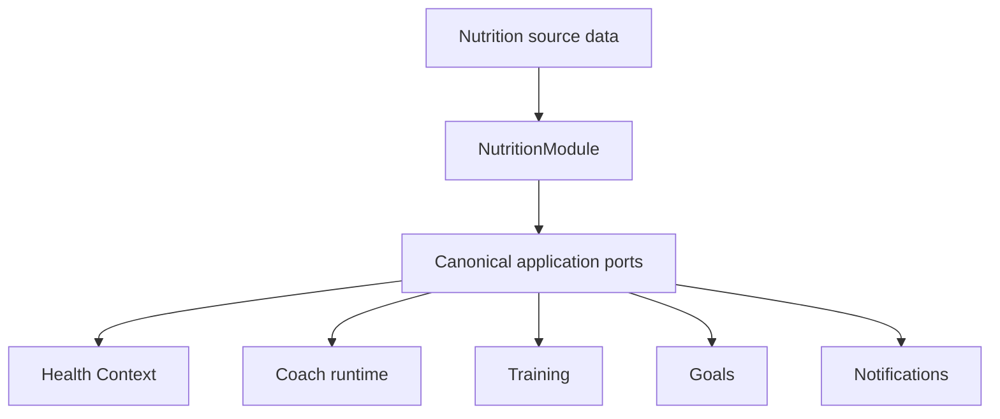
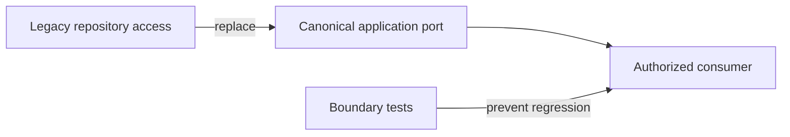

# Release 2.1 — Epic A3 Nutrition Legacy Runtime Migration

## Context

Prompt 8 identified active consumers that bypassed Nutrition application boundaries. Prompt 8B introduces application ports and migrates the highest-risk runtime paths without changing Nutrition rules or enabling LLM behavior.

## Migration performed

- Missing profile, plan and day states now return canonical successful read models (`not_configured` or `insufficient_data`) from `GetTodayNutritionUseCase`.
- Health Context no longer reads `NutritionProfileRepository`.
- Coach chat, Coach Intelligence source loading and Agent Tool Nutrition lookup use the canonical Nutrition application port.
- Training, Goals and Notifications use minimal Nutrition signal ports instead of Nutrition repositories.
- NutritionModule no longer exports persistence repository tokens.
- Nutrition Expert no longer falls back to raw plan/log/profile data when canonical context is missing; it returns a deterministic unavailable response.
- A boundary test scans external API consumers for direct Nutrition repository imports.

## Application ports and projections

`NutritionConsumerProjectionService` is owned by NutritionModule and exposes the following tokens:

| Port | Consumer | Projection |
|---|---|---|
| `NUTRITION_COACH_CONTEXT_PORT` | Coach and Health Context | canonical daily read model and availability |
| `NUTRITION_TRAINING_SIGNALS_PORT` | Training | availability, freshness and canonical adherence percentage |
| `NUTRITION_GOAL_SIGNALS_PORT` | Goals | availability, recent logged-day coverage and active-plan signal |
| `NUTRITION_NOTIFICATION_SIGNALS_PORT` | Notifications and Coach decision | availability and canonical adherence percentage |

The ports do not expose Mongoose documents, schemas, repositories, plans, profiles, foods or raw logs.

## Normal-state behavior

Expected onboarding absence is normalized inside Nutrition:

```text
missing profile/plan → 200 + not_configured
missing nutrition day → 200 + insufficient_data
unexpected processing failure → technical failure / processing_failed handling
401 or 403 → authentication/authorization flow
```

## Architecture



## Migration boundary



## Privacy and authorization

The new projections are allowlisted and do not emit raw Nutrition payloads. Consumer ports receive the authenticated user context; consumers do not receive persistence identifiers or repository access. Existing LLM flags remain unchanged and no external provider is introduced.

## Validation and remaining conditions

The API suite now passes (215 suites / 1,352 tests), Mobile passes (22 suites / 104 tests), API/Mobile/API Client builds pass, and the boundary suite passes. Fixtures and expectations were migrated to canonical ports/projections, including onboarding normal states.

E2E was executed but is `ENVIRONMENT_BLOCKED`: MongoMemoryServer fails with `listen EPERM: operation not permitted 0.0.0.0`. The remaining compatibility-only items are the public `TodayNutrition` alias and historical persisted fields; neither is active in the canonical runtime.

## Next steps

1. Remove raw Coach context fields and dead mapping methods.
2. Complete the remaining `TodayNutrition` compatibility-boundary cleanup.
3. Re-run E2E in an environment that permits MongoMemoryServer to bind a port.
4. Update the legacy register before Prompt 9.

## Prompt 8B.2 cleanup pass

The final cleanup removed the remaining raw Nutrition fields from compiled Coach contracts and runtime projections, removed the Nutrition Expert raw helpers and fallback path, removed Nutrition-derived calculations from Recovery and Dashboard consumers, and reduced feedback/debug persistence to non-Nutrition context. The Agent Tool now returns only safe availability metadata.

The architecture boundary suite now checks repository/Mongoose imports, forbidden raw runtime fields, and internal `TodayNutrition` references. The source audit reports zero active raw Coach runtime fields, zero external Nutrition repository imports, and zero internal `TodayNutrition` type consumers; the remaining `todayNutrition` property is confined to the canonical Nutrition use-case compatibility output.

Validation status for this pass is conditional: API build passes and boundary tests pass, but 12 legacy expectation suites still fail because fixtures assert removed raw Nutrition behavior. Mobile/build baselines remain green. E2E remains `ENVIRONMENT_BLOCKED` by MongoMemoryServer `listen EPERM: operation not permitted 0.0.0.0`.

Prompt 8B.2 is not fully complete until those stale fixtures/assertions are migrated and the API suite returns green. Prompt 9 remains pending.

## Prompt 9 certification reconciliation

The historical checkpoint above is superseded by Prompt 8B.3: the API suite is green at 215 suites / 1,352 tests, Mobile is green at 22 suites / 104 tests, and boundary tests pass. Current source inspection confirms zero active raw Coach/Expert runtime fields, zero external Nutrition repository access and zero internal `TodayNutrition` consumers.

Prompt 9 certification status is `EPIC_A3_CERTIFIED_WITH_CONDITIONS`. P0 and P1 are zero. E2E remains `ENVIRONMENT_BLOCKED` solely because MongoMemoryServer cannot bind `0.0.0.0`; it must be re-run in a compatible CI/host before broad rollout.

Prompt 10 supersedes the operational condition: the sandbox restriction was reproduced, then compatible-host E2E passed 16 suites / 56 tests after registering the four Nutrition consumer-port aliases as providers in `NutritionModule`. P0 and P1 remain zero. The public `TodayNutrition` alias and historical persisted fields remain compatibility-only/deferred and are not active canonical runtime owners.

## Prompt 8B.3 — Canonical test migration

The twelve failing API suites were classified as stale fixtures or assertions; no production bug was required. Tests now use canonical projections or assert the intentionally safe absence of Nutrition context in non-Nutrition consumers. Legacy Nutrition feedback tests were removed because that behavior no longer belongs to Coach feedback generation.

Final validation:

| Target | Result |
| --- | --- |
| API tests | `PASSED` — 215 suites / 1,352 tests |
| Mobile tests | `PASSED` — 22 suites / 104 tests |
| API build | `PASSED` |
| Mobile build | `PASSED` |
| API Client build | `PASSED` |
| API Client and Types lint | `PASSED` |
| Nutrition boundary tests | `PASSED` |
| E2E | `ENVIRONMENT_BLOCKED` — MongoMemoryServer `listen EPERM` |
| `git diff --check` | `PASSED` |

P1 runtime legacy and active legacy test fixtures are now zero. The public `TodayNutrition` alias remains compatibility-only and has zero internal consumers. Prompt 8 is complete with the E2E environmental condition; Prompt 9 remains pending.
