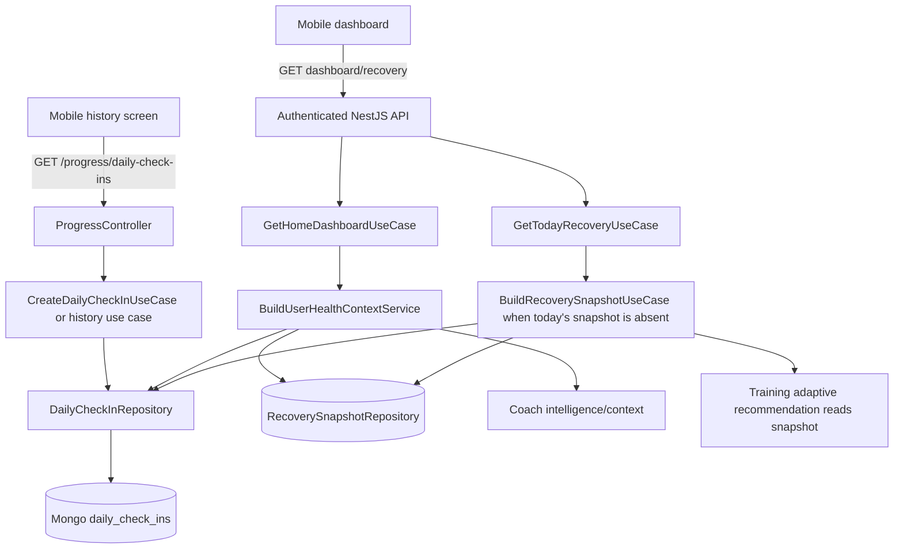
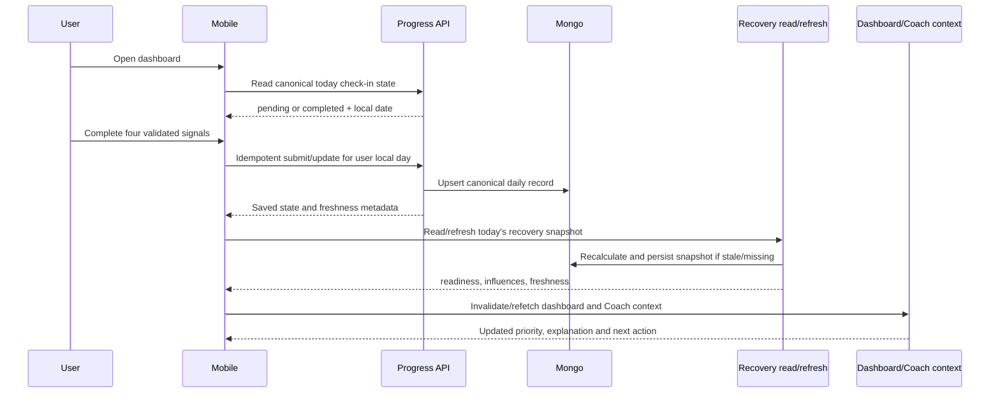

# Elev9 Coach — Release 2.1 Epic A1 Daily Check-in Audit

## 1. Executive Summary

O Epic A1 está **partially available**: existe um slice backend funcional para registrar e consultar histórico de check-ins, mas não existe uma jornada móvel de criação acessível ao usuário. O caminho de leitura já alimenta recovery, dashboard, contexto de saúde e recomendações determinísticas; o caminho de escrita não aciona uma atualização explícita e não possui identidade diária, timezone ou idempotência.

**Evidence:**
- `apps/api/src/modules/progress/presentation/http/progress.controller.ts` — `POST /progress/daily-check-in` e `GET /progress/daily-check-ins`.
- `apps/api/src/modules/progress/application/use-cases/create-daily-check-in/create-daily-check-in.use-case.ts` — persiste quatro sinais.
- `apps/api/src/modules/recovery/application/use-cases/build-recovery-snapshot/build-recovery-snapshot.use-case.ts` — lê check-ins, calcula e faz upsert do `RecoverySnapshot`.
- `apps/mobile/src/navigation/app-navigator.tsx` e `apps/mobile/src/screens/daily-check-in-history-screen.tsx` — somente histórico está navegável.
- Não há chamada `createDailyCheckIn` em `apps/mobile/src`.

Maior força: boundaries backend já reconhecem `progress`, `recovery`, `dashboard` e `ai`, com contratos e testes unitários reais. Maior fragilidade: a aparência de “check-in integrado” vem de endpoints e calculadoras, não de um ciclo diário demonstrável. Maior risco: duplicação de registros no mesmo dia e decisões baseadas em um snapshot possivelmente obsoleto.

Recomendação: consolidar o menor loop seguro — submissão móvel, estado de hoje, idempotência por dia local, refresh de recovery/dashboard e testes E2E — antes de ampliar sinais ou IA. O release mais próximo é um **A1 core determinístico**, não um Coach adaptativo completo.

## 2. Current Maturity

Estimativa baseada em capacidades, não em volume de código:

| Dimension | Estimate | Rationale |
|---|---:|---|
| Implementation | 55% | Persistência, DTO, controller, history, cálculo de recovery e leitura por IA existem; somente quatro sinais são suportados. |
| Integration | 30% | Leituras backend são conectadas; criação não existe no mobile, não há acionamento explícito pós-submit e o dashboard não expõe `check-in pending` canônico. |
| Validation | 20% | Há unit/controller/DTO tests, mas não há prova móvel ou E2E verde do fluxo completo. |
| Production readiness | 10% | Auth e validação existem, mas faltam unicidade temporal, idempotência, analytics, offline/degraded policy e evidência operacional. |

Classificação oficial: **PARTIALLY_IMPLEMENTED**, com partes **IMPLEMENTED_NOT_INTEGRATED**.

## 3. Repository Inventory

| Area | File or Directory | Responsibility | Current Status | Reusable |
|---|---|---|---|---|
| Backend | `apps/api/src/modules/progress/progress.module.ts` | Ownership, DI e Mongoose feature do Progress | PARTIALLY_IMPLEMENTED | Yes |
| Backend | `apps/api/src/modules/progress/presentation/http/progress.controller.ts` | POST de criação e GET de histórico | PARTIALLY_IMPLEMENTED | Yes |
| Backend | `apps/api/src/modules/progress/presentation/http/dto/create-daily-check-in.request.dto.ts` | Validação dos quatro níveis 1–5 | IMPLEMENTED_NOT_INTEGRATED | Yes |
| Domain | `apps/api/src/modules/progress/domain/entities/daily-check-in.entity.ts` | Entidade sem data de negócio diária | PARTIALLY_IMPLEMENTED | Yes, with date decision |
| Domain | `apps/api/src/modules/progress/domain/repositories/daily-check-in.repository.ts` | Port de create/latest/history | PARTIALLY_IMPLEMENTED | Yes |
| Persistence | `apps/api/src/modules/progress/infrastructure/mongoose/daily-check-in.schema.ts` | Collection `daily_check_ins`, timestamps e índice de histórico | PARTIALLY_IMPLEMENTED | Yes |
| Persistence | `apps/api/src/modules/progress/infrastructure/mongoose/mongoose-daily-check-in.repository.ts` | Adapter Mongoose | PARTIALLY_IMPLEMENTED | Yes |
| Recovery | `apps/api/src/modules/recovery/application/use-cases/build-recovery-snapshot/build-recovery-snapshot.use-case.ts` | Cálculo, explicação de influências e upsert do snapshot | IMPLEMENTED_NOT_INTEGRATED | Yes |
| Recovery | `apps/api/src/modules/recovery/application/use-cases/get-today-recovery/get-today-recovery.use-case.ts` | Snapshot UTC de hoje; constrói se ausente | PARTIALLY_IMPLEMENTED | Yes |
| Dashboard | `apps/api/src/modules/dashboard/application/use-cases/get-home-dashboard/get-home-dashboard.use-case.ts` | Lê até três check-ins e monta resumo | IMPLEMENTED_NOT_INTEGRATED | Yes |
| AI context | `apps/api/src/modules/ai/application/services/context-builder/build-user-health-context.service.ts` | Lê último check-in e recovery para contexto | IMPLEMENTED_NOT_INTEGRATED | Yes |
| Contract | `packages/types/src/progress/index.ts` | Request/response públicos com quatro sinais | PARTIALLY_IMPLEMENTED | Yes |
| Client | `packages/api-client/src/progress-api.ts` | Método POST e histórico já tipados | IMPLEMENTED_NOT_INTEGRATED | Yes |
| Mobile | `apps/mobile/src/screens/daily-check-in-history-screen.tsx` | Histórico com loading/error/retry/empty | PARTIALLY_IMPLEMENTED | Yes |
| Mobile | `apps/mobile/src/navigation/app-navigator.tsx` | Rota `DailyCheckInHistory` | IMPLEMENTED_NOT_INTEGRATED | Yes |
| Mobile | `apps/mobile/src/hooks/use-dashboard.ts` | Dados de dashboard e CTA que aponta para histórico | PARTIALLY_IMPLEMENTED | Yes |
| Docs | `docs/adr/adr-002-recovery-system.md` | Regras declaradas do check-in/recovery | SCAFFOLDED/partially aligned | Yes, must reconcile |
| Docs | `docs/roadmap/phase-0-checklist.md` | Reconhece que a regra de um check-in/dia ainda precisa ser definida | SCAFFOLDED | Yes |

## 4. Current Architecture

O encadeamento de escrita termina em `daily_check_ins`. Não existe consumer/evento que conecte diretamente o POST à recalculação. A atualização pode ocorrer posteriormente em endpoints de recovery/contexto, e `GetTodayRecoveryUseCase` usa dia UTC.

## 5. Current Product Flow

Hoje, um usuário autenticado pode navegar até `DailyCheckInHistory` se algum caller o abrir, consultar histórico e ver quatro métricas. O dashboard pode mostrar “Complete Check-In” como CTA quando a prioridade é recovery, mas `apps/mobile/src/screens/dashboard-screen.tsx:handleCoachCta` navega para `DailyCheckInHistory`, não para um formulário. Não há caminho user-visible para submeter valores.

O backend aceita POST autenticado e grava um documento; não há confirmação móvel, edição, estado “feito hoje”, nem E2E do ciclo.

## 6. Target Product Flow

## 7. Capability Assessment

| Capability | Classification | Evidence | Gap |
|---|---|---|---|
| Persist four core signals | PARTIALLY_IMPLEMENTED | `CreateDailyCheckInUseCase.execute`; `MongooseDailyCheckInRepository.create` | No daily key, update or idempotency. |
| API create endpoint | IMPLEMENTED_NOT_INTEGRATED | `ProgressController.createDailyCheckIn`, `POST /progress/daily-check-in` | No mobile caller or post-submit orchestration. |
| API history | PARTIALLY_IMPLEMENTED | `ProgressController.getDailyCheckIns`, history use case | No canonical “today” read. |
| Energy, sleep, soreness, motivation | PARTIALLY_IMPLEMENTED | `create-daily-check-in.request.dto.ts`, entity and types | Only four 1–5 signals; no domain evidence for other requested signals. |
| Stress, pain, mood, fatigue, sleep duration, adherence, notes | NOT_STARTED | No fields in DTO/entity/shared type | Product decision required; do not add by assumption. |
| Mobile create form | NOT_STARTED | No create screen/hook/caller under `apps/mobile/src` | Needs screen, state, validation and submit UX. |
| Mobile history | PARTIALLY_IMPLEMENTED | `daily-check-in-history-screen.tsx` | Read-only, no today/edit path. |
| Dashboard pending state | PARTIALLY_IMPLEMENTED | Dashboard use case reads recent history; mobile CTA targets history | No date-aware pending/completed contract. |
| Recovery calculation | IMPLEMENTED_NOT_INTEGRATED | `BuildRecoverySnapshotUseCase` and calculator | Not invoked from submission; UTC date. |
| Recovery persistence | PARTIALLY_IMPLEMENTED | `upsertDailySnapshot` in build use case | Snapshot can be stale after a new check-in. |
| Coach context | IMPLEMENTED_NOT_INTEGRATED | `BuildUserHealthContextService` reads latest check-in/snapshot | Feature flag and fallback; no proven post-submit refresh. |
| Training influence | IMPLEMENTED_NOT_INTEGRATED | `BuildAdaptiveTrainingRecommendationUseCase` reads latest snapshot | No proof check-in changes an executable plan/workout. |
| Nutrition influence | PARTIALLY_IMPLEMENTED | Dashboard/nutrition guidance reads health/recovery context | No A1-specific outcome proof. |
| Idempotency/one per day | NOT_STARTED | Repository has only create/latest/history; schema has no unique day key | Duplicate POSTs and multiple same-day records are possible. |
| Edit today | NOT_STARTED | No update route/port | Rule must be chosen and documented. |
| Timezone | PARTIALLY_IMPLEMENTED | User profile has timezone; recovery uses `todayUtcDateString()` | Check-in lacks business date; user timezone not applied. |
| Offline submission | NOT_STARTED | No check-in draft/queue/conflict path; only token/briefing AsyncStorage | Required A1 behavior can be online-only with explicit degraded UX. |
| Analytics | NOT_STARTED | No app-level product analytics transport; local stubs/comments only | Define events and provider before claiming measurement. |
| Tests | PARTIALLY_IMPLEMENTED | Use-case, DTO, controller and repo specs | No mobile flow integration or green end-to-end proof. |
| Accessibility | PARTIALLY_IMPLEMENTED | Existing mobile component conventions and history labels | No check-in form to validate. |

## 8. Backend Assessment

The backend is the most reusable portion. `ProgressModule` registers the real controller/use cases/repository and auth guard. Validation is strict through global `ValidationPipe` and DTO range decorators. However, `CreateDailyCheckInUseCase` receives no business date and calls `repository.create` unconditionally. The schema only has `createdAt` and a non-unique `{ userProfileId, createdAt }` index.

**Classification:** PARTIALLY_IMPLEMENTED.

## 9. Mobile Assessment

`DailyCheckInHistoryScreen` is a real read surface with loading, error, retry and empty states. `AppNavigator` exposes only `DailyCheckInHistory`. There is no create screen, no submission hook, no draft, no duplicate-submit guard and no offline queue. The dashboard CTA incorrectly lands on history for a “Complete Check-In” intent.

**Classification:** IMPLEMENTED_NOT_INTEGRATED for history; NOT_STARTED for the daily entry experience.

## 10. Contract Assessment

`packages/types/src/progress/index.ts` and `packages/api-client/src/progress-api.ts` are aligned for the current POST/history API, so a client method technically exists. They do not represent a local day, status, freshness, update semantics or errors specific to duplicate/day conflicts. Mobile’s `apps/mobile/src/api/client.ts` does not expose a local convenience method for creation.

**Classification:** PARTIALLY_IMPLEMENTED.

## 11. Recovery Integration Assessment

`BuildRecoverySnapshotUseCase` combines check-ins, workout logs, adherence and profile data, runs `RecoveryScoreCalculatorService`, and persists a daily snapshot. `GetTodayRecoveryUseCase` rebuilds only when the UTC snapshot is absent. This proves recovery can consume check-ins, not that the check-in mutation invalidates or refreshes recovery. `motivationLevel` is stored and sent through AI context but is not an input to the recovery calculator/source influences.

**Classification:** IMPLEMENTED_NOT_INTEGRATED.

## 12. Coach Intelligence Assessment

`BuildUserHealthContextService` reads the latest check-in and latest recovery snapshot. Coach aggregation and expert routing exist, but mobile’s `useCoachIntelligence` is gated by `EXPO_PUBLIC_AI_COACH_INTELLIGENCE_ENABLED`, while backend `AI_COACH_INTELLIGENCE_ENABLED` defaults false. When disabled or failing, mobile uses a deterministic local fallback. LLM, streaming and agent runtime flags also default false. Therefore the check-in can be part of context, but no active default configuration proves a user-facing AI response changes after submission.

**Classification:** IMPLEMENTED_NOT_INTEGRATED.

## 13. Dashboard Integration Assessment

`GetHomeDashboardUseCase` reads up to three recent check-ins and uses them in recovery summary calculations. `useDashboard` separately loads dashboard domains and recovery, and maps a recovery-priority CTA to `DailyCheckInHistory`. There is no canonical today-check-in status in the dashboard contract and no invalidation of a check-in query after mutation because no mutation exists.

**Classification:** PARTIALLY_IMPLEMENTED.

## 14. Persistence and Idempotency Assessment

The answer to “one canonical state per user per day?” is **no**. The current identity is `userProfileId + createdAt`, not `userProfileId + business date`. Retries create additional documents; latest/history semantics can select an arbitrary latest submission rather than an explicit daily version. No optimistic concurrency, upsert-by-day, unique day index, timezone conversion or migration strategy exists.

## 15. Offline Assessment

No check-in-specific offline behavior was found. `AsyncStorage` is used for token storage and the daily briefing; Coach conversation has an in-memory/local draft pattern but no check-in queue. For A1, online-only submission with an explicit offline message, preserved unsent form state during the screen session and retry is **Required**. Durable draft is **Recommended**. Queue, conflict resolution and eventual sync are **Deferred** unless product requires offline submission.

## 16. Analytics Assessment

Technical logging/correlation and AI traces are not product analytics. There is no confirmed app-level event transport or provider. The required events are absent as a validated pipeline: `DailyCheckInViewed`, `DailyCheckInStarted`, `DailyCheckInCompleted`, `DailyCheckInEdited`, `DailyCheckInFailed`, and `DailyCheckInAbandoned`. They must be defined with schema version, source, local date, duration, network state and safe error/result properties; no raw health values should be sent by default.

## 17. Testing Assessment

Existing proof includes:
- `apps/api/src/modules/progress/application/use-cases/create-daily-check-in/create-daily-check-in.use-case.spec.ts` — success, missing profile and persistence values.
- `apps/api/src/modules/progress/presentation/http/dto/create-daily-check-in.request.dto.spec.ts` — validation range.
- `apps/api/src/modules/progress/presentation/http/progress.controller.spec.ts` — controller behavior.
- `apps/api/src/modules/progress/application/use-cases/get-daily-check-in-history/get-daily-check-in-history.use-case.spec.ts` — history behavior.
- Não foi encontrado teste específico para `apps/mobile/src/screens/daily-check-in-history-screen.tsx`; a cobertura móvel existente não prova o fluxo de check-in.

The API suite passed (202 suites, 1,318 tests) and mobile passed (6 suites, 28 tests) in the observed run, but no A1 E2E proves the real chain. `nx test:e2e api` failed because MongoMemoryServer could not bind/start in the sandbox (`EPERM`, code 48), so integration evidence is unavailable. Tests also omit duplicate submission, local-day boundary, edit policy, stale snapshot, retry and dashboard refresh.

## 18. Documentation Assessment

`docs/adr/adr-002-recovery-system.md`, `docs/specs/recovery/build-recovery-snapshot/*`, `docs/specs/ai/build-user-health-context/*`, `docs/specs/dashboard/README.md`, `docs/architecture/communication-flow.md` and `docs/domain/bounded-contexts.md` document relevant behavior. `docs/roadmap/phase-0-checklist.md` explicitly leaves “one check-in per day” to be defined. Documentation describes the concept more completely than the mobile implementation and must be reconciled with the final date/edit semantics.

## 19. Duplication and Architectural Drift

- Dashboard and AI context independently read raw/latest check-ins; no canonical today read model exists.
- Mobile contains local Coach fallback logic while backend owns canonical context; this is acceptable as degradation but not equivalent intelligence.
- Recovery is calculated on request and persisted, while Progress writes do not invalidate it.
- `motivationLevel` is stored and exposed to AI context but omitted from `BuildRecoverySnapshotUseCase` calculator inputs.
- API client has `createDailyCheckIn`, but the mobile-specific client facade does not expose it.
- `GetTodayRecoveryUseCase` uses UTC while user profiles can contain timezone; business-day semantics diverge.
- Product/ADR docs mention a daily check-in and adaptation, but the user-visible creation path is absent.

No safe removal is recommended in A1. Existing history and local fallbacks should be deprecated only after the canonical path and telemetry are proven.

## 20. Risks

| Severity | Risk | Evidence / impact |
|---|---|---|
| Critical | Duplicate same-day records | No date field or unique index in `daily-check-in.schema.ts`; retries can create multiple states. |
| Critical | User cannot complete the core action | No mobile create screen/caller; CTA points to history. |
| High | Recovery remains stale | `GetTodayRecoveryUseCase` returns existing snapshot without checking check-in freshness. |
| High | Timezone boundary errors | Recovery uses `todayUtcDateString()`; check-in has no local business date. |
| High | No proof of end-to-end behavior | No passing A1 E2E; MongoMemoryServer E2E run blocked by sandbox binding failure. |
| High | AI capability overstatement | AI coach flag defaults false and mobile falls back locally. |
| Medium | Missing safety signals | Pain, stress, mood, fatigue, sleep duration and notes are absent; do not infer medical meaning. |
| Medium | No product measurement | No confirmed analytics transport/events. |
| Medium | Cross-context coupling risk | Progress already sits below Recovery; direct write-to-recovery injection could create a module cycle. |
| Low | Accessibility unvalidated | Reusable UI primitives exist, but no form exists to audit. |

## 21. Reusable Assets

Preserve and reuse the Progress controller/use-case error conventions, DTO range validation, entity/repository boundary, Mongoose adapter, shared types/client method, history screen patterns, `packages/ui` inputs/buttons/cards, `AuthSessionGuard`, `GetTodayRecoveryUseCase`, `BuildRecoverySnapshotUseCase`, `BuildUserHealthContextService`, dashboard refresh patterns, and existing unit test fixtures. Preserve the deterministic fallback behavior for disabled/unavailable Coach intelligence.

## 22. Removal Candidates

No immediate removal. After migration and validation, candidates for later retirement are: direct raw-check-in reads from dashboard/AI in favor of a canonical today read model, the dashboard CTA to history for incomplete check-ins, and duplicated mobile Coach derivation where the canonical endpoint is active. Do not remove the history screen or shared API method.

## 23. Final Verdict

The Epic is **partially available / implemented but disconnected**. Backend persistence and downstream readers are real, but the primary product loop is absent. The smallest safe completion path is: define local-day semantics, make Progress write idempotent, expose today state, add the mobile form and navigation, refresh recovery/dashboard, prove Coach context refresh, then add analytics and E2E. No additional signals or LLM orchestration should be treated as A1 prerequisites without a product decision.

### Mandatory answers

| # | Answer |
|---:|---|
| 1 | Yes, backend-only and partial; no complete product experience. |
| 2 | `progress` bounded context, `DailyCheckIn` entity/repository. |
| 3 | `ProgressModule`; Recovery owns derived snapshots. |
| 4 | `POST /progress/daily-check-in`, `GET /progress/daily-check-ins`. |
| 5 | `packages/types/src/progress/index.ts` and `packages/api-client/src/progress-api.ts`. |
| 6 | History only; no functional create form. |
| 7 | Yes for history; no create route. |
| 8 | No canonical date-aware detection. |
| 9 | Recovery can consume it, but POST does not directly refresh it. |
| 10 | Yes, `RecoverySnapshotRepository.upsertDailySnapshot`. |
| 11 | Yes as latest context input, subject to flags/fallback and freshness. |
| 12 | Indirectly through recovery snapshot; outcome change is unproven. |
| 13 | Indirectly through health/recovery guidance; outcome change is unproven. |
| 14 | No mutation-driven recalculation/invalidation. |
| 15 | No. |
| 16 | No. |
| 17 | Yes, history endpoint/screen; no daily-state detail/edit. |
| 18 | Not correctly for check-ins; recovery is UTC. |
| 19 | No check-in offline support. |
| 20 | No confirmed product event pipeline. |
| 21 | Unit/controller/repository tests only; no proven integration flow. |
| 22 | No passing A1 E2E. |
| 23 | No A1-specific flag found; AI flags are relevant and default off. |
| 24 | Yes, raw readers and local Coach fallback paths. |
| 25 | Current public models are aligned; generated/source artifacts exist and must be kept coherent. |
| 26 | Boundary risk exists if Progress directly imports Recovery; use read-after-write orchestration or an application event boundary. |
| 27 | Existing Progress/recovery/dashboard/context/client/UI/test assets listed above. |
| 28 | No immediate removal; defer cleanup until integration is proven. |
| 29 | Date-aware idempotent write, today query, mobile flow, dashboard/recovery refresh, analytics/tests. |
| 30 | Online-only A1 first; durable offline sync and expanded signals deferred. |
