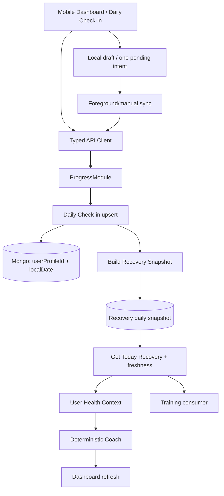

# Epic A1 Production Certification

## Executive Summary

The Daily Check-in is functionally integrated across Progress, Recovery, deterministic Coach context, Dashboard and mobile. The canonical daily identity is `userProfileId + localDate`; the backend resolves timezone, performs an atomic upsert protected by a partial unique index, recalculates Recovery synchronously and rejects stale Recovery/Coach reads. Mobile supports create/edit, real submission, dashboard refresh and a bounded offline queue.

Automated evidence is green: API has 206 suites and 1,333 tests; mobile has 15 suites and 73 tests. All required builds, lint and diff validation pass. The Mongo-backed E2E target was executed but could not start `MongoMemoryServer` because the sandbox rejects listening with `EPERM`/code 48. Physical-device and manual critical-flow validation were not executed.

## Certification Verdict

**CERTIFIED_WITH_CONDITIONS**

There are no identified functional, data-integrity or analytics-privacy blockers in the reviewed code. Rollout must remain controlled until external E2E and iOS/Android validation are completed. This verdict does not claim full production certification of offline behavior, hardware storage security or background execution.

## Scope

Reviewed backend identity/persistence, contracts, API client, mobile flow/navigation/dashboard, Recovery and Coach freshness, Training consumer, offline storage/sync, Product Analytics, privacy, accessibility, observability, tests, documentation and rollout readiness. No new feature was added during this audit.

## Architecture Reviewed



The canonical owner remains `ProgressModule`; Recovery owns derived snapshots; Health Context composes current state; Coach, Dashboard and Training consume it. Nutrition is not an A1 Recovery consumer.

## Requirement Matrix

| Requirement                 | Evidence                                                                      | Tests                                           | Risk                                                  | Status         |
| --------------------------- | ----------------------------------------------------------------------------- | ----------------------------------------------- | ----------------------------------------------------- | -------------- |
| Backend identity            | `daily-check-in-date.service.ts`; repository day filter                       | API date/use-case tests                         | UTC-only profile capability                           | PASS           |
| Atomic upsert               | `mongoose-daily-check-in.repository.ts`; `findOneAndUpdate({ upsert: true })` | repository/concurrency tests                    | legacy records need audit                             | PASS           |
| Uniqueness                  | partial unique `userProfileId + localDate` index                              | repository tests                                | legacy records without date are outside index         | PASS_WITH_RISK |
| Timezone                    | `CreateDailyCheckInUseCase`; `DailyCheckInDateService`                        | timezone/date tests                             | current profile data effectively UTC                  | PASS_WITH_RISK |
| Today endpoint              | `GetTodayDailyCheckInUseCase`; Progress controller                            | controller/use-case tests                       | full Mongo E2E unavailable                            | PASS           |
| Immutable history           | only current canonical day is upserted; no historical update endpoint         | history/use-case tests                          | legacy migration must preserve records                | PASS           |
| Recovery recalculation      | create use case invokes `BuildRecoverySnapshotUseCase`                        | API/recovery tests                              | persisted check-in can precede failed derived rebuild | PASS           |
| Recovery freshness          | `recovery-freshness.ts`; today/current use cases                              | freshness/rebuild tests                         | no external E2E proof                                 | PASS           |
| Health Context              | delegates to today Recovery                                                   | context tests                                   | compatibility fallback remains                        | PASS           |
| Deterministic Coach         | stale decisions rebuilt; AI flags default false                               | Coach tests                                     | separate reads can show intermediate state            | PASS_WITH_RISK |
| Training integration        | prefers `GetTodayRecoveryUseCase`                                             | Training tests                                  | compatibility fallback remains                        | PASS           |
| Contracts                   | `packages/types/src/progress/index.ts`                                        | type build                                      | no types test target                                  | PASS           |
| API client                  | `packages/api-client/src/progress-api.ts`                                     | direct contract test: 6 tests                   | no Nx test target                                     | PASS           |
| Mobile create               | `DailyCheckInFlow`, screen and hook                                           | mobile form/integration tests                   | no component render suite                             | PASS_WITH_RISK |
| Mobile edit                 | today response hydrates canonical values                                      | mobile form/integration tests                   | device validation pending                             | PASS_WITH_RISK |
| Validation                  | four signals constrained to 1–5                                               | API/mobile/storage tests                        | render validation pending                             | PASS           |
| Dashboard CTA               | dashboard screen and helpers                                                  | Dashboard tests                                 | device focus behavior pending                         | PASS           |
| Dashboard refresh           | refreshes daily state, Recovery and Coach                                     | Dashboard tests                                 | multiple independent requests                         | PASS_WITH_RISK |
| Offline draft               | AsyncStorage boundary, 24h TTL                                                | storage tests                                   | not hardware-backed                                   | PASS_WITH_RISK |
| Offline queue               | one pending payload and serialized sync                                       | sync/storage tests                              | no connectivity/background guarantee                  | PASS_WITH_RISK |
| Retry                       | bounded automatic attempts and manual retry                                   | sync/concurrency tests                          | physical lifecycle pending                            | PASS           |
| Logout cleanup              | AuthProvider clears offline storage                                           | mobile tests/build                              | fixed namespace relies on cleanup                     | PASS_WITH_RISK |
| Analytics privacy           | typed allowlist and forbidden-property guard                                  | analytics/privacy tests                         | external provider disabled                            | PASS           |
| Analytics failure isolation | noop/safe provider                                                            | provider failure tests                          | provider rollout future                               | PASS           |
| Accessibility               | labels, roles, values, live regions, targets                                  | static evidence                                 | VoiceOver/TalkBack not executed                       | PASS_WITH_RISK |
| Observability               | backend events and safe mobile categories                                     | API/static review                               | mobile offline logs limited                           | PASS_WITH_RISK |
| E2E                         | `api:test:e2e` target exists                                                  | 16 suites attempted; Mongo failed EPERM/code 48 | sandbox restriction                                   | PASS_WITH_RISK |
| Documentation               | audits, taxonomy, architecture and plans                                      | file review                                     | final report added here                               | PASS           |
| Rollout control             | generative AI/external analytics remain off                                   | config review                                   | no A1 remote flag found                               | PASS_WITH_RISK |
| Concurrency                 | API unique/upsert and active sync promise                                     | API/mobile tests                                | physical multi-trigger pending                        | PASS           |
| Compatibility               | deprecated API alias and legacy storage handling                              | client/storage tests                            | legacy DB procedure pending                           | PASS_WITH_RISK |

**Summary:** 20 `PASS`, 13 `PASS_WITH_RISK`, 0 `FAIL`, 0 `NOT_APPLICABLE`.

## Backend Assessment

`ProgressModule` owns the Daily Check-in. `CreateDailyCheckInUseCase` resolves profile timezone, derives `localDate`, upserts and invokes Recovery synchronously. Mongoose uses atomic `findOneAndUpdate` and handles duplicate-key races. The partial unique index preserves compatibility with legacy documents lacking `localDate`; those records require a production database audit before broad rollout. Recovery failure is surfaced as a typed error and must be monitored because persistence precedes derived rebuild completion.

## Contracts and API Client

The request contains exactly the four signals. Responses expose `localDate`, timezone and ISO timestamps. Today absence is `{ completedToday: false, dailyCheckIn: null }`. `createDailyCheckIn` remains a compatibility alias. No unsafe competing public contract was found; mobile models are local view/storage models.

## Mobile Functional Assessment

```text
Dashboard → DailyCheckIn → today load → create/edit → four answers
→ review → submit → canonical response → Recovery refresh → Dashboard/Coach refresh
```

No default signal is submitted silently. Incomplete submission, duplicate submit, error preservation, retry and real API success are covered by the current implementation/tests. Queued offline state is never presented as canonical completion.

## Recovery and Coach Assessment

Energy and sleep feed Recovery directly. Muscle soreness is inverted for readiness and direct for fatigue. Motivation remains available to Health Context/Coach but is intentionally excluded from the Recovery formula. Current-day freshness compares check-in update time with Recovery source time; stale snapshots and Coach decisions rebuild. The deterministic path works with generative AI disabled. Training is `CONNECTED`; Nutrition is `NOT_USED` for A1.

## Offline Resilience Assessment

Drafts and pending submissions are validated, versioned and expired. Only one pending intent exists. Sync is serialized, replay is safe against backend idempotency, and today/Recovery are reread before cleanup. Logout cleanup is implemented. Known limitations are no connectivity library, no guaranteed background execution, non-hardware-backed AsyncStorage and fixed keys relying on logout cleanup for account isolation.

## Analytics and Privacy Assessment

The typed allowlist/noop provider covers online and offline taxonomy. Events measure behavior only. Health values, Recovery/readiness, identity, email, token and raw payloads are excluded. Provider failures cannot block the flow and external collection is disabled by default. Local storage contains only the minimum four values needed to resume/retry and is cleared after success or logout.

## Accessibility Assessment

The flow provides labels/roles, scale values and selected state, progress semantics, live regions, retry/discard controls, touch targets and token-based contrast. VoiceOver, TalkBack and text scaling remain device-validation conditions because no component-render/device harness exists.

## Observability Assessment

Backend has structured upsert, Recovery recalculation and stale rebuild events. Mobile exposes safe error categories and analytics states without payloads. Offline storage/sync has limited direct structured logging; this is a monitoring follow-up, not a correctness blocker.

## Test Evidence

| Area                    | Result                                                                    |
| ----------------------- | ------------------------------------------------------------------------- |
| API                     | 206 suites, 1,333 tests passed with `npm exec nx test api -- --runInBand` |
| Mobile                  | 15 suites, 73 tests passed with `npm exec nx test mobile -- --runInBand`  |
| API build               | Passed                                                                    |
| Mobile build            | Passed for Web, Android and iOS bundles                                   |
| Types/API client builds | Passed                                                                    |
| API client direct test  | 1 suite, 6 tests passed                                                   |
| Lint                    | Passed for configured `types` and `api-client` targets                    |
| Diff check              | Passed                                                                    |

## E2E Status

**NOT PASSED.** `npm exec nx test:e2e api -- --runInBand` was executed. All 16 E2E suites were unable to initialize MongoMemoryServer; errors included `listen EPERM: operation not permitted 0.0.0.0` and `UnexpectedCloseError ... code "48"`. This is not evidence of functional success. Run externally with the same command.

## Security Risks

| Risk                                                   | Level  | Mitigation/condition                                      |
| ------------------------------------------------------ | ------ | --------------------------------------------------------- |
| AsyncStorage exposure on compromised/backed-up devices | MEDIUM | Minimized payload, TTL, cleanup and security review       |
| Fixed local keys rely on logout for account isolation  | MEDIUM | Mandatory logout test and future session-scoped namespace |
| Legacy documents lack `localDate`                      | MEDIUM | Production duplicate/index audit                          |
| No true background sync                                | LOW    | Do not promise it; foreground/manual sync is explicit     |
| No external analytics consent/provider                 | LOW    | External collection remains disabled                      |

## Known Limitations

- No iOS/Android physical-device execution.
- No manual VoiceOver/TalkBack, timezone-boundary or multi-account execution.
- E2E blocked in sandbox.
- No connectivity listener or guaranteed background retry.
- Nutrition does not consume Recovery in A1.
- No A1-specific remote feature flag; use release/distribution controls.

## Accepted Risks

Offline platform limitations are acceptable for controlled rollout because online state remains canonical and pending is never shown as completed. AsyncStorage risk is acceptable only for limited rollout after security/product approval and cleanup verification.

## Certification Conditions

1. Run API E2E in an environment where MongoMemoryServer can bind and verify the Daily Check-in → Recovery → Dashboard/Coach chain.
2. Execute the manual matrix on iOS and Android: online create/edit, offline queue/relaunch/foreground sync, lost response, logout isolation, timezone boundary and accessibility.
3. Audit production `daily_check_ins` records without `localDate` and same-day duplicates before broad rollout.
4. Confirm privacy/security approval for limited AsyncStorage persistence and TTL/cleanup policy.
5. Roll out gradually with monitoring for submit, queue/sync and Recovery failures; keep external analytics noop until governance exists.

## Rollout Plan

No new feature flag was introduced. Use existing release/distribution controls:

```text
internal → 5% → 25% → 50% → 100%
```

Advance only after monitoring submit success, errors, queued rate, sync success/failure, Recovery failures, stale rebuild rate, crash-free sessions, completion and median duration.

## Rollback Criteria

Pause/rollback for duplicate daily records, lost submissions, false success, material submit regression, Recovery failure spike, crash regression, pending items cleared without confirmation, cross-account local data, or any health/personal data reaching analytics.

## Manual Validation Checklist

Status for every item: **NOT_EXECUTED**.

- Online create: pending CTA → answers → review → submit → Recovery → completed Dashboard.
- Online edit: hydrate → update → Recovery rebuild → Dashboard refresh.
- Offline queue: disable network → submit → queued → close/reopen → foreground sync.
- Lost response: persisted backend write → client error → retry → no duplicate → reconciliation.
- Logout isolation: draft/pending → logout → second account → no previous local data.
- Timezone boundary around profile-local midnight.
- VoiceOver/TalkBack, enlarged text, focus order and live regions.

## Remaining Follow-ups

**High priority:** external E2E, physical-device matrix, legacy database audit and AsyncStorage security review.

**Follow-up:** stronger account-scoped namespace, structured mobile offline logs, connectivity/background strategy, component-render tests and Nutrition/Recovery integration if scope expands.

## Final Sign-off

- Audited commit: `e4ae424` (`feat(mobile): add offline resilience to daily check-in`)
- Branch: `feat/dashboard-v1`
- Audit date: 2026-07-28
- Git status at audit start: clean
- Final verdict: **CERTIFIED_WITH_CONDITIONS**
- Production code changes in Prompt 9: none required.
