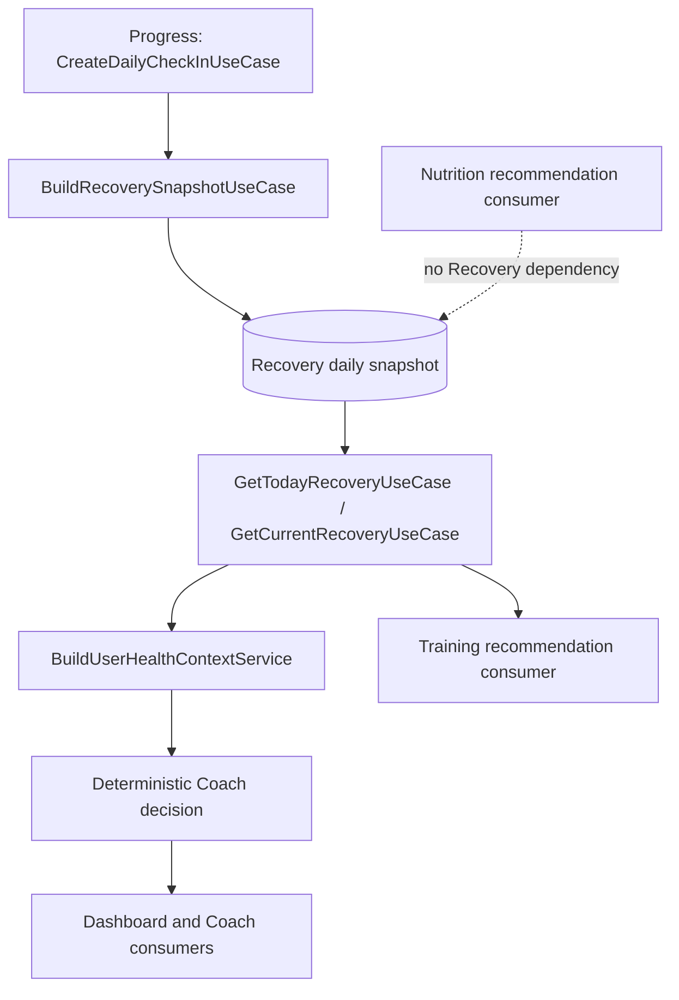

# Release 2.1 — Epic A1 Recovery and Coach Context Validation

## Executive Summary

The canonical Daily Check-in write path is present in `ProgressModule`: it persists one daily record and synchronously invokes Recovery recalculation. The audit found a real freshness gap in read paths: existing Recovery snapshots and Coach decisions could be returned without checking whether the current day's check-in had been updated afterwards. The minimum correction was implemented in the Recovery and deterministic Coach read use cases.

After the correction, the production wiring is:

The result is `integrated but incomplete`: deterministic backend consumers now reject stale Recovery/Coach state, but a real Mongo-backed E2E chain remains unexecuted because of the existing `MongoMemoryServer/EPERM` environment blocker. Motivation is intentionally context-only: it is available to Health Context and Coach context, but is not silently added to the Recovery formula.

## Canonical Pipeline

Evidence:

- `apps/api/src/modules/progress/application/use-cases/create-daily-check-in/create-daily-check-in.use-case.ts` — `CreateDailyCheckInUseCase.execute(...)` resolves the canonical local day, upserts the daily record, then calls `BuildRecoverySnapshotUseCase.execute(...)` synchronously.
- `apps/api/src/modules/recovery/application/use-cases/build-recovery-snapshot/build-recovery-snapshot.use-case.ts` — `BuildRecoverySnapshotUseCase.execute(...)` selects the current-day check-in and persists the Recovery snapshot with `sourceContext.generatedAt`.
- `apps/api/src/modules/recovery/application/use-cases/get-today-recovery/get-today-recovery.use-case.ts` — `GetTodayRecoveryUseCase.execute(...)` now compares the current check-in update time with the snapshot source time and rebuilds stale state.
- `apps/api/src/modules/ai/application/services/context-builder/build-user-health-context.service.ts` — `BuildUserHealthContextService.resolveRecoverySnapshot(...)` delegates to `GetTodayRecoveryUseCase` when the canonical provider is available.
- `apps/api/src/modules/ai/application/use-cases/get-today-coach-decision/get-today-coach-decision.use-case.ts` and `get-current-coach-decision.use-case.ts` — existing decisions are rebuilt when their Recovery source is older than the current Recovery source.
- `apps/mobile/src/hooks/use-dashboard.ts` — Dashboard refreshes the Recovery and Coach API sources on focus; it does not calculate Recovery locally.

## Signal Mapping

| Check-in signal | Recovery input | Transformation | Direction | Validated |
|---|---|---|---|---|
| `energyLevel` | `RecoveryScoreCalculatorInput.energyLevel` | Five-point value passed directly | Higher value increases readiness and reduces fatigue | Yes: `BuildRecoverySnapshotUseCase` and calculator tests |
| `sleepQuality` | `RecoveryScoreCalculatorInput.sleepQuality` | Five-point value passed directly | Higher value increases readiness and reduces fatigue | Yes: `BuildRecoverySnapshotUseCase` and calculator tests |
| `muscleSoreness` | `RecoveryScoreCalculatorInput.muscleSoreness` | Five-point value passed directly; readiness uses `invertScore`, fatigue uses direct value | Higher soreness reduces readiness and increases fatigue | Yes: `apps/api/src/modules/recovery/application/services/recovery-score-calculator.service.ts` |
| `motivationLevel` | Health Context `latestCheckIn.motivationLevel` | Preserved in the latest check-in context; not passed to Recovery calculator | Available to Coach context, no Recovery-score effect | Yes: context tests and implementation-plan decision |

The omission of `motivationLevel` from the Recovery formula is deliberate and documented. Changing that formula would be a product/rules decision outside this validation prompt.

## Recovery Freshness

Recovery identity is already daily and protected at persistence level:

- `apps/api/src/modules/recovery/infrastructure/mongoose/recovery-snapshot.schema.ts` — unique index on `userProfileId + date`.
- `apps/api/src/modules/recovery/infrastructure/mongoose/mongoose-recovery-snapshot.repository.ts` — daily upsert and latest ordering by date, creation time, and id.
- `apps/api/src/modules/recovery/application/services/recovery-freshness.ts` — compares `sourceContext.generatedAt` (falling back to snapshot `createdAt`) against the current check-in `updatedAt`.
- `apps/api/src/modules/recovery/application/use-cases/get-today-recovery/get-today-recovery.use-case.ts` — rejects stale today snapshots and rebuilds them.
- `apps/api/src/modules/recovery/application/use-cases/get-current-recovery/get-current-recovery.use-case.ts` — resolves the user's local today and applies the same freshness rule.

The current profile implementation persists UTC, so the effective local-day and Recovery date remain aligned. The code still resolves dates through `RecoveryDateService`; future IANA profile support must preserve that shared boundary.

Before this correction, an existing snapshot could be returned without comparing it to a newer check-in. That was the principal freshness defect. The correction is intentionally small and does not introduce global versioning or new infrastructure.

## Health Context

`BuildUserHealthContextService` remains the context owner. Its latest check-in mapping includes all four signals. In the production constructor path it now calls `GetTodayRecoveryUseCase`, so the context receives a current-or-rebuilt snapshot instead of independently selecting an arbitrary latest repository record.

Evidence:

- `apps/api/src/modules/ai/application/services/context-builder/build-user-health-context.service.ts` — `loadLatestCheckIn(...)` and `resolveRecoverySnapshot(...)`.
- `apps/api/src/modules/ai/application/services/context-builder/build-user-health-context.service.spec.ts` — context composition and fallback coverage.

The service retains a compatibility fallback for construction paths that do not provide the canonical use case. That fallback is not the preferred production path and is classified below as `LEGACY_ACTIVE` until all direct construction/test adapters are consolidated.

## Deterministic Coach

The deterministic decision path remains active independently of generative AI:

- `apps/api/src/modules/ai/application/use-cases/build-coach-decision/build-coach-decision.use-case.ts` — consumes current Recovery and persists a deterministic decision with `llmMetadata.used: false`.
- `apps/api/src/modules/ai/application/services/coach-decision-calculator.service.ts` — deterministic priority selection; readiness below 40 or fatigue above 75 selects Recovery priority.
- `apps/api/src/modules/ai/application/use-cases/get-today-coach-decision/get-today-coach-decision.use-case.ts` and `get-current-coach-decision.use-case.ts` — reject decisions older than current Recovery source data and rebuild them.
- `apps/api/src/modules/ai/application/services/coach-intelligence/coach-intelligence.config.ts` — `AI_COACH_INTELLIGENCE_ENABLED` defaults to `false`.

Relevant defaults:

| Flag | Default | Effect | Required for Epic A1 |
|---|---:|---|---:|
| `AI_COACH_INTELLIGENCE_ENABLED` | `false` | Enables the separate Coach Intelligence endpoint/path | No |
| `AI_AGENT_RUNTIME_ENABLED` | `false` | Enables Agent Runtime | No |
| `AI_AGENT_TOOLS_ENABLED` | `false` | Enables agent tools | No |
| `AI_LLM_ENABLED` | `false` | Enables LLM provider usage | No |

Streaming, tool calling, structured outputs, and memory are not required for the deterministic A1 path. No AI flag was enabled or changed.

## Dashboard Consistency

The mobile Dashboard obtains Recovery and Coach data through the existing API client hooks and refreshes them on screen focus. It does not recompute Recovery, readiness, or Coach state.

The backend Dashboard aggregation uses `BuildUserHealthContextService` and Coach decision sources. With the freshness corrections, a check-in submission followed by a Dashboard refresh cannot reuse a Recovery snapshot older than the check-in update time through the canonical path. The remaining limitation is that the separate mobile requests are not one transactional response; the UI can observe intermediate network states, but each source is canonical and independently fresh.

## Training Consumer

**Status: CONNECTED**

`apps/api/src/modules/training/application/use-cases/build-adaptive-training-recommendation/build-adaptive-training-recommendation.use-case.ts` now prefers `GetTodayRecoveryUseCase` when injected, rather than directly selecting an arbitrary latest repository snapshot. This is a wiring correction only. No adaptive-training rule was added or changed.

The use case retains a repository fallback for compatibility with isolated construction paths. That fallback is not the canonical production dependency.

## Nutrition Consumer

**Status: NOT_USED**

`apps/api/src/modules/nutrition/application/use-cases/get-nutrition-recommendations/get-nutrition-recommendations.use-case.ts` reads nutrition recommendation persistence and does not consume Recovery or User Health Context. No contradictory Recovery source was found, and no nutrition adaptation was introduced in A1.

## Feature Flags

The deterministic pipeline does not require an AI flag. Defaults are confirmed in the configuration services:

- `apps/api/src/modules/ai/application/services/coach-intelligence/coach-intelligence.config.ts` — deterministic Coach Intelligence feature flag defaults to disabled.
- `apps/api/src/modules/ai/application/services/agent/agent-runtime.config.ts` — Agent Runtime and tools default to disabled.
- `apps/api/src/modules/ai/application/services/llm/ai-llm-config.service.ts` — LLM defaults to disabled.

## Legacy Paths

| Path | Classification | Finding |
|---|---|---|
| `ProgressModule → BuildRecoverySnapshotUseCase` | `CANONICAL` | Owns check-in-triggered Recovery rebuild. |
| `GetTodayRecoveryUseCase` / `GetCurrentRecoveryUseCase` | `CANONICAL` | Own current-date/current-state selection and freshness validation. |
| `BuildUserHealthContextService → GetTodayRecoveryUseCase` | `CANONICAL` | Production context path now delegates to canonical Recovery read. |
| Direct Recovery repository fallback in `BuildUserHealthContextService` | `LEGACY_ACTIVE` | Compatibility path for callers without the optional use case; should be retired after constructor/test migration. |
| Direct Recovery repository fallback in Training | `LEGACY_ACTIVE` | Compatibility path; canonical provider is preferred. |
| Mobile Dashboard Recovery and Coach requests | `CANONICAL` | Separate API reads, not local calculations or a parallel Recovery algorithm. |
| Nutrition recommendation persistence path | `CANONICAL` for Nutrition, `NOT_USED` for A1 Recovery | No Recovery dependency. |
| Agent Runtime, LLM, streaming, tool calling | `LEGACY_INACTIVE` for A1 | Infrastructure exists but defaults are disabled and does not participate in this flow. |

## Tests and Evidence

Added or updated coverage:

- `apps/api/src/modules/recovery/application/services/recovery-freshness.spec.ts` — stale/fresh comparison and no-check-in behavior.
- `apps/api/src/modules/recovery/application/use-cases/get-today-recovery/get-today-recovery.use-case.spec.ts` — stale today snapshot rebuild.
- `apps/api/src/modules/recovery/application/use-cases/get-current-recovery/get-current-recovery.use-case.spec.ts` — stale current snapshot rebuild.
- `apps/api/src/modules/ai/application/use-cases/get-today-coach-decision/get-today-coach-decision.use-case.spec.ts` — stale Coach decision rebuild after newer Recovery.
- Existing `BuildRecoverySnapshotUseCase`, calculator, context, Coach, and mobile Dashboard tests provide lower-level mapping and consumer evidence.

Executed API validation: `206` suites and `1333` tests passed with `npm exec nx test api -- --runInBand` after the changes. A full Mongo-backed E2E proof was attempted separately and must not be considered passed if the environment continues to reject `MongoMemoryServer` with `EPERM`.

## Remaining Risks

- The full submit-to-dashboard chain is not proven against a real Mongo instance in the current sandbox if the E2E environment remains blocked.
- Motivation is context-only and therefore does not affect the Recovery score until a separate product decision changes the formula.
- Profile timezone support is currently UTC-only; future IANA support must keep Progress and Recovery on the same date service.
- Compatibility fallbacks leave two non-canonical repository access paths active for isolated construction. They should be removed only after all callers are migrated.
- Nutrition has no Recovery/Health Context consumer, so adaptive nutrition remains a future capability.

## Final Verdict

The Daily Check-in → Recovery → Health Context → deterministic Coach pipeline is **integrated with freshness corrections applied**, not fully production-validated. The canonical source is now explicit in production wiring, Recovery freshness is checked before reuse, and stale Coach decisions are rebuilt. The next safe scope is Product Analytics; do not expand into new adaptive intelligence until the E2E and operational evidence gaps are closed.
