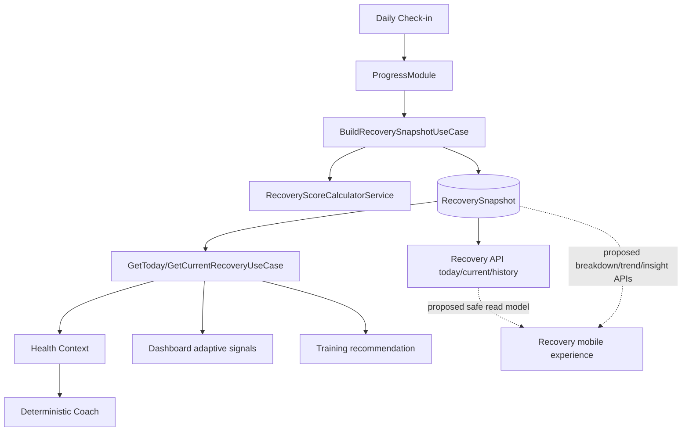
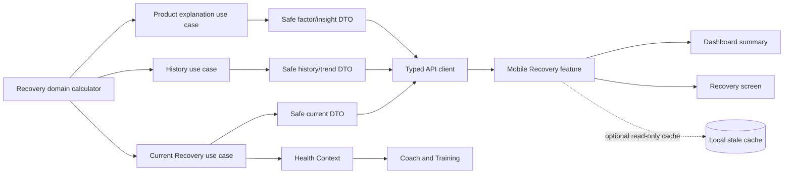

# Epic A2 Recovery Intelligence Audit

## Executive Summary

O repositório possui uma base de Recovery funcional e determinística, com ownership dividido de forma coerente: `ProgressModule` dispara a construção e `RecoveryModule` calcula, persiste e consulta snapshots. O cálculo é coberto por testes e os endpoints `today`, `current` e `history` existem.

O produto, porém, ainda não possui uma experiência Recovery completa. O contrato HTTP expõe `sourceContext` interno e `userProfileId`; não existe modelo público seguro para freshness, disponibilidade, breakdown, trend ou insight; o Dashboard deriva categorias localmente; não existe tela Recovery dedicada; e a rota chamada “Recovery History” mostra histórico de Daily Check-in. Há ainda fallbacks ativos e thresholds duplicados entre consumidores.

**Veredito: `READY_WITH_BLOCKERS`.** A arquitetura é viável para implementação incremental, mas o Prompt 2 deve primeiro criar read models/APIs canônicos e remover a ambiguidade do contrato público antes da UI de produto.

## Audit Scope

Foram auditados backend, contratos, API client, Dashboard, mobile, Coach, Training, Nutrition, analytics, offline, privacidade, observabilidade, testes, E2E, flags e documentação. A auditoria é somente leitura; nenhum código de produção foi alterado.

## Repository State

- Branch: `feat/dashboard-v1`.
- Último commit A1: `0a9e045 fix(progress): resolve daily check-in rollout issues`.
- Árvore limpa antes desta auditoria.
- Projetos Nx: `api`, `mobile`, `types`, `api-client`, `ui`, `web`.
- Validação executada: API `206` suítes/`1333` testes; mobile `15` suítes/`73` testes; builds de `api`, `mobile`, `types`, `api-client`; lint e `git diff --check` aprovados.
- E2E físico, dispositivo, dados legados reais e testes de acessibilidade assistiva não foram executados neste prompt.

## Current Architecture

Evidência principal: `apps/api/src/modules/recovery/recovery.module.ts`, `apps/api/src/modules/progress/application/use-cases/create-daily-check-in/create-daily-check-in.use-case.ts`, `apps/api/src/modules/recovery/application/use-cases/build-recovery-snapshot/build-recovery-snapshot.use-case.ts`, `apps/api/src/modules/ai/application/services/context-builder/build-user-health-context.service.ts`.

## Domain Ownership

| Capability | Owner | Classification | Evidence | Gap |
|---|---|---|---|---|
| Daily Check-in write | Progress | CANONICAL | `CreateDailyCheckInUseCase` invokes Recovery | Product read model still absent |
| Snapshot calculation/persistence | Recovery | CANONICAL | `BuildRecoverySnapshotUseCase`, repository, schema | Internal fields leak through HTTP |
| Current/today/history selection | Recovery | CANONICAL | `GetTodayRecoveryUseCase`, `GetCurrentRecoveryUseCase`, `GetRecoveryHistoryUseCase` | No public availability/freshness semantics |
| Health context | AI/Health Context | CANONICAL COMPOSER | `BuildUserHealthContextService` | Active repository fallback remains |
| Dashboard view | Dashboard | DERIVED_VIEW | `recovery-read-model.mapper.ts` | Uses different category vocabulary |
| Training decision | Training | CONSUMER | `BuildAdaptiveTrainingRecommendationUseCase` | Active latest-snapshot fallback |
| Mobile Recovery interpretation | Several mobile screens | DUPLICATED_DOMAIN_LOGIC | local thresholds/copy in dashboard, workout, nutrition and coach hooks | Must be consolidated behind contract |

## Data Model

| Field | Exists | Source | Canonical | Exposed externally | Risk |
|---|---|---|---|---|---|
| `userProfileId` | Yes | entity/schema | Yes internally | Yes | High: unnecessary public identity |
| `date` | Yes | entity/schema | Yes, local-day string | Yes | Naming differs from A1 `localDate` |
| `readinessScore` | Yes | calculator | Yes | Yes | Sensitive product data needs safe DTO |
| `fatigueScore` | Yes | calculator | Yes | Yes | No product explanation contract |
| `recoveryTrend` | Yes | calculator | Yes | Yes | Semantics need public contract |
| `recommendedIntensity` | Yes | calculator | Yes | Yes | Mobile reinterprets it in places |
| `influences` | Yes | calculator | Internal/product bridge | Yes | Labels are internal-ish and lack safe presentation model |
| `sourceContext` | Yes, optional | build use case | Internal | Yes | High: contains raw signals and internal context |
| `formulaVersion` | Yes | calculator | Internal provenance | Yes | Not needed by product UI |
| `generatedBy` | Schema only | persistence | Internal | Not in mapper | Keep internal |
| `createdAt/updatedAt` | Yes | schema | Technical | Yes, createdAt | Need explicit freshness semantics |
| `localDate/timezone/status/confidence/explanation` | No | — | Missing | No | Required for A2 product read model |

## Recovery Algorithm

Evidence: `apps/api/src/modules/recovery/application/services/recovery-score-calculator.service.ts`, version `recovery-deterministic-v1`.

| Input | Range | Direction | Weight | Required | Fallback | Consumer |
|---|---:|---|---:|---|---|---|
| `sleepQuality` | 1–5 | higher improves readiness; higher lowers fatigue | 30% readiness / 15% fatigue | No | neutral 3 | Recovery, Coach |
| `energyLevel` | 1–5 | higher improves readiness; higher lowers fatigue | 30% / 20% | No | neutral 3 | Recovery, Coach |
| `muscleSoreness` | 1–5 | higher reduces readiness; higher increases fatigue | 15% / 30% | No | neutral 3 | Recovery, Coach |
| `adherenceScore` | 0–100 | higher improves readiness | 15% | No | neutral 50 | Recovery |
| `recentWorkoutLoad` | 0–100 | higher reduces readiness/increases fatigue | 10% / 35% | No | neutral 50 | Recovery |
| `motivationLevel` | 1–5 | Does not affect score | — | No | context only | Coach |

Streak and missed-workout bonuses/penalties também entram no cálculo. O score é limitado a 0–100; intensidade usa thresholds `39/59/79`; tendência compara o score atual com scores prévios. Não há evidência de inversão incorreta de soreness, mas a regra está duplicada em consumidores móveis.

## Freshness

`RecoveryFreshnessService` compara `checkIn.updatedAt` com `sourceContext.generatedAt` ou `snapshot.createdAt`. `GetTodayRecoveryUseCase` e `GetCurrentRecoveryUseCase` selecionam o dia/local date e reconstruem quando o snapshot está ausente ou stale. Isso é `CANONICAL_REBUILD`, não ainda `PRODUCTION_READY`: o contrato não comunica freshness/availability, snapshots legados podem não ter `sourceContext`, e o histórico não executa a mesma política de freshness por item.

## Historical Data

`GetRecoveryHistoryUseCase` e `GET /recovery/history?limit=1..90` existem, com ordenação descendente e limite padrão 14. Classificação: `AVAILABLE_UNPAGED`. Não há paginação por cursor, trend endpoint, range explícito, breakdown ou modelo de histórico para mobile. Não existe UI Recovery History; a tela `apps/mobile/src/screens/daily-check-in-history-screen.tsx` consulta histórico de check-ins, embora a rota em `app-navigator.tsx` tenha título “Recovery History”.

## Factor Breakdown

Classificação: `RAW_TECHNICAL`. `influences` existem e incluem códigos, labels, impact e opcionalmente weight/value, mas não há contrato de apresentação seguro nem estados positivo/neutro/negativo/indisponível. `sourceContext` contém sinais brutos e não pode ser usado como DTO de produto.

## Categories and Thresholds

O backend possui `RecommendedIntensity` (`recovery`, `light`, `moderate`, `hard`). O Dashboard mobile cria outra categoria (`Ready`, `Moderate`, `Recovery Needed`) e outros consumidores repetem thresholds/copy. Não existe `RecoveryCategory` canônica pública. Gap: backend deve fornecer semântica estável, e o mobile deve somente renderizar.

## Backend APIs

| Method | Route | Purpose | Consumer | Contract | Status |
|---|---|---|---|---|---|
| GET | `/recovery/today` | snapshot do dia | Dashboard/consumidores | `GetTodayRecoveryResponse` | CANONICAL, interno demais |
| GET | `/recovery/current` | snapshot atual | Training/Coach/consumidores | `GetCurrentRecoveryResponse` | CANONICAL, interno demais |
| GET | `/recovery/history` | snapshots recentes | API consumers | `GetRecoveryHistoryResponse` | CANONICAL, sem produto completo |
| GET | breakdown/trend/insight | — | — | — | MISSING |

Auth e ownership são resolvidos no servidor por `AuthSessionGuard` e perfil associado ao usuário. O mapper HTTP `mapRecoverySnapshot` expõe `sourceContext` e `userProfileId`, risco HIGH.

## Contracts and API Client

`packages/types/src/recovery/index.ts` define `RecoverySnapshot`, trends, intensity, influences e respostas today/current/history. `packages/api-client/src/recovery-api.ts` expõe `getTodayRecovery`, `getCurrentRecovery`, `getRecoveryHistory`. Não existem contratos públicos de category, freshness, availability, factor presentation, trend ou deterministic insight. O API client não calcula domínio.

## Dashboard

`apps/mobile/src/hooks/use-dashboard.ts` faz chamada independente a Recovery; `apps/mobile/src/components/dashboard/recovery-readiness-card.tsx` mostra score, status derivado, métricas vindas de `sourceContext` e recomendação. Tem loading/error/empty/retry e label de acessibilidade, mas não mostra freshness, fatores explicados ou navegação para uma tela Recovery. O empty copy pode ser enganoso, pois o backend constrói snapshot neutro sem check-in.

Maturidade: `LIVE_SUMMARY`, não `PRODUCT_READY`.

## Mobile Experience

Não há tela Recovery dedicada nem rota Recovery. A tela `daily-check-in-history-screen.tsx` é histórico de check-in, apesar do título de navegação. Workout, nutrition e hooks de Coach chamam Recovery diretamente e formatam thresholds/copy localmente. Maturidade: `PARTIAL`.

Componentes a reutilizar no futuro: `RecoveryReadinessCard`, estados compartilhados de loading/error/empty/retry e o mapper seguro de Dashboard `apps/api/src/shared/mappers/recovery-read-model.mapper.ts`. Não há chart de Recovery confirmado; não instalar biblioteca no A2 sem necessidade comprovada.

## Coach Integration

`BuildUserHealthContextService` consome `GetTodayRecoveryUseCase` e compõe scores, trend, intensity, influences e os quatro sinais do check-in. Coach determinístico funciona sem LLM; a configuração de LLM/Agent Runtime permanece desativada por padrão. Há fallback ativo para repository/latest e rebuild, classificado `COMPATIBILITY_LAYER`. Maturidade: `CONTEXT_CONNECTED`, com explicações determinísticas internas, não `PRODUCT_READY`.

## Training Integration

`BuildAdaptiveTrainingRecommendationUseCase` prefere Recovery de hoje e usa fallback latest. Classificação: `CONNECTED` para o consumidor interno, com compatibilidade ativa. Não há novo algoritmo A2. A tela Recovery futura deve reutilizar o mesmo contrato e não contradizer Training.

## Nutrition Status

Backend Nutrition não possui integração canônica com Recovery: `NOT_USED`. Há uso ad hoc de `getTodayRecovery()` no mobile de recomendações, portanto a área é `PARTIAL/NON-CANONICAL` e deve permanecer gap futuro, não parte do MVP A2.

## Analytics

Infraestrutura A1 em `apps/mobile/src/analytics/product-analytics.ts` está pronta e noop. Não existem eventos Recovery específicos. Maturidade: `INFRASTRUCTURE_READY`; taxonomy de produto será definida em prompt posterior sem coletar score, fatores ou sinais.

## Observability

Existem logs estruturados para stale/rebuild e persistência do fluxo A1. Não há inventário comprovado de métricas para latência, ausência, rebuild rate ou histórico. Logs devem manter apenas metadados técnicos seguros; `sourceContext` não deve ser logado nem devolvido a novos consumidores.

## Offline Behavior

A1 persiste draft/submission pendente de Daily Check-in, mas não há cache de leitura de Recovery. Classificação: `NO_CACHE`. Recomendação futura: cache somente leitura do read model seguro, com timestamp e indicação stale; nunca cálculo local ou decisão canônica.

## Accessibility

O card Dashboard tem accessibility label; não há tela Recovery, gráficos ou testes específicos. Maturidade: `PARTIAL`. A2 deve fornecer valor/semântica textual para score, tendência e fatores, sem depender apenas de cor, arco ou gráfico.

## Privacy and Security

Ownership HTTP é aplicado pelo perfil autenticado. O principal risco é de boundary: `mapRecoverySnapshot` expõe `userProfileId` e `sourceContext`, que inclui sinais brutos, contexto de treino e campos internos. Classificação: HIGH para a experiência pública A2; corrigir via read model seguro no Prompt 2. Não há evidência de que analytics A1 envie esses campos.

## Performance

Dashboard faz chamadas independentes para dashboard, Recovery, Coach, workout, nutrition, progress e check-in; focus/refresh pode repetir chamadas. Recovery history tem limite, mas sem paginação. Há risco MEDIUM de duplicação/request storm e reconstrução repetida em leituras stale. Não foi feita otimização neste prompt.

## Test Inventory

| Area | Evidence | Status |
|---|---|---|
| Calculator/freshness/use cases/repository/controller/mapper | `apps/api/src/modules/recovery/**` specs | COVERED |
| API full suite | 206 suites, 1333 tests passed | COVERED |
| Mobile Recovery product UI | No dedicated Recovery screen/card spec | NOT_COVERED |
| Mobile Dashboard/A1 | dashboard and A1 specs | PARTIAL |
| Contracts/API client | build/type checks and client tests | PARTIAL |
| Coach/Health Context | API specs and stale tests | PARTIAL |
| Training | recommendation specs | PARTIAL |
| Recovery E2E | indirect A1/dashboard E2E only | PARTIAL |
| Accessibility/device | no executed device evidence | NOT_COVERED |

## E2E Coverage

`apps/api/test/e2e/progress-daily-check-in.e2e-spec.ts` prova indiretamente A1→Recovery; `dashboard-home.e2e-spec.ts` prova Dashboard. Não há E2E dedicado para current/history/breakdown/trend, safe response shape ou stale rebuild de Recovery. O E2E real com Mongo/dispositivo permanece para certificação posterior.

## Legacy Data

Schema usa `date` e possui índice único `{userProfileId,date}`; não há migration/versioning formal localizado nem inventário de documentos reais. Snapshots antigos podem não ter `sourceContext`, `generatedBy` ou campos esperados. Classificação: `UNKNOWN/PARTIAL_COMPATIBILITY`; Prompt 2 precisa estratégia não destrutiva e testes de legado.

## Feature Flags

Flags existentes incluem `EXPO_PUBLIC_AI_COACH_INTELLIGENCE_ENABLED`, `AI_LLM_ENABLED`, `AI_AGENT_RUNTIME_ENABLED` e flags de streaming/tools/memory. Defaults de IA permanecem desativados. Não foi localizada flag específica de Recovery UI/read model; A2 deve usar mecanismo existente de ambiente/release ou flag dedicada somente se já suportada.

## Maturity Matrix

| Area | Maturity | Evidence | Main gap |
|---|---|---|---|
| Domain | VALIDATED | RecoveryModule/entities/use cases | Safe product ownership boundary |
| Persistence | VALIDATED | schema, unique index, repository | Legacy inventory |
| Algorithm | VALIDATED | deterministic-v1 + specs | Product explanation model |
| Freshness | CONNECTED | stale service + rebuild use cases | Public freshness/availability |
| History | AVAILABLE_UNPAGED | history use case/API | Product history/trend |
| Breakdown | RAW_TECHNICAL | influences/sourceContext | Safe factor read model |
| Contracts | PARTIAL | `packages/types/src/recovery` | Public product contract |
| API Client | CONNECTED | `recovery-api.ts` | New read models |
| Current API | CONNECTED | `/today`, `/current` | Safe DTO semantics |
| History API | CONNECTED | `/history` | Pagination/range/product shape |
| Mobile UI | PARTIAL | Dashboard card only | Dedicated experience |
| Dashboard | PARTIAL | live summary | CTA/category/freshness |
| Coach | CONTEXT_CONNECTED | Health Context | Product-safe explanation |
| Training | CONNECTED | adaptive use case | Remove/centralize fallback later |
| Nutrition | NOT_PRESENT | no canonical backend use | Future scope |
| Analytics | INFRASTRUCTURE_READY | noop typed provider | A2 taxonomy |
| Offline | NO_CACHE | A1 write resilience only | Read cache future |
| Accessibility | PARTIAL | card label | Screen/chart tests |
| Observability | PARTIAL | stale/rebuild logs | Metrics and safe correlation |
| Tests | PARTIAL | strong backend, weak product UI | Recovery product/E2E tests |
| E2E | PARTIAL | indirect A1/Dashboard | Recovery contract flow |
| Rollout | PARTIAL | A1 mechanism | A2 exposure strategy |

## Gap Analysis

| Priority | Gap | Evidence | Required action |
|---|---|---|---|
| BLOCKER | Public response exposes raw `sourceContext`/profile ID | `recovery.controller.ts`, `mapRecoverySnapshot` | Safe Recovery read model and DTO |
| BLOCKER | No canonical product availability/freshness/category semantics | `packages/types/src/recovery/index.ts` | Define backend-owned read contract |
| HIGH | No breakdown/trend/insight product APIs | recovery controller | Add only required read models |
| HIGH | No dedicated Recovery screen/route | `app-navigator.tsx`, mobile inventory | Build overview and history experience |
| HIGH | Mobile thresholds and copy duplicated | Dashboard/workout/nutrition/coach consumers | Centralize behind contract |
| HIGH | “Recovery History” is check-in history | `daily-check-in-history-screen.tsx` | Rename/split routes safely |
| MEDIUM | Legacy snapshots not inventoried | schema/no migration found | Compatibility strategy and data audit |
| MEDIUM | Recovery E2E/product UI/accessibility gaps | test inventory | Add in implementation/validation prompts |
| MEDIUM | No Recovery read cache | A1 offline feature only | Optional read-only cache after online MVP |
| FUTURE | Nutrition integration, wearables, adaptive expansion | current architecture | Keep outside A2 MVP |

## Risk Register

| Risk | Probability | Impact | Mitigation | Owner area | Release gate |
|---|---|---|---|---|---|
| Raw source context becomes public UI contract | High | High | Safe mapper/DTO, allowlist | Recovery/API | Blocker |
| Mobile and backend thresholds diverge | High | High | Backend category/intensity semantics | Recovery/Mobile | Blocker |
| Stale/neutral snapshot misrepresented as current | Medium | High | Availability + freshness contract | Recovery | Blocker |
| Legacy snapshots lack source metadata | Medium | Medium | Compatibility query/migration plan | Recovery data | High |
| Recovery history is mislabeled check-in history | High | Medium | Separate routes and contracts | Mobile | High |
| Charts inaccessible | Medium | Medium | Text summary and screen-reader model | Mobile/UI | High |
| Request duplication on Dashboard | Medium | Medium | Query ownership and instrumentation | Dashboard | Medium |
| Raw wellness data in future telemetry | Low | High | Analytics/log allowlists | Analytics | Blocker |
| Scope expands into Nutrition/wearables/LLM | Medium | High | Explicit non-goals and gates | Product | Medium |

## Proposed Product Requirements

MVP A2 should be read-only and deterministic:

1. Current Recovery overview with safe score, backend category/intensity, availability, freshness/last updated and refresh/error states.
2. Factor breakdown using product-safe factor statuses and explanations, never raw signals or weights.
3. Seven-day history/trend with explicit insufficient-data state; bounded history contract.
4. Deterministic insight/action copy, non-clinical and auditable.
5. Dashboard CTA into a dedicated Recovery screen without changing Daily Check-in ownership.
6. Training remains a consumer; Nutrition remains future/noncanonical.
7. Read cache is optional follow-up and must show stale state.

## Proposed Target Architecture

Backend owns thresholds, freshness, availability and explanation semantics. Mobile formats and renders only.

## Decision Log

### Decision: Recovery ownership

- Context: Progress triggers; Recovery calculates and reads.
- Options: move ownership to Progress, duplicate in Dashboard, retain Recovery.
- Recommendation: retain `RecoveryModule` as canonical owner.
- Reasoning: existing use cases, repository and tests already form a coherent boundary.
- Consequences: Progress remains orchestration; API must expose safe read models.
- Status: `PROPOSED`.

### Decision: Current endpoint

- Context: `/recovery/today` and `/recovery/current` both exist.
- Recommendation: preserve `/today` as product current-day source and map both through one application read model.
- Status: `PROPOSED`.

### Decision: Breakdown

- Context: raw `influences` exist but are not a product contract.
- Recommendation: backend-derived safe factor statuses/reasons; never expose `sourceContext`.
- Status: `PROPOSED`.

### Decision: Trend

- Context: history exists, trend is only per-snapshot direction.
- Recommendation: start with bounded seven-day backend-derived read model; no chart dependency decision in audit.
- Status: `PROPOSED`.

### Decision: Insights

- Context: deterministic Coach rules exist internally.
- Recommendation: reuse auditable reason codes/copy through a dedicated safe read model; no LLM.
- Status: `PROPOSED`.

### Decision: Offline

- Context: no Recovery read cache.
- Recommendation: defer until current/history contracts stabilize; cache only safe confirmed read models.
- Status: `PROPOSED`.

## Recommended Implementation Sequence

1. Prompt 2 — Backend Recovery Read Models and APIs.
2. Prompt 3 — Shared Contracts and API Client.
3. Prompt 4 — Mobile Recovery Overview and Breakdown UI.
4. Prompt 5 — Mobile History and Trend UI.
5. Prompt 6 — Mobile Integration and Dashboard Connection.
6. Prompt 7 — Deterministic Recovery Insights and safe copy.
7. Prompt 8 — Product Analytics, observability and optional read cache.
8. Prompt 9 — E2E, accessibility, privacy and performance validation.
9. Prompt 10 — Production certification and rollout.

## Audit Verdict

`READY_WITH_BLOCKERS`.

Ownership, deterministic algorithm, persistence, freshness rebuild and internal consumers are sufficiently evidenced. Implementation must not start with mobile UI: the public Recovery boundary is currently too internal and product semantics are inconsistent. The minimum blockers are the safe read model, canonical freshness/category/availability contract, and removal of the misleading/duplicated mobile interpretation paths.

