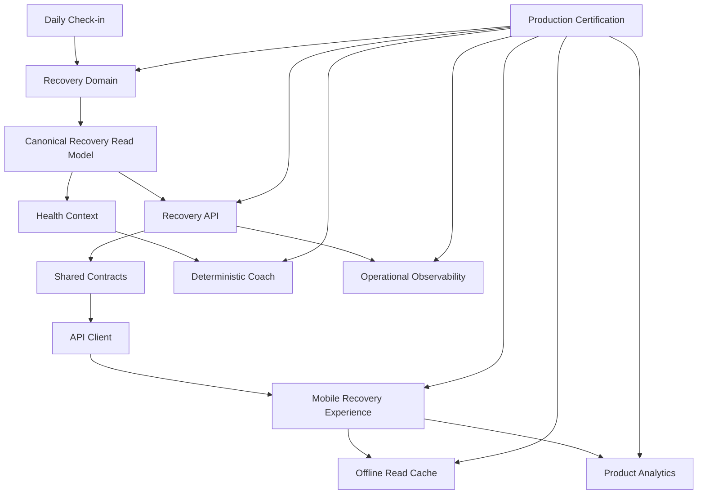

# Epic A2 Production Certification

## Certification Verdict

```text
CERTIFIED_WITH_CONDITIONS
```

No P0 release blocker was found in the reviewed A2 path. The controlled rollout gate is supported by passing unit, integration, build and Mongo-backed E2E evidence. Full rollout is not certified until the external device, offline, account-switch, screen-reader and operational sign-off conditions are completed.

## Executive Summary

The A2 architecture is coherent: RecoveryModule owns canonical semantics, public read models hide internal snapshot data, shared contracts and the API client preserve the boundary, and mobile renders server decisions without recalculating them. The Coach uses canonical Recovery semantics when available and retains a documented legacy compatibility path. The read cache is versioned, allowlisted and owner-namespaced, with network-first fallback. API E2E passed under approved elevated local-port execution with 16 suites and 56 tests. Remaining evidence gaps are physical/manual validation, production telemetry dashboards/alerts, and the non-hardware-backed local cache threat-model review.

## Scope

This certification reviews Prompts 1–8, including backend read models, contracts, API client, mobile UI/integration, deterministic Coach alignment, analytics, observability and offline read cache. No production code correction was required during Prompt 9.

## Evidence Reviewed

- A2 commits: `8f29173`, `5da9d57`, `26aa12a`, `b13cf88`, `aa2b3ad`, `667cec0`, `79d322f`.
- A2 audit, architecture, product, plan and file-change-map documents.
- A1 certification and external validation documents.
- API, mobile, contracts, API client, E2E and storage source/tests.
- `git diff --check` and dependency/lockfile inspection.

## Certification Matrix

| Area                     | Status         | Evidence                                              | Risk                                   | Severity | Action                                 |
| ------------------------ | -------------- | ----------------------------------------------------- | -------------------------------------- | -------- | -------------------------------------- |
| Architecture             | PASS           | Recovery read-model flow and module boundaries        | None found in A2 path                  | —        | Maintain ownership                     |
| Domain ownership         | PASS_WITH_RISK | Recovery policies/read-model mapper                   | Legacy consumers remain                | P2       | Track fallback removal                 |
| Backend/API              | PASS           | Controllers, use cases, mapper, bounded history       | External load data absent              | P2       | Monitor after rollout                  |
| Contracts                | PASS           | Shared `RecoveryExperience*` types and privacy tests  | Runtime parity relies on E2E           | P2       | Keep E2E in release gate               |
| API client               | PASS           | Route/query/error tests                               | No Nx test target                      | P2       | Preserve direct test command           |
| Mobile UI/integration    | PASS_WITH_RISK | 21 suites, state mapper, route and container          | No device execution                    | P1       | Complete device matrix                 |
| Dashboard/navigation     | PASS           | CTA and category-source inspection/tests              | Manual navigation not executed         | P1       | Validate on device                     |
| Daily Check-in flow      | PASS_WITH_RISK | Focus refresh and E2E chain                           | Physical return flow untested          | P1       | Validate externally                    |
| Coach                    | PASS_WITH_RISK | Canonical branch and deterministic tests              | Legacy fallback active                 | P2       | Measure fallback                       |
| Training consistency     | PASS_WITH_RISK | Shared semantic action review                         | Full matrix not E2E-proven             | P2       | External regression review             |
| Analytics                | PASS           | Typed allowlist/noop/provider isolation tests         | No external collector                  | P2       | Validate collector separately          |
| Observability            | PASS_WITH_RISK | Redacted Recovery logger adapter/tests                | No external dashboards/alerts          | P1       | Configure operational monitoring       |
| Offline cache            | PASS_WITH_RISK | Schema/storage/privacy/lifecycle tests                | AsyncStorage not hardware-backed       | P1       | Complete threat-model/device review    |
| Authentication/isolation | PASS_WITH_RISK | Auth cleanup, opaque owner namespace, E2E auth        | Account switch not physically executed | P1       | Execute account matrix                 |
| Privacy/security         | PASS_WITH_RISK | Public allowlists and negative tests                  | Local cache at-rest limitation         | P1       | Security sign-off                      |
| Accessibility            | PASS_WITH_RISK | Labels, roles, textual chart/offline alternatives     | VoiceOver/TalkBack not run             | P1       | Manual assistive validation            |
| Performance              | PASS_WITH_RISK | Bounded history, request deduplication code review    | No production latency sample           | P2       | Measure p95 after rollout              |
| Concurrency              | PASS_WITH_RISK | Operation/session generation guards and unit coverage | Device lifecycle not exercised         | P1       | External lifecycle test                |
| Legacy compatibility     | PASS_WITH_RISK | Legacy endpoints/fallback preserved and documented    | Real legacy DB not audited             | P1       | Run legacy-data audit                  |
| Tests                    | PASS           | API 209/1344; mobile 21/99; client 12/12              | No dedicated hook render suite         | P2       | Add if test harness becomes available  |
| E2E                      | PASS_WITH_RISK | 16/56 passed with local-port permission               | A2 Coach semantic E2E depth limited    | P1       | Add external semantic flow if required |
| Documentation            | PASS           | A2 architecture/product/analytics/cache docs          | Sign-off pending                       | P2       | Complete release sign-offs             |
| Deployment/rollback      | PASS_WITH_RISK | Versioned routes/cache and documented rollback        | No dedicated A2 remote flag            | P1       | Use controlled version/release rollout |
| Operability              | PASS_WITH_RISK | Runbook and signals documented below                  | External alerting absent               | P1       | Configure alerts before broad rollout  |

## Architecture

The verified flow is:

```text
Daily Check-in
→ Recovery domain
→ canonical Recovery semantics
→ public read model
→ API
→ shared contracts
→ API client
→ mobile
```

The parallel deterministic path is:

```text
canonical Recovery semantics
→ Health Context
→ Coach
```

Controllers delegate to use cases, the API client transports data, mobile maps response state only, and the cache persists an allowlisted public model. No new domain calculation was found in the A2 path.

## Domain Ownership

`RecoveryModule` owns score selection, freshness/rebuild, category mapping, factor breakdown, deterministic insight and trend policy. `ProgressModule` triggers rebuild. Health Context composes canonical Recovery for Coach. Dashboard and mobile are derived views. Legacy Coach and Training paths remain compatibility layers, not new A2 owners.

## Backend

`GET /recovery/experience/current` and `GET /recovery/experience/history` use authenticated controllers, bounded query validation, safe read-model mappers and explicit technical/domain error semantics. Public responses exclude `sourceContext`, `userProfileId`, database metadata and raw check-in payloads. Current rebuild and history queries are instrumented with redacted low-cardinality signals.

## Contracts

Backend DTOs, `packages/types` contracts, API client methods and mobile cache validation agree on the public fields: availability, freshness, score, fatigue score, category, last update, trend, public factors, insight and bounded history. Negative privacy fixtures reject internal fields.

## API Client

The canonical methods are `getCurrentRecoveryExperience()` and `getRecoveryExperienceHistory({ days? })`. HTTP and network errors remain errors; the client does not synthesize domain states.

## Mobile

The screen is state-driven and uses `useRecoveryExperience`, with independent current/history resources, refresh, retry, focus refresh and Daily Check-in return handling. Category, trend, freshness, availability, factors and insight are received from the backend. Offline cache presentation adds `dataSource` metadata without rewriting canonical freshness.

## Dashboard

The Dashboard Recovery card consumes the public current Experience response, presents backend category/freshness and routes to the dedicated Recovery screen. No local score threshold is used in this card. Manual navigation validation remains pending.

## Daily Check-in

The unavailable-data action opens the canonical Daily Check-in route. Returning to Recovery triggers focus refresh. Automated coverage confirms the backend Daily Check-in → Recovery chain; physical lifecycle validation is still required.

## Coach

The canonical Coach branch consumes Recovery read-model semantics and remains deterministic with LLM disabled. It respects availability, freshness, factor impacts and insight action. The legacy snapshot path remains a documented compatibility fallback and must be monitored rather than treated as the canonical A2 path.

## Training Consistency

The Recovery action semantics are shared with the canonical Coach context and do not introduce Adaptive Training. No explicit contradiction was found in the reviewed A2 path. Full device/product validation of category-to-guidance presentation remains a P2 follow-up.

## Analytics

Implemented product events are explicit user actions only: Dashboard CTA, screen view, refresh, full retry, history retry and Check-in handoff. The provider is typed, allowlisted and noop-safe. Score, category, factors, trend, insight, check-in values, identity and payloads are excluded.

## Observability

Redacted signals cover current/history requests, rebuild attempt/success/failure, legacy encounters, trend data sufficiency, mapping failures and Coach context outcomes. No score, category, factor, payload, token, query or user identifier is used. External dashboards and alerts are not configured in this repository.

## Offline Cache

`AsyncStorageRecoveryCache` uses version `v1`, opaque session namespaces, allowlisted public data, current/history merge, 24-hour soft age and seven-day hard expiry.

```text
401 does not use cache.
403 does not use cache.
Account switching does not expose another account’s cache.
Canonical freshness is not overwritten.
Expired cache never renders.
```

These guarantees are code/test verified; physical account-switch and offline execution remain pending.

## Security

Authentication guards and server-side profile ownership are present. Logout clears Recovery cache and session namespace. No auth bypass, cross-account response path or sensitive public DTO exposure was found in reviewed A2 code. AsyncStorage is not hardware-backed or custom-encrypted; this remains a production threat-model condition.

## Privacy

| Data                                 | Backend           | API               | Mobile memory          | Cache          | Analytics | Logs | Allowed               |
| ------------------------------------ | ----------------- | ----------------- | ---------------------- | -------------- | --------- | ---- | --------------------- |
| score/category/fatigue               | Yes               | Public read model | Yes                    | Allowlisted    | No        | No   | Product/cache only    |
| public factors/insight/trend/history | Yes               | Safe              | Yes                    | Allowlisted    | No        | No   | Product/cache only    |
| raw check-in values                  | Internal context  | No                | No A2 UI/cache         | No             | No        | No   | Backend internal only |
| owner key                            | Session namespace | No                | Session/cache boundary | Namespace only | No        | No   | Local isolation only  |
| userProfileId/sourceContext          | Internal          | No                | No                     | No             | No        | No   | Never public          |
| Coach content                        | Internal response | No cache          | Runtime only           | No             | No        | No   | Runtime only          |

## Accessibility

- Code verified: headings, score labels, factor grouping, textual trend/chart alternative, offline notice, retry labels and color-independent copy.
- Test verified: automated mobile suite coverage for accessibility helpers/state text.
- Manual validation required: VoiceOver, TalkBack, 100/150/200% scaling, reduced motion and high-contrast behavior.

## Performance

History is bounded to the requested range. Current/history requests are orchestrated independently and duplicate operations are guarded. No production latency dataset exists; p95 measurement is a rollout condition.

## Concurrency

The mobile hook uses an operation guard, mounted checks and session generation checks. Cache writes use allowlisted records. Account switching during an in-flight request remains a required physical/device validation scenario.

## Error Semantics

| Condition                 | Backend           | API client | Mobile               | Cache                         | Coach                  |
| ------------------------- | ----------------- | ---------- | -------------------- | ----------------------------- | ---------------------- |
| insufficient data         | Domain response   | Preserved  | Empty state          | May cache public state        | Check-in guidance      |
| not available             | Domain response   | Preserved  | Empty state          | May cache public state        | Neutral fallback       |
| processing failed         | Domain response   | Preserved  | Retry state          | Not written as useful current | Safe fallback          |
| network error             | N/A               | Error      | Error/cache fallback | Only recoverable transport    | Safe fallback          |
| 401/403                   | HTTP error        | Error      | Auth/error flow      | No fallback                   | No fabricated Recovery |
| validation/contract error | HTTP/client error | Error      | Error                | No fallback                   | Safe fallback          |
| corrupted/expired cache   | N/A               | N/A        | Offline miss/error   | Removed/ignored               | N/A                    |
| history-only error        | N/A               | Error      | Current preserved    | Partial cache                 | N/A                    |

## Legacy Compatibility

Legacy endpoints and Coach fallback remain for A1 compatibility. Legacy snapshots are classified rather than silently treated as current in the public read model. A populated legacy database was not inspected in this certification.

## Tests

| Layer                |               Suites | Tests | Status         | Gaps                                        |
| -------------------- | -------------------: | ----: | -------------- | ------------------------------------------- |
| API unit/integration |                  209 | 1,344 | PASS           | No production load test                     |
| Mobile               |                   21 |    99 | PASS           | No device execution                         |
| API client direct    |                    1 |    12 | PASS           | No Nx `api-client:test` target              |
| Types                |           Build only |     — | PASS           | No Nx `types:test` target                   |
| E2E                  |                   16 |    56 | PASS_WITH_RISK | External A2 mobile/Coach flow still pending |
| Accessibility        | Automated code/tests |     — | PASS_WITH_RISK | VoiceOver/TalkBack pending                  |

## Builds

| Target                  | Result |
| ----------------------- | ------ |
| `types`                 | PASS   |
| `api-client`            | PASS   |
| `api`                   | PASS   |
| `mobile` web bundle     | PASS   |
| `mobile` Android bundle | PASS   |
| `mobile` iOS bundle     | PASS   |

`npm run lint` passed for the configured `types` and `api-client` projects. `api:lint` and `mobile:lint` targets do not exist; this is documented rather than treated as a pass.

## E2E

The first in-sandbox run failed before test execution because MongoMemoryServer could not bind a port (`listen EPERM`, code 48). The same command was then executed with local-port permission and passed:

```text
16 suites passed
56 tests passed
```

The passing E2E includes current/history public Recovery responses, privacy assertions and no-check-in availability in `progress-daily-check-in.e2e-spec.ts`. It does not prove physical offline cache, screen readers or production device lifecycle.

## Configuration

AI/LLM defaults remain disabled. No dedicated remote A2 flag, external analytics provider, alerting backend or new storage framework was introduced. Controlled rollout must therefore use the existing release/version/navigation exposure mechanism until an approved flag mechanism is available.

## Rollback

1. Stop new exposure of the Dashboard Recovery CTA/route using the release exposure mechanism.
2. Keep backend endpoints and A1-compatible endpoints available.
3. Preserve Daily Check-in and Recovery snapshots; do not delete domain data.
4. Ignore cache key `elev9.recovery-experience.v1:*` if cache rollback is required; cleanup can follow separately.
5. Keep Coach legacy compatibility active while investigating canonical read-model failures.

Rollback must not delete check-ins, alter Recovery algorithms or mix accounts.

## Operational Runbook

### Current endpoint failure

Inspect current request technical-failure signals and latency. Confirm auth/profile status, repository/rebuild errors and mapping failures. Pause rollout if failures exceed the agreed threshold; preserve A1 endpoints and use the rollback sequence.

### History endpoint failure

Treat as partial degradation: current Recovery may remain usable. Inspect history request signals and restore the endpoint without changing current semantics.

### Rebuild failure

Inspect rebuild attempt/failure signals and source/check-in freshness through protected server diagnostics. Retry through the endpoint. Do not convert failure to score zero or low Recovery.

### Cache corruption

The adapter removes invalid records and falls back to network. If widespread, disable cache exposure through release configuration and investigate storage/runtime behavior.

### Analytics failure

No product impact is expected. Provider failures must remain isolated; do not block navigation, Recovery, retry or Check-in.

### Coach compatibility fallback increase

Treat as a signal of missing/failed canonical Health Context. Investigate read-model construction and legacy snapshot rate; do not silently expand legacy behavior.

## Alerting Recommendations

`RECOMMENDED / NOT_CONFIGURED`: current technical failure rate, history technical failure rate, rebuild failure rate, mapping failures, Coach compatibility fallback increase, p95 latency and authorization anomalies. Do not use score/category/factor as dimensions.

## SLO Recommendations

These are proposed targets, not measured production results:

| Signal                  | Recommendation | Status                     |
| ----------------------- | -------------: | -------------------------- |
| Current request success |         ≥99.5% | RECOMMENDED / NOT_MEASURED |
| History request success |           ≥99% | RECOMMENDED / NOT_MEASURED |
| Current p95 latency     |        <500 ms | RECOMMENDED / NOT_MEASURED |
| Rebuild failure         |            <1% | RECOMMENDED / NOT_MEASURED |
| Privacy incidents       |              0 | RELEASE REQUIREMENT        |
| Cross-account leaks     |              0 | RELEASE REQUIREMENT        |

## Risk Register

| ID  | Risk                                                   | Likelihood | Impact | Severity | Mitigation                            | Owner         |
| --- | ------------------------------------------------------ | ---------- | ------ | -------- | ------------------------------------- | ------------- |
| R1  | Physical iOS/Android/Web validation absent             | Medium     | High   | P1       | Execute external device matrix        | QA/Release    |
| R2  | VoiceOver/TalkBack/manual scaling absent               | Medium     | High   | P1       | Manual accessibility sign-off         | Accessibility |
| R3  | Offline/account-switch lifecycle not physically proven | Medium     | High   | P1       | External network/account matrix       | Mobile QA     |
| R4  | AsyncStorage lacks custom/hardware-backed encryption   | Medium     | High   | P1       | Threat-model/security review          | Security      |
| R5  | Coach legacy compatibility fallback remains            | Medium     | Medium | P2       | Monitor fallback and plan removal     | Coach         |
| R6  | External dashboards/alerts absent                      | High       | Medium | P1       | Configure operational monitoring      | Operations    |
| R7  | Real legacy database not audited                       | Medium     | Medium | P1       | Run non-destructive legacy audit      | Backend       |
| R8  | API/mobile latency not measured in production          | High       | Medium | P2       | Measure p95 during controlled rollout | Operations    |
| R9  | Package-specific lint targets absent                   | Certain    | Low    | P2       | Retain configured lint and builds     | Engineering   |

## Rollout Recommendation

The evidence supports internal or tightly controlled canary exposure only. Do not proceed to broad rollout until the open conditions are closed. A suggested progression is 5% after external validation and named sign-off, then 25% and 100% only after operational signals remain within the approved release thresholds. Keep the legacy path and rollback mechanism available throughout the progression.

## Open Conditions

Before rollout beyond internal/limited exposure:

1. Execute passing external device validation on iOS and Android, including online/offline, logout, account switch, cache expiry/corruption and return from Daily Check-in.
2. Execute VoiceOver, TalkBack and font-scaling validation.
3. Run the A2 public endpoint/Coach semantic E2E flow in the release environment and preserve evidence.
4. Complete security review of AsyncStorage wellness-data exposure and real legacy snapshots.
5. Configure operational dashboards/alerts for current/history/rebuild/mapping/fallback signals.
6. Confirm release exposure and rollback owner; no full rollout without a reversible release mechanism.

## External Validation Plan

| Matrix        | Required cases                                                                                        |
| ------------- | ----------------------------------------------------------------------------------------------------- |
| Devices       | small/recent iPhone, small/recent Android, Web                                                        |
| Network       | online, offline, slow, timeout, recovery                                                              |
| Accounts      | login, logout, switch, expired session, 401, 403                                                      |
| Accessibility | VoiceOver, TalkBack, 100/150/200% scaling, reduced motion, high contrast                              |
| Functional    | available, insufficient, unavailable, processing failure, stale, legacy, unknown, empty/error history |
| Cache         | recent, old, expired, corrupted, partial current/history                                              |

## Production Checklist

- [x] Architecture reviewed
- [x] Domain ownership reviewed
- [x] Backend reviewed
- [x] Contracts reviewed
- [x] API client reviewed
- [x] Mobile code reviewed
- [x] Navigation/Dashboard reviewed
- [x] Daily Check-in integration reviewed
- [x] Coach reviewed
- [x] Training consistency reviewed
- [x] Analytics privacy reviewed
- [x] Observability reviewed
- [x] Offline cache reviewed
- [x] Authentication and account isolation code-reviewed
- [x] Security/privacy code review completed
- [x] Accessibility code review completed
- [ ] Manual accessibility approved
- [x] Automated tests approved
- [x] Builds approved
- [x] Configured lint approved
- [ ] Package-specific API/mobile lint targets available
- [x] Rollback documented
- [x] Runbook documented
- [ ] External dashboards/alerts configured
- [x] E2E approved with elevated local-port execution
- [ ] External device validation approved
- [ ] External offline validation approved

## Final Sign-off

```text
Architecture Sign-off: Pending named owner
Backend Sign-off: Pending named owner
Mobile Sign-off: Pending named owner
Product Sign-off: Pending named owner
Privacy Sign-off: Pending named owner
Security Sign-off: Pending named owner
Accessibility Sign-off: Pending manual validation
QA Sign-off: Pending external device matrix
Operations Sign-off: Pending dashboards/alerts
Release Manager Sign-off: Pending rollout decision
```


