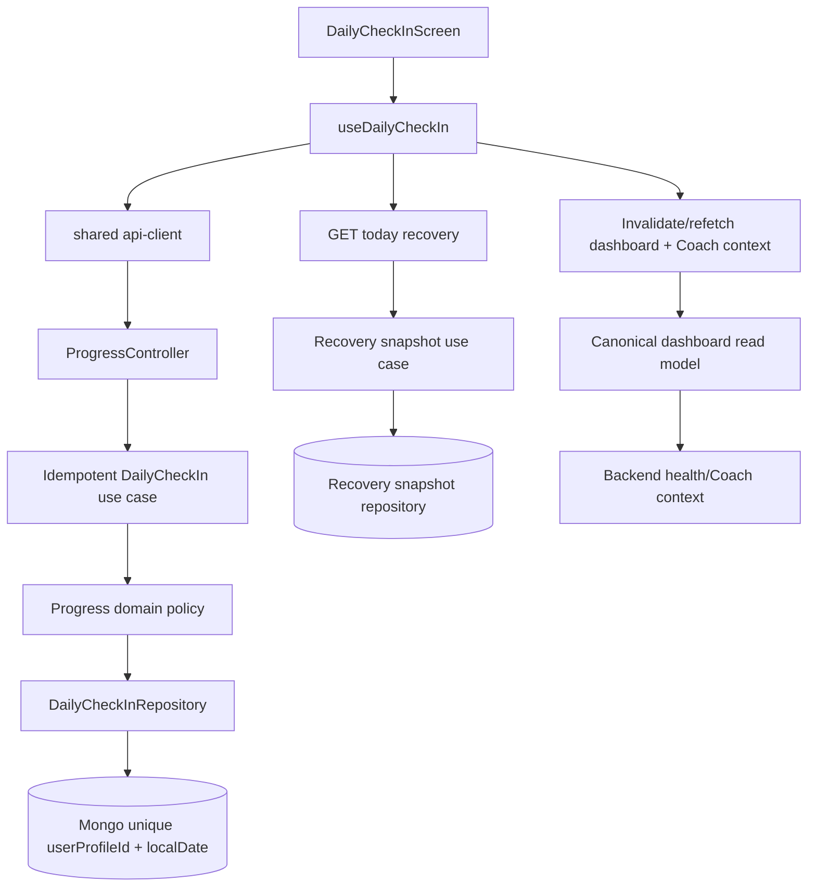

# Release 2.1 Epic A1 — Daily Check-in Implementation Plan

## 1. Objective

Deliver a sub-minute, mobile-first Daily Check-in that creates one canonical state per user local day, refreshes derived recovery/dashboard data, and exposes a truthful Coach context without moving business rules into the UI.

## 2. Scope

The minimum A1 signal set is the four fields already implemented: `energyLevel`, `sleepQuality`, `muscleSoreness`, and `motivationLevel`, each 1–5. Scope also includes today status, submission feedback, history reuse, explicit edit policy, local-day identity, idempotency, dashboard entry/refresh, recovery refresh, deterministic Coach-context refresh, analytics definitions, accessibility, error/retry handling and end-to-end proof.

Stress, pain, mood, fatigue, sleep duration, hydration, adherence and notes are not in the current model. They require a product decision and are out of the minimum implementation unless formally added to scope.

## 3. Non-goals

No LLM activation, new agent runtime, medical diagnosis, wearable integration, push orchestration, microservice, broad offline synchronization, nutrition/training engine rewrite, or expansion to every proposed signal. Do not duplicate recovery or Coach rules in mobile.

## 4. Architectural Ownership

`progress` owns the raw Daily Check-in command, aggregate/entity, validation, business-day identity and persistence. `recovery` owns derived readiness/snapshot calculation and persistence. `dashboard` owns read composition and pending-state presentation. `ai` owns context aggregation and Coach decisions. Mobile owns presentation and remote/local UX state only.

Avoid a direct Progress→Recovery module dependency because `RecoveryModule` already imports Progress. For A1, prefer the existing read-after-write boundary: after an idempotent write, the client invalidates/refetches today recovery/dashboard, and the backend’s existing recovery use case recalculates when the snapshot is missing or explicitly stale. If immediate server-side recalculation becomes mandatory, introduce an application event/orchestrator at a higher-level boundary rather than reversing domain ownership.

## 5. Target Architecture

## 6. Target Data Flow

1. Resolve authenticated `userProfileId` and persisted user timezone on the backend.
2. Derive and persist a business-day key with an explicitly documented timezone policy; do not use client wall-clock data as authority without validation.
3. Validate the four 1–5 values.
4. Upsert the day record or apply the documented edit policy; repeated requests return the same canonical record.
5. Return record identity, local date, updated timestamp and freshness/status metadata.
6. Re-read today recovery through the existing recovery boundary, recalculating when its source check-in is newer or snapshot is absent.
7. Invalidate/refetch dashboard and Coach context; display changed recovery signals and explanation where available.

## 7. Backend Work

| Task | Objective                                        | Files likely affected                                                                                                                                    | Dependencies                   | Acceptance criteria                                                                    | Tests                                 | Risks                                      |
| ---- | ------------------------------------------------ | -------------------------------------------------------------------------------------------------------------------------------------------------------- | ------------------------------ | -------------------------------------------------------------------------------------- | ------------------------------------- | ------------------------------------------ |
| B1   | Decide and document business-day/timezone policy | `apps/api/src/modules/progress/**`, `apps/api/src/modules/recovery/application/services/recovery-date.service.ts`, `docs/adr/adr-002-recovery-system.md` | User profile timezone behavior | Boundary tests prove local-day identity; UTC behavior is not silently retained         | timezone/unit tests                   | Historical migration ambiguity             |
| B2   | Add canonical day identity to domain/contract    | Existing `daily-check-in.entity.ts`, repository port, DTO/output                                                                                         | B1                             | Read/write can identify “today” without createdAt heuristics                           | domain/contract tests                 | Breaking public response                   |
| B3   | Make write idempotent                            | `create-daily-check-in.use-case.ts`, repository adapter/schema                                                                                           | B2                             | Retry and concurrent same-day requests yield one record; values follow edit policy     | use-case/repository integration tests | Race conditions if index absent            |
| B4   | Add today read semantics                         | Existing Progress controller/use-case directories                                                                                                        | B2                             | Authenticated caller receives pending/completed state for local day                    | controller/use-case tests             | Duplicate read models                      |
| B5   | Define edit behavior                             | Existing create use-case/controller or a confirmed update use-case directory                                                                             | B3                             | Either same-day edit works with audit semantics or API rejects it with documented code | policy tests                          | Accidental historical mutation             |
| B6   | Refresh derived recovery safely                  | Existing `GetTodayRecoveryUseCase` and `BuildRecoverySnapshotUseCase`                                                                                    | B2/B3                          | Newer check-in cannot leave an older same-day snapshot as authoritative                | recovery integration tests            | Module cycle if direct import is added     |
| B7   | Return safe errors and freshness                 | Existing HTTP DTO/error conventions                                                                                                                      | B3/B4                          | Validation, auth, conflict and internal errors are typed and non-sensitive             | controller tests                      | Client cannot distinguish retryable errors |

## 8. Shared Contract Work

Modify `packages/types/src/progress/index.ts` and regenerate the package outputs through the existing Nx target. Add only fields needed for day status, local date, updated timestamp and explicit edit/result semantics. Keep the four existing signal names and ranges. Confirm API and mobile consume the same types; do not maintain parallel mobile DTOs.

## 9. API Client Work

Reuse `packages/api-client/src/progress-api.ts:createDailyCheckIn` and `getDailyCheckInHistory`. Add today/update methods only if the chosen contract requires them. Ensure errors preserve API error codes and that the mobile facade (`apps/mobile/src/api/client.ts`) exposes the shared methods without duplicating request schemas.

## 10. Mobile Work

Create the confirmed screen/hook under existing `apps/mobile/src/screens` and `apps/mobile/src/hooks` patterns. Use existing `packages/ui` primitives. Provide four quick 1–5 controls, accessible labels/hints, validation before submit, disabled submit while in flight, success confirmation, error with retry, empty/history link, and session-preserved draft state. Do not calculate readiness or recommendations locally.

## 11. Navigation Work

Modify `apps/mobile/src/navigation/app-navigator.tsx` to add a create route under the existing authenticated navigator. Preserve `DailyCheckInHistory`; change the dashboard “Complete Check-In” action to the create route and expose history from the completed state.

## 12. Dashboard Integration Work

Modify `apps/mobile/src/hooks/use-dashboard.ts`, `apps/mobile/src/screens/dashboard-screen.tsx`, and the confirmed dashboard read model path so pending/completed status comes from the backend. After successful submission, invalidate/refetch check-in status, recovery, dashboard and Coach context. Preserve per-domain loading/error behavior and prevent a successful mutation from leaving stale recovery visible.

## 13. Recovery Integration Work

Reuse `GetTodayRecoveryUseCase` and `BuildRecoverySnapshotUseCase`. Add source freshness comparison (check-in updatedAt/local date versus snapshot inputs) before returning a snapshot. Ensure the response exposes existing readiness, trend, recommended intensity and influences. Do not add `motivationLevel` to the calculator without a product/rules decision; document it as context-only or explicitly include it with tests.

## 14. Coach Intelligence Integration Work

Prove that `BuildUserHealthContextService` receives the updated check-in and current recovery after submission. In default configuration, deterministic context and safe fallback must work without an external LLM. If AI flags remain false, label the UI behavior honestly; A1 completion must not depend on LLM, Responses API, streaming or agent runtime activation.

## 15. Persistence and Idempotency Work

Use a stable day key based on backend-resolved user timezone and a unique index on the owner plus that key. Choose one explicit mutation contract: idempotent POST-upsert or POST-create plus same-day PUT. Handle duplicate-key races by re-reading the canonical record. Define whether edits replace values, increment a revision, or are prohibited; retain audit timestamps and do not create a second daily document.

## 16. Offline Strategy

| Classification       | Decision                                                                                                                                                                                             |
| -------------------- | ---------------------------------------------------------------------------------------------------------------------------------------------------------------------------------------------------- |
| Required for Epic A1 | Detect/represent offline or request failure, keep entered values during the screen session, disable duplicate submission, allow retry, and keep dashboard degraded rather than fabricating recovery. |
| Recommended          | Durable draft in the existing AsyncStorage approach, with expiry and clear-on-success.                                                                                                               |
| Deferred             | Offline write queue, conflict resolution, eventual sync and multi-device merge.                                                                                                                      |

## 17. Analytics Plan

| Event                   | Trigger                                        | Required properties                                               | Owner          | Validation                            |
| ----------------------- | ---------------------------------------------- | ----------------------------------------------------------------- | -------------- | ------------------------------------- |
| `DailyCheckInViewed`    | Form or completed-state screen becomes visible | source, localDate, state, schemaVersion                           | Mobile/Product | unit event test + provider inspection |
| `DailyCheckInStarted`   | User changes first signal or presses start     | source, localDate, schemaVersion                                  | Mobile/Product | component test                        |
| `DailyCheckInCompleted` | Server confirms canonical save                 | localDate, durationMs, edit, recoveryRefreshStatus, schemaVersion | Mobile/Product | API-to-event integration test         |
| `DailyCheckInEdited`    | Same-day edit confirmed                        | localDate, durationMs, schemaVersion                              | Mobile/Product | mutation test                         |
| `DailyCheckInFailed`    | Validation/network/server failure after submit | errorCode, retryable, networkState, schemaVersion                 | Mobile/Product | failure/retry test                    |
| `DailyCheckInAbandoned` | Form unmounts after started without success    | localDate, completionStep, schemaVersion                          | Mobile/Product | lifecycle test                        |

Do not send raw health values, free-text notes or direct identifiers unless privacy review explicitly approves them. Existing logs/correlation are technical observability, not this event taxonomy.

## 18. Testing Plan

| Layer                 | Test                                                                    | Purpose                        | Blocking                            |
| --------------------- | ----------------------------------------------------------------------- | ------------------------------ | ----------------------------------- |
| Domain                | Local-day derivation, four-signal policy, edit policy                   | Prove canonical business rules | Yes                                 |
| Use case              | Create, retry, duplicate, concurrent same day, profile/timezone failure | Prove idempotency and errors   | Yes                                 |
| Repository            | Unique index/upsert/race behavior against Mongo                         | Prove persistence guarantee    | Yes                                 |
| Controller            | Auth, validation, today/status, error contracts                         | Prove public API               | Yes                                 |
| Contract              | Shared type/client serialization                                        | Prevent API/mobile drift       | Yes                                 |
| Recovery integration  | New check-in invalidates/rebuilds stale snapshot                        | Prove derived state            | Yes                                 |
| Dashboard integration | Pending→completed and refresh                                           | Prove first value              | Yes                                 |
| Mobile hook/component | loading, validation, submit lock, success, retry, offline               | Prove UX states                | Yes                                 |
| Navigation            | Dashboard CTA reaches create route; completed state reaches history     | Prevent dead end               | Yes                                 |
| E2E                   | register/login/profile→check-in→recovery→dashboard/Coach                | Prove full A1                  | Yes                                 |
| Analytics             | Six event triggers and privacy-safe properties                          | Prove measurement              | No for first PR, yes before release |
| Accessibility         | Labels, focus/order, contrast, screen reader, touch target              | Prove inclusive form           | Yes                                 |

## 19. Migration Strategy

First deploy additive schema fields/index support and instrument duplicate detection. Backfill existing documents with a deterministic legacy date only when the timestamp and selected timezone policy make it unambiguous; otherwise retain them as historical records and exclude them from canonical “today” uniqueness. Then enable the unique index after duplicate audit/quarantine. Do not silently merge conflicting same-day records.

## 20. Compatibility Strategy

Keep existing POST path and four request fields. Add response fields compatibly where possible. Preserve GET history and existing screen. During rollout, accept legacy records as history but use only new day-keyed records for canonical today status. Version or flag any breaking edit semantics.

## 21. Feature Flag Strategy

No A1-specific flag currently exists. If rollout control is required, add one with default false in non-production and an explicit production value; document enabled/disabled behavior and test both paths. Do not describe the feature as ready while its default path is disabled. Existing `AI_COACH_INTELLIGENCE_ENABLED`, `AI_LLM_ENABLED` and `AI_AGENT_RUNTIME_ENABLED` remain independent and must not gate deterministic A1 completion.

## 22. Observability Requirements

Log correlation id, operation name, profile-safe identifier, local-date key hash or non-sensitive key, outcome, latency, duplicate/retry result and recovery refresh outcome. Emit metrics for submit success/failure, duplicate prevention, recovery refresh latency/staleness and dashboard refresh failures. Never log raw health values. Add alertable error rates only after the deployment environment has a metrics sink.

## 23. Accessibility Requirements

Every signal control must have a visible label, accessible value/state, logical order, sufficient touch target, focus behavior, error association and non-color-only feedback. The completion confirmation and retry error must be announced. Test with the existing React Native accessibility conventions and real device/screen-reader checks.

## 24. Documentation Updates

Update the recovery ADR, Progress/API communication flow, bounded-context/domain docs, relevant `docs/specs/progress` material, roadmap checklist and feature matrix. Document signal scope, local-day/timezone policy, edit semantics, idempotency, default flag, offline limitation and analytics privacy.

## 25. Implementation Sequence

1. Confirm domain ownership and date/edit decisions.
2. Add additive day identity and migration/duplicate policy.
3. Consolidate backend idempotent behavior and today read.
4. Align shared contracts and API client.
5. Add mobile form/hook and validation.
6. Connect authenticated navigation and correct dashboard CTA.
7. Add dashboard pending state and post-submit invalidation.
8. Make recovery freshness/recalculation behavior provable.
9. Verify Coach context refresh with deterministic flags.
10. Add product analytics transport/events.
11. Add unit, integration, accessibility and E2E tests.
12. Validate offline/error behavior and update docs.
13. Run the final A1 audit and release checklist.

## 26. Pull Request Strategy

Use small PRs: (1) date/idempotency backend, (2) contracts/client, (3) mobile form/navigation, (4) dashboard/recovery refresh, (5) analytics and observability, (6) integration/E2E/accessibility, (7) documentation and final audit. Each PR must include only its layer’s tests and no unrelated refactor.

## 27. Commit Strategy

Suggested commits, not executed: `feat(progress): make daily check-in idempotent`; `feat(types): expose daily check-in state`; `feat(mobile): add daily check-in flow`; `feat(dashboard): refresh after daily check-in`; `test: cover daily check-in end to end`; `docs: specify daily check-in semantics`.

## 28. Definition of Ready

Domain owner, signal scope, timezone source, day-key format, edit policy, migration approach, API compatibility, analytics privacy and offline boundary are approved; affected paths and test environment are known; no unresolved direct Progress→Recovery dependency remains.

## 29. Definition of Done

The dashboard opens a real form; four fields validate and save once per user local day; retries are safe; today/history/edit behavior is documented; recovery refreshes from new input; dashboard and deterministic Coach context refresh; loading/error/offline/accessibility states work; analytics are emitted through a real transport; critical tests including E2E pass; no canonical business logic exists in mobile; docs and rollout configuration are updated.

## 30. Epic Acceptance Checklist

- [ ] Dashboard CTA opens Daily Check-in creation.
- [ ] Form is completable in under one minute.
- [ ] Four fields validate at API and UI boundaries.
- [ ] One canonical record exists per user local day.
- [ ] Repeated submit is idempotent and duplicate-safe.
- [ ] Edit is supported or explicitly rejected by documented rule.
- [ ] Today status and history are available.
- [ ] Recovery snapshot is fresh after successful submission.
- [ ] Dashboard reflects completion and changed recovery.
- [ ] Coach context consumes updated signals; LLM is not required.
- [ ] Success, loading, error, retry and offline states are tested.
- [ ] Accessibility checks pass.
- [ ] Six product events are defined and delivered safely.
- [ ] Full A1 E2E passes in a real test environment.
- [ ] Migration, compatibility, observability and docs are complete.

## Backend Consolidation Update — Prompt 2

The backend implementation selected the smallest compatible path:

- Canonical owner: `ProgressModule` and `DailyCheckIn`.
- Mutation: existing `POST /progress/daily-check-in` now performs an atomic upsert for the current day, preserving the public path.
- Today read: `GET /progress/daily-check-in/today` returns `completedToday` and the canonical record.
- Local day: `DailyCheckInDateService` resolves `localDate` from `UserProfile.timezone` using IANA runtime validation.
- Current profile contract: profiles currently allow only `UTC`; invalid/missing runtime values fall back to `UTC` as the documented technical fallback.
- Identity: `userProfileId + localDate`, with a partial unique Mongo index so legacy documents without `localDate` do not prevent startup.
- Edit policy: submitting again for the current day updates the canonical document; historical edit remains unavailable because history is read-only.
- Recovery: `CreateDailyCheckInUseCase` invokes `BuildRecoverySnapshotUseCase` synchronously after the upsert. A recalculation failure returns a stable conflict error; the saved record remains retryable and no second record is created.
- Legacy compatibility: UTC legacy records within the current UTC day are eligible for promotion during upsert/read; no destructive backfill or global migration framework was introduced.
- IA: no AI flag, LLM, agent runtime, streaming or tool calling was changed.

The implementation deliberately leaves shared package types/API-client alignment for Prompt 3. Backend HTTP DTOs expose `localDate`, `timezone` and `updatedAt` without exposing Mongo internals.

Validation status for Prompt 2: `api` build passed; `api` unit/integration-oriented suite passed with 205 suites and 1,327 tests; `types` and `api-client` builds passed; configured lint passed. The E2E target remains unvalidated because `MongoMemoryServer` cannot bind/listen in the sandbox (`EPERM`, code 48). The new E2E file is present and must be run in an environment with MongoMemoryServer networking permitted.

## Shared Contracts and API Client Update — Prompt 3

The public contract now follows the actual backend DTOs and exposes only the four confirmed signals:

- `SubmitDailyCheckInRequest` — `energyLevel`, `sleepQuality`, `muscleSoreness`, `motivationLevel`.
- `DailyCheckIn` — the four signals plus `localDate`, `timezone`, `createdAt` and `updatedAt`.
- `SubmitDailyCheckInResponse` — the canonical `dailyCheckIn` record.
- `GetTodayDailyCheckInResponse` — `completedToday` plus nullable `dailyCheckIn`.
- `DailyCheckInHistoryResponse` — the existing `dailyCheckIns` collection using the canonical record shape.

`LocalDate`, `IsoDateTime` and `Timezone` remain lightweight string aliases. They document transport semantics but do not claim runtime validation in `packages/types`. Runtime validation remains in the NestJS DTO because this workspace does not use a shared schema library.

The API client now exposes `submitDailyCheckIn`, `getTodayDailyCheckIn` and `getDailyCheckInHistory`. The existing `createDailyCheckIn` method remains as a deprecated compatibility alias. The client never calculates `localDate`, selects a timezone, decides create versus update, or recalculates Recovery.

Today absence is represented by the successful backend response `{ completedToday: false, dailyCheckIn: null }`; it is not converted into a generic `404` error. Authentication, validation, conflict and Recovery errors continue to propagate through `ApiClientError`.

The public timezone contract is `string`, while the current user-profile capability remains effectively `UTC`. No IANA enum or client-controlled timezone field was introduced.

Prompt 3 validation: `types` and `api-client` builds passed; the dedicated `progress-api.spec.ts` passed when executed directly because neither package has an Nx test target. The mobile source was not modified and remains a future consumer of the aligned client.

## Mobile Daily Check-in UI Update — Prompt 4

The mobile implementation uses a hybrid five-step flow: four focused questions followed by one review step. This keeps the interaction conversational while allowing the user to inspect and edit every answer before submission.

Implemented UI assets:

- typed `DailyCheckIn` route with optional `mode: 'create' | 'edit'` and initial values;
- `DailyCheckInFlow`, question, scale, review, error and success components;
- local form hook and pure state model;
- canonical 1–5 scale matching the backend DTO;
- injected `onSubmit` boundary, with the navigable screen intentionally failing with a controlled Prompt 5 message when no callback is provided;
- accessibility labels, radio state/value, progress semantics, live error regions and exit confirmation;
- local edit mode without adding IDs, dates, timezone or Recovery logic.

The design reuses `Screen`, `Card`, `Button`, `Text`, `Badge`, colors, spacing and radius tokens from `@elev9/ui`. The existing dashboard CTA and API client were intentionally left unchanged.

The mobile project has no component-testing library in its current dependencies. Pure form-state tests were added and the full mobile build/test targets are used for static and runtime validation. Final API wiring, real today-state loading, cache invalidation, dashboard refresh and analytics remain Prompt 5 work.

## Mobile Integration and Dashboard Connection Update — Prompt 5

The mobile flow is now connected to the existing typed API client without introducing a second data-management library:

- `useDailyCheckIn` loads `getTodayDailyCheckIn()` as the canonical source. A null record resolves to create mode; a record resolves to edit mode, regardless of route hints.
- Submission delegates only the four shared signals to `submitDailyCheckIn()`. The hook prevents concurrent submissions, maps transport/domain failures to safe UI errors, and signs out through the existing auth provider for expired sessions.
- After a successful mutation, the hook stores the canonical response and fetches the synchronously recalculated Recovery snapshot. No date, timezone, readiness or Recovery calculation exists in mobile.
- Dashboard loading now includes the canonical daily-check-in state. The primary check-in CTA navigates to `DailyCheckIn`, uses pending/completed copy, and no longer redirects to history. Existing dashboard focus refresh re-fetches the dashboard domains, Recovery and deterministic Coach intelligence after returning from the flow.
- The existing history route remains unchanged. No analytics, offline persistence, background retry, new dependency, backend file, shared contract or API-client implementation was changed in Prompt 5.
- Safe technical logs contain only mapped error codes in development; health-signal payloads and response bodies are not logged.

Prompt 5 validation: `npm exec nx test mobile -- --runInBand` passed with 10 suites and 41 tests; `npm exec nx build mobile` passed for Web, iOS and Android bundles. `npm exec nx build types`, `npm exec nx build api-client`, `npm exec nx build api`, `npm run lint` (the repository script targets `types` and `api-client`) and `git diff --check` also passed. No mobile lint target is configured in the workspace.

## Recovery and Coach Context Validation — Prompt 6

- Added shared Recovery freshness comparison in `apps/api/src/modules/recovery/application/services/recovery-freshness.ts`.
- Updated today/current Recovery reads to rebuild when the current check-in is newer than the stored snapshot.
- Routed production Health Context composition through `GetTodayRecoveryUseCase`.
- Updated today/current Coach decision reads to reject decisions sourced from older Recovery snapshots.
- Updated Training's adaptive recommendation use case to prefer canonical today Recovery without adding adaptive behavior.
- Confirmed `motivationLevel` remains context-only; it was not added to the Recovery formula.
- Confirmed Nutrition does not currently consume Recovery or Health Context; no scope expansion was made.
- Added freshness and stale-decision tests; full API suite passed with 206 suites and 1333 tests.
- Created `docs/audits/release-2.1-epic-a1-recovery-coach-validation.md` with evidence and remaining risks.
- Full Mongo-backed E2E remains a required external validation if the sandbox continues to block `MongoMemoryServer/EPERM`.

## Product Analytics — Prompt 7

- Audited the repository and found no active canonical Product Analytics provider; existing telemetry is technical/AI observability only.
- Added `apps/mobile/src/analytics/product-analytics.ts` with typed event contracts, an event-property allowlist, forbidden-property protection, provider failure isolation, and a noop default.
- Instrumented Dashboard CTA viewed/selected events and the Daily Check-in lifecycle: start, steps, submit, retry, success, and reliable explicit exit.
- Added ephemeral flow-session correlation and monotonic client durations without persisting identity or health data.
- Classified UI errors into safe analytics categories without sending raw API errors.
- Added privacy, provider-failure, error-mapping, and analytics boundary tests.
- Created `docs/analytics/release-2.1-epic-a1-daily-check-in-event-taxonomy.md`.
- External provider activation, consent, retention enforcement, offline queueing, and E2E remain future work.

## Offline Resilience — Prompt 8

The mobile implementation now has a Daily Check-in-specific offline boundary, without introducing a global sync framework or a new dependency. `AsyncStorageDailyCheckInStorage` persists only a partial four-signal draft or one complete pending submission, each with versioned technical metadata and conservative TTLs (24 hours for drafts, 72 hours for pending submissions). It does not persist `localDate`, timezone, Recovery, tokens, or user identity.

`DailyCheckInSyncService` remains a transport adapter: the backend continues to decide the local day, create/update policy, Recovery and canonical completion. A pending item is replaced by the latest local intent, retries are serialized, and successful submission is reconciled with `today` and Recovery before local data is cleared. Temporary network/server errors remain queued; authentication, validation, profile and Recovery-processing errors require manual intervention.

The state model is `idle → draft → submitting → queued/syncing → synced|failed`. Foreground, initial screen load and manual retry are supported. No connectivity library or true background execution was present, so automatic reconnect retry is not claimed; AppState foreground is the supported lifecycle trigger. Logout clears the namespaced draft and pending item before the authenticated session is discarded.

The Dashboard presents queued/failed as distinct from `completedToday`; pending local data never becomes canonical success. Product analytics reuses the Prompt 7 allowlisted noop boundary and records only transport behavior (`queued`, `sync_started`, `sync_succeeded`, `sync_failed`, `pending_discarded`).

The remaining operational limitation is account isolation with fixed namespaced keys: logout cleanup is mandatory and implemented, but a future multi-account storage abstraction should provide a stronger pseudonymous session namespace before enabling long-lived local persistence.

## Final Production Certification — Prompt 9

The final audit at commit `e4ae424` found no functional or privacy blocker in the implemented A1 path. The verdict is `CERTIFIED_WITH_CONDITIONS`: automated API/mobile/build evidence passes, but Mongo-backed E2E cannot initialize in the sandbox (`listen EPERM`/MongoMemoryServer code 48), and physical-device/manual validation remains outstanding. Conditions are recorded in `docs/audits/release-2.1-epic-a1-production-certification.md`: external E2E, iOS/Android online/offline/accessibility checks, legacy database duplicate audit, AsyncStorage security review and controlled rollout monitoring.

## External Validation and Rollout Gate — Prompt 10

External-port E2E completed successfully after minimal pre-existing AI module wiring corrections: 16 suites and 55 tests passed. API, mobile, types and API-client builds, API/mobile tests, lint and diff validation also passed. No physical iOS/Android runtime, screen-reader, device-offline, timezone-boundary or populated legacy-database validation was available in this environment. The rollout gate is therefore `ROLLOUT_GATE_PASSED_WITH_RESTRICTIONS`; retain `CERTIFIED_WITH_CONDITIONS` and limit rollout to internal/tightly controlled exposure until those conditions are executed. See `docs/validation/release-2.1-epic-a1-external-validation.md`.

Prompt 10 made only localized wiring fixes in the existing AI module: optional default catalog injection for `CoachExpertRegistry` and `AgentToolRegistryService`, plus registration of existing composition, explainability and persona policy providers. No Daily Check-in domain, contract, mobile, offline or analytics behavior changed.
