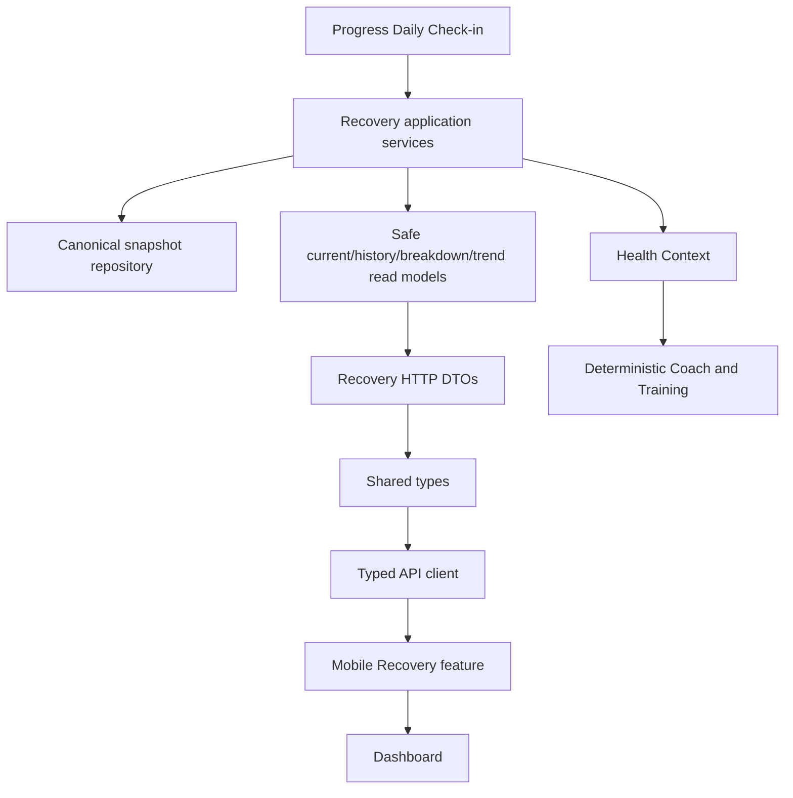

# Epic A2 Recovery Intelligence Implementation Plan

## Objective

Transform existing deterministic Recovery capability into a safe, explainable, read-only product experience without moving domain rules to mobile or enabling generative AI.

## Scope

Current Recovery overview, safe factor breakdown, bounded history/trend, deterministic insight/action copy, Dashboard entry point, typed contracts, API client, mobile states, accessibility, privacy, tests and controlled rollout evidence.

## Non-goals

No new signals, weights, algorithm, clinical model, wearables, HealthKit/Google Fit, Adaptive Training/Nutrition, LLM, Agent Runtime, notifications, gamification, new analytics provider or generic offline framework.

## Architectural Ownership

`RecoveryModule` remains canonical owner of snapshot calculation, persistence, freshness, history and product read-model assembly. `ProgressModule` owns Daily Check-in and triggers rebuild. Health Context, Coach, Dashboard and Training consume Recovery. Nutrition remains outside A2 MVP.

## Target Architecture



## Current Execution Status

- Prompt 1 — completed.
- Prompt 2 — completed.
- Prompt 3 — completed.
- Prompt 4 — completed.
- Prompt 5 — completed.
- Prompt 6 — completed.
- Prompt 7 — completed: Recovery product-action analytics and redacted operational observability.
- Prompt 8 — next: Offline Recovery Read Cache.

## Prompt 4 Status (historical detail)

- Prompt 1 — completed
- Prompt 2 — completed
- Prompt 3 — completed
- Prompt 4 — completed
- Prompt 5 — completed
- Prompt 6 — completed

### Mobile UI decisions

- `RecoveryScreen` foi criada como feature isolada e orientada por `RecoveryScreenState`.
- O MVP apresenta sete dias; não há fetch nem seleção de ranges adicionais neste prompt.
- Categoria, freshness, impacts, trend e insight são apresentados a partir dos contratos compartilhados; nenhuma regra é calculada no mobile.
- A visualização de histórico usa barras simples e alternativa textual, sem nova biblioteca de charts.
- A tela “Recovery History” existente permanece isolada porque hoje exibe histórico de Daily Check-in; a correção de rota/título fica reservada à integração do Prompt 5.
- Callbacks de refresh, retry, Daily Check-in, history item, range e insight action estão preparados para injeção.

### Prompt 4 tests and gaps

- Fixtures públicas para available, stale e legacy.
- Testes unitários de copy, acessibilidade textual, datas locais e screen state.
- Build mobile aprovado; render tests não existem no workspace e não foi instalada biblioteca para criá-los.
- Restavam API integration, navigation, Dashboard, analytics, offline read cache e validação física; Prompt 5 resolveu somente API integration, navigation e Dashboard.

## Prompt 5 Status

- `useRecoveryExperience` integra current e history através dos métodos públicos do API client.
- Current e history possuem estados independentes; falha de history preserva current válido.
- A rota tipada `Recovery` aponta para `RecoveryScreenContainer`.
- O Dashboard Recovery card usa o response público de current e abre a rota dedicada.
- Thresholds locais e leitura de `sourceContext` foram removidos do card principal.
- `DailyCheckInHistoryScreen` agora se apresenta como `Daily Check-in History`.
- Retorno ao Recovery após Daily Check-in atualiza dados por focus refresh.
- Não foram alterados backend, contracts, API client, analytics ou offline persistence.
- Restam validação determinística do Coach, analytics, cache offline, E2E físico e certificação.

## Backend Work

### 1. Define safe Recovery presentation model

- Objective: stop exposing raw `sourceContext`, profile IDs and internal formula metadata.
- Files likely affected: `apps/api/src/modules/recovery/presentation/http/recovery.controller.ts`, current mapper area, Recovery application read-model directories.
- Dependencies: confirm current entity/schema and existing Dashboard mapper.
- Acceptance: response contains only approved product fields; raw signals and internal IDs are absent; ownership remains server-side.
- Tests: controller/mapper/privacy contract tests.
- Risk: medium; compatibility aliases may be required.

### 2. Consolidate current/today selection

- Objective: one application policy for current-day selection, freshness, availability and rebuild.
- Files likely affected: `apps/api/src/modules/recovery/application/use-cases/get-today-recovery`, `get-current-recovery`, `application/services/recovery-freshness.ts`.
- Dependencies: safe response semantics.
- Acceptance: no stale snapshot is represented as current; no-check-in/no-snapshot is explicit; timezone remains backend-owned.
- Tests: current/today, stale, midnight and legacy cases.
- Risk: high for legacy data.

### 3. Add factor breakdown read model

- Objective: map internal influences to safe product statuses/reasons without exposing weights or raw values.
- Files likely affected: Recovery application/domain presentation paths confirmed in Prompt 2.
- Dependencies: product copy/reason-code decision and algorithm tests.
- Acceptance: deterministic output, non-clinical language, unavailable state supported.
- Tests: mapping and privacy tests.
- Risk: high; avoid accidentally freezing internal labels as public contract.

### 4. Add bounded history/trend read model

- Objective: support seven-day product trend with explicit insufficient-data semantics.
- Files likely affected: `get-recovery-history` use case, Recovery repository/query and controller.
- Dependencies: history compatibility and pagination decision.
- Acceptance: bounded query, deterministic ordering, no unbounded payload, legacy records handled.
- Tests: empty, partial, seven-day and duplicate cases.
- Risk: medium.

## Shared Contract Work

- Define safe `RecoveryCurrent`, `RecoveryAvailability`, `RecoveryFreshness`, `RecoveryFactor`, `RecoveryHistory`, `RecoveryTrend` and deterministic insight contracts only after backend shape is fixed.
- Keep transport dates as strings; do not expose `sourceContext`, raw signals, weights, profile IDs or internal formula versions.
- Add explicit absence/partial-data semantics and compatibility aliases only where current consumers require them.

## API Client Work

- Preserve `getTodayRecovery`, `getCurrentRecovery`, `getRecoveryHistory` signatures where viable.
- Add only methods backed by canonical endpoints/read models: breakdown/trend/insight if separate endpoints are justified.
- API client must format, deserialize and map errors only; it must not calculate category, freshness, trend or score.

## Mobile Work

- Create a dedicated Recovery feature/screen after contracts stabilize.
- Reuse `RecoveryReadinessCard` as a summary starting point, but remove local threshold interpretation.
- Add overview, factor rows, deterministic explanation, freshness, loading, error, empty and stale states.
- Keep accessibility textual: score, category, trend and factors must be announced without relying on color/chart shape.
- Do not use route params or local storage as canonical Recovery state.

## Dashboard Work

- Replace local category derivation with backend contract.
- Add a Recovery CTA to a typed dedicated screen.
- Keep Daily Check-in CTA separate.
- Avoid duplicate Recovery requests by making one hook/aggregation owner explicit.

## Coach and Training Compatibility

- Preserve Health Context and deterministic Coach behavior with AI disabled.
- Keep Training on the canonical Recovery use case; document and later retire direct latest-snapshot fallbacks only when safe.
- Do not connect Nutrition in A2 MVP; classify it as future/noncanonical.

## Analytics and Observability

- Define behavioral events only: screen viewed, factor selected, history range selected, refresh/retry.
- Never send score, category, factors, raw check-in values, messages, IDs or source context.
- Add technical metrics/logs for current latency, stale rebuild, missing snapshot and history latency without sensitive payloads.

## Offline Strategy

Defer Recovery read cache until the safe read model is stable. If implemented, cache only confirmed product responses with TTL/stale indicator. Never calculate locally or treat cache as canonical.

## Testing Plan

| Layer                | Required evidence                                  | Blocking              |
| -------------------- | -------------------------------------------------- | --------------------- |
| Domain/application   | score unchanged, freshness, breakdown, trend       | Yes                   |
| Repository           | date ordering, uniqueness, legacy shape            | Yes                   |
| Controller/contracts | safe allowlist, absence, auth                      | Yes                   |
| API client           | route/shape/error semantics                        | Yes                   |
| Mobile               | overview, factors, empty/stale/error/accessibility | Yes                   |
| Dashboard            | CTA, refresh, no duplicate interpretation          | Yes                   |
| Coach/Training       | canonical source and freshness compatibility       | Yes                   |
| E2E                  | check-in→Recovery→context→Dashboard                | Yes for certification |
| Device/manual        | VoiceOver/TalkBack and scaling                     | Release gate          |

## Documentation Updates

Keep the A2 audit, plan and file map synchronized. Add API/read-model documentation only if that is already the repository convention. Record product-safe terminology and explicit non-clinical copy guidelines.

## Implementation Sequence

1. Confirm the safe public model and absence semantics.
2. Consolidate current/today read selection.
3. Add breakdown and bounded trend read models.
4. Align shared types and API client.
5. Add backend contract and privacy tests.
6. Build Recovery overview/breakdown mobile feature.
7. Build history/trend UI.
8. Connect Dashboard and remove local threshold derivation.
9. Add deterministic insight copy and accessibility.
10. Add analytics/observability and optional safe read cache.
11. Execute E2E/device/privacy/performance validation.
12. Certify and roll out gradually.

## Pull Request Strategy

1. `feat(recovery): expose safe current read model`
2. `feat(recovery): add breakdown and history read models`
3. `feat(types): align recovery product contracts`
4. `feat(mobile): add recovery overview`
5. `feat(mobile): add recovery history and trend`
6. `feat(dashboard): connect recovery experience`
7. `test(recovery): validate product read pipeline`

## Definition of Ready

- Ownership and public fields approved.
- No raw source context in public DTO.
- Category/freshness/availability semantics specified.
- Legacy data strategy documented.
- Current/history/breakdown/trend endpoint decisions made.
- Privacy and non-clinical copy reviewed.

## Definition of Done

- Backend is canonical and tested.
- Public contracts are safe and stable.
- Mobile renders only server-derived semantics.
- Dashboard, Coach and Training use compatible sources.
- Empty/stale/error/offline-read states are explicit.
- Accessibility, privacy, observability and E2E evidence exist.
- No new signals, algorithms, AI or external providers were introduced.

## Epic Acceptance Checklist

- [ ] Current Recovery is available through a safe typed contract.
- [ ] No-check-in/no-snapshot is distinguishable from a neutral score.
- [ ] Freshness and last-updated semantics are server-owned.
- [ ] Factor breakdown is deterministic and non-clinical.
- [ ] History/trend is bounded and handles insufficient data.
- [ ] Dedicated Recovery navigation exists.
- [ ] Dashboard CTA and summary are consistent.
- [ ] Mobile contains no Recovery thresholds/calculations.
- [ ] Coach and Training consume canonical Recovery.
- [ ] Nutrition remains explicitly out of scope.
- [ ] Analytics and logs exclude sensitive values.
- [ ] Accessibility and privacy tests pass.
- [ ] E2E/device validation and rollout criteria are documented.

## Risks and Dependencies

Critical dependencies are safe DTO design, legacy snapshot compatibility, removal of duplicated mobile thresholds, and product agreement on non-clinical factor explanations. A2 must not proceed to UI implementation until these are resolved in Prompt 2.

## Execution Status

- Prompt 1 — completed: architecture and gap audit.
- Prompt 2 — completed: backend safe Recovery read models and product endpoints.
- Prompt 3 — completed: shared Recovery contracts and API client alignment.

## Prompt 6 Status

- Prompt 1 — completed.
- Prompt 2 — completed.
- Prompt 3 — completed.
- Prompt 4 — completed.
- Prompt 5 — completed.
- Prompt 6 — completed: Health Context now carries the canonical Recovery Experience read model when available, and the Recovery Coach expert consumes category, availability, freshness, factor impacts and insight action without recalculating them. The legacy snapshot path remains only as a compatibility fallback.
- Prompt 7 — completed: typed Recovery action events were added to the existing noop/allowlisted analytics boundary; Recovery current/history/rebuild/legacy/trend operational signals use a redacted logger adapter; the stale Recovery log no longer contains profile/date identifiers.
- Prompt 8 — next: Offline Recovery Read Cache.

### Prompt 7 decisions

- Product Analytics tracks only explicit navigation and action intent: Dashboard entry, screen view, refresh, retry, history retry and Daily Check-in handoff.
- The current seven-day-only UI does not emit a history-range event.
- No score, category, freshness, factor, trend, insight, Daily Check-in value, profile identifier or response payload is sent to Product Analytics or Recovery operational signals.
- The existing mobile analytics provider remains noop by default; no provider, event bus or dependency was added.
- Backend Recovery operational signals reuse Nest structured logging through `RecoveryObservabilityService`; no exporter or tracing backend was introduced.
- Existing Coach intelligence trace retention and identifiers remain a follow-up outside the new Recovery signal payload.

## Prompt 8 Status

- Prompt 1 — completed.
- Prompt 2 — completed.
- Prompt 3 — completed.
- Prompt 4 — completed.
- Prompt 5 — completed.
- Prompt 6 — completed.
- Prompt 7 — completed.
- Prompt 8 — completed: the mobile app now uses a versioned AsyncStorage read cache with opaque session ownership, allowlisted public responses, seven-day history scope, 24-hour soft age and seven-day hard expiry. Network remains first; only recoverable transport failures use cache, and logout removes the owner namespace.
- Prompt 9 — completed: production certification issued `CERTIFIED_WITH_CONDITIONS`. Automated unit/build/E2E evidence passed; physical device, manual accessibility, physical offline/account-switch and operational dashboard conditions remain open.

### Prompt 9 certification decision

```text
CERTIFIED_WITH_CONDITIONS
```

The A2 code path has no identified P0 blocker. Full rollout remains conditional on external device/offline/accessibility validation, security review of local wellness-data storage, real legacy-data review, named sign-offs and operational dashboards/alerts. The next action is `External Validation and Release Sign-off`; no additional implementation prompt is required by this certification.

### Prompt 8 decisions

- AsyncStorage is reused because it is already installed and used by the mobile app; no storage dependency or framework was added.
- Current and history are independently mergeable so a partial network success cannot erase the other resource.
- Cache records persist only public Recovery Experience fields and use explicit version/owner validation.
- Cache age is local metadata (`recent`, `old`, `expired`) and never overwrites backend Recovery freshness.
- `processing_failed` responses are rendered but never replace a previously useful current cache.
- Cache fallback is limited to recoverable network transport errors; authorization, validation and contract errors remain errors.
- Logout clears Recovery cache and the session namespace; account/session generation prevents older responses from rendering after a switch.

### Prompt 6 decisions

- The Coach uses `GetCurrentRecoveryReadModelUseCase` internally; it does not call the Recovery HTTP controller or API client.
- `RecoveryModule` remains the semantic owner. No Recovery algorithm, weight or threshold changed.
- The canonical Coach branch maps public category and insight action to the existing Coach analysis vocabulary; it does not derive category, trend or factor impact from score/check-in values.
- `motivationLevel` remains Coach context only and is not represented as a Recovery factor or score cause.
- LLM and generative AI remain disabled by default.
- Legacy snapshot behavior is preserved as a compatibility fallback and remains a documented migration gap.

### Prompt 2 decisions

- Compatibility preserved for legacy `/recovery/today`, `/recovery/current` and `/recovery/history` responses.
- New public product endpoints: `GET /recovery/experience/current` and `GET /recovery/experience/history?days=7`.
- Public availability: `available`, `not_available`, `insufficient_data`, `processing_failed`.
- Public freshness: `current`, `stale`, `legacy`, `unknown`.
- Existing intensity thresholds were preserved through a backend category mapper: recovery→low, light→moderate, moderate→good, hard→high.
- Breakdown exposes only energy, sleep and muscle soreness impact states; `motivationLevel` remains Coach-only context.
- Trend requires two valid snapshots, compares ordered half-series averages and uses a threshold of five points.
- Legacy snapshots are not migrated automatically; missing source context is exposed as `legacy` and excluded from trend.
- E2E was added; the initial sandbox execution hit `MongoMemoryServer` `listen EPERM 0.0.0.0`, then the same suite passed under approved elevated local-port execution. External device/Coach semantic validation remains a release condition.

## Prompt 3 Status

- Prompt 1 — completed.
- Prompt 2 — completed.
- Prompt 3 — completed: shared `RecoveryExperience*` contracts, compile-time privacy fixtures and typed API client methods.
- Prompt 4 — next: Mobile Recovery UI.

### Prompt 3 decisions

- New contracts live alongside, and do not replace, the legacy Recovery snapshot contracts.
- `LocalDate` and `IsoDateTime` aliases are reused from the existing Progress contract package.
- New client methods are `getCurrentRecoveryExperience()` and `getRecoveryExperienceHistory(query?)`.
- The client serializes only `days`, omitting it when undefined and rejecting non-integer values outside 1..90.
- HTTP and network failures remain `ApiClientError`; the client does not synthesize `processing_failed`.
- The backend public DTO is the source of truth; no backend, mobile, Dashboard or API client consumer migration was performed.
