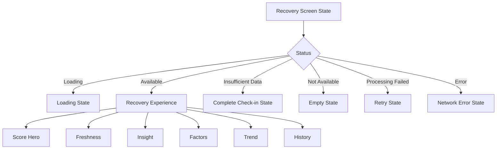

# Epic A2 Mobile Recovery Experience

## Executive Summary

O Prompt 4 cria uma experiência Recovery isolada, orientada por estado e preparada para receber os read models públicos do backend. A tela não faz requests, não calcula regras de domínio e não depende de navegação ou Dashboard.

## Scope

Inclui score atual, categoria, freshness, insight determinístico, fatores públicos, trend de sete dias, histórico, loading, estados vazios, falha de processamento, erro de rede, retry e refresh por callbacks.

Não inclui API integration, navegação real, Dashboard, analytics ou cache offline.

## Product Goals

- tornar o resultado atual compreensível em poucos segundos;
- explicar influências sem expor valores brutos ou pesos;
- distinguir resultado atual, legado, stale e indisponível;
- oferecer uma orientação determinística sem linguagem clínica;
- manter uma alternativa textual para o histórico visual.

## Information Hierarchy

```text
Recovery score → category → guidance → factors → trend → history
```

## Screen Architecture

`RecoveryScreen` recebe `RecoveryScreenState` e callbacks. Os componentes são stateless e não importam API client, hooks de rede ou navegação.



## UI States

- `loading`: indicador acessível enquanto o container prepara dados;
- `available`: hero, freshness, insight, fatores, trend e histórico;
- `insufficient_data`: CTA para completar o Daily Check-in;
- `not_available`: estado vazio neutro;
- `processing_failed`: retry sem exibir score anterior como atual;
- `error`: erro remoto separado de falha de processamento.

Freshness `current`, `stale`, `legacy` e `unknown` é apresentada sem expor os enums ao usuário.

## Score Hero

O hero apresenta o score e a categoria recebidos pelo backend. Não adiciona percentual, `/100`, arredondamento ou thresholds locais.

## Freshness

`lastUpdatedAt` é apenas formatado para apresentação. A tela não decide se o resultado está atual ou stale.

## Factor Breakdown

Renderiza somente `energy`, `sleep` e `muscle_soreness`, com impacto e explicação amigáveis. `motivationLevel` não é renderizado como fator de Recovery.

## Insight

O insight usa tone e action do backend. Como não há infraestrutura i18n confirmada para estas keys, o fallback local é centralizado em `recovery-copy.ts` e marcado como apresentação temporária para o Prompt 5/i18n futuro.

## Trend

A direção e a regra de dados insuficientes vêm do contrato. A UI não calcula médias, deltas ou thresholds.

## History

O MVP apresenta os sete dias recebidos pelo backend, uma visualização simples em barras e uma lista textual. O gráfico possui alternativa acessível com pontos, datas e scores.

## Accessibility

- título da tela com heading;
- score anunciado com valor e categoria;
- fatores agrupados com label, impacto e explicação;
- resumo textual do trend e dos pontos do gráfico;
- actions com role, label e estado de loading/disabled pelos primitives existentes;
- estados de loading/erro anunciáveis;
- informação não depende somente de cor;
- layout usa texto flexível e não exige altura fixa.

Render tests não foram introduzidos porque o workspace não possui biblioteca de renderização mobile; os helpers, modelos, fixtures e build cobrem o contrato testável disponível.

## Copy Guidelines

Copy deve ser curta, não julgadora e não clínica. Recovery é orientação para decisões de treino, não avaliação médica.

## Privacy

A feature não acessa `sourceContext`, `userProfileId`, sinais brutos, pesos, IDs internos ou scores derivados localmente. As fixtures usam somente contratos públicos.

## Component Architecture

- `RecoveryScreen`: composição e callbacks;
- `RecoveryScoreHero`: score/categoria;
- `RecoveryFreshnessNote`: freshness e data formatada;
- `RecoveryInsightCard`: orientação/action;
- `RecoveryFactorList`/`RecoveryFactorRow`: breakdown;
- `RecoveryTrendSummary`: direção;
- `RecoveryHistoryChart`: visualização simples e acessível;
- `RecoveryHistoryList`: itens e callback;
- estados loading, empty e error dedicados;
- helpers centralizados para copy, acessibilidade e datas.

## Test Strategy

Fixtures e testes unitários cobrem categorias, freshness, impacts, trend, datas locais, estados available/stale/legacy e ausência de valores brutos. O build mobile valida a composição React Native.

## Integration Contract

O Prompt 5 poderá injetar estado e callbacks para conectar API client, navegação, Dashboard e refresh. A rota `DailyCheckInHistory` permanece isolada neste prompt; embora ainda tenha título legado no navigator, a nova Recovery screen não reutiliza seus dados de check-in.

## Remaining Gaps

- integração com API client;
- registro de rota e navegação;
- CTA e refresh do Dashboard;
- resolução oficial de translation keys;
- analytics;
- cache offline de leitura;
- validação visual em dispositivos físicos.
