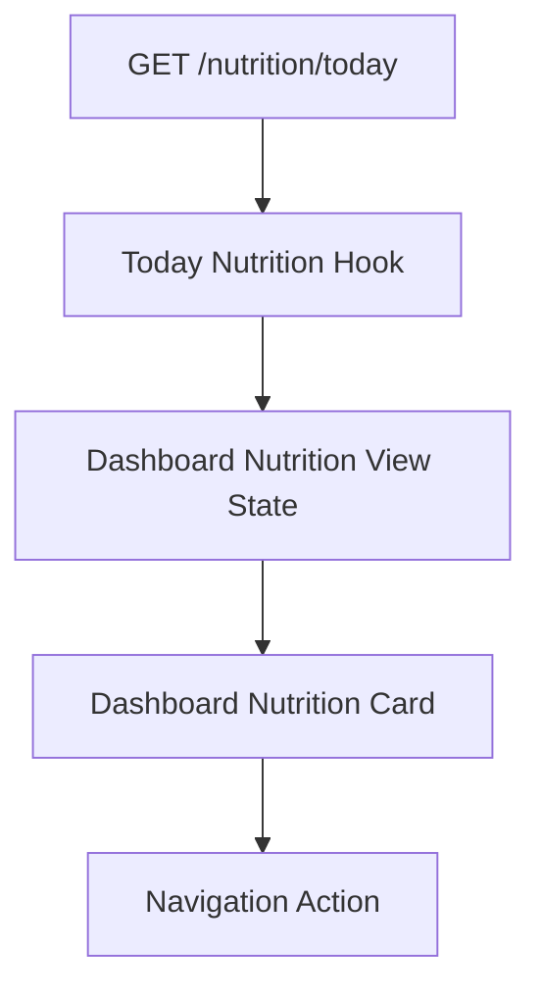

# Release 2.1 — Epic A3 Dashboard Nutrition Experience

## Context

Prompts 1 and 2 established `NutritionModule` as the owner of Nutrition meaning and exposed the canonical `NutritionReadModel` through `GET /nutrition/today`. Prompt 3 adapts the existing Mobile Dashboard card to present that model without recalculating domain facts.

## Objective

Give the user a compact, actionable view of today’s Nutrition state: calories, essential macros, meal progress, next meal, deterministic focus, freshness, and the next action.

## Experience before

The existing card displayed raw daily targets, derived meal counts locally, and exposed limited error/empty behavior. The weekly progress card also converted Nutrition adherence into unrelated weekly trend and focus semantics. The Dashboard action for profile setup could prefill from Training context.

## Experience after

The Nutrition card now presents:

- canonical consumed/target calories and backend-provided remaining or excess;
- a visually clamped progress bar that preserves above-target semantics in copy;
- canonical macro consumption and units;
- canonical completed/planned meals and backend-provided next meal;
- canonical focus, insight fallback, and typed action;
- explicit stale, legacy, and unknown freshness messaging;
- loading, retry, setup, partial-data, unavailable, and processing-failure states;
- accessible labels for the card, progress, metrics, and actions.

The existing Dashboard layout, card order, navigation container, and refresh control remain unchanged.

## Principles and hierarchy

```text
Nutrition status
→ primary calorie progress
→ next action/focus
→ supporting macros and meals
```

The Dashboard summarizes. Nutrition Overview remains the detailed experience.

## State model

`useDashboard` keeps Nutrition as an independent domain state with its own loading, error, retry, and refresh behavior. The card distinguishes transport error from the canonical `availability` value.

| State               | Presentation                                                    |
| ------------------- | --------------------------------------------------------------- |
| `available`         | Full canonical summary                                          |
| `not_configured`    | Setup explanation and canonical action                          |
| `insufficient_data` | Safe progress-start explanation and action                      |
| `not_available`     | Temporary unavailable state and retry                           |
| `processing_failed` | Safe processing message and retry                               |
| `current`           | No extra badge required                                         |
| `stale`             | Discreet “may not be fully up to date” message                  |
| `legacy`            | Discreet refresh message without exposing technical terminology |
| `unknown`           | Neutral update-time message                                     |

Missing optional fields do not hide independent valid sections and are not converted to zero.

## Canonical consumption

The presentation model reads only:

- `calories.consumed`, `target`, `remaining`, `excess`, `percentage`, and `state`;
- `macros[].consumed`, `target`, and `unit`;
- `mealProgress.completed`, `planned`;
- `nextMeal.title`;
- `progress.adherenceStatus`;
- `focus` or `insight` and their typed `action`;
- `availability` and `freshness`.

The only local numeric transformation is display formatting and visual clamping of the already-canonical progress percentage. The Dashboard no longer derives Nutrition adherence, meal counts, next meal, focus, or weekly “on track” semantics.

## Navigation and actions

`NutritionAction` remains a domain intent. The Dashboard maps it to existing routes:

| Action                    | Route                                        |
| ------------------------- | -------------------------------------------- |
| `open_profile`            | `CreateNutritionProfile`                     |
| `create_plan`             | `NutritionPlan`                              |
| `open_today_meals`        | `TodaysMeals`                                |
| `log_meal` with id        | `LogMeal` with `mealId`                      |
| `log_meal` without id     | `TodaysMeals`                                |
| `open_hydration` / `none` | Safe no-op because no supported route exists |

No route names are present in the shared domain contract.

## Loading, refresh, and errors

Initial loading uses the existing card skeleton. Dashboard refresh remains global, while Nutrition retry remains domain-specific. Refresh does not clear the rest of the Dashboard. Authentication and transport failures continue through the existing API/client behavior; no stale data from another user is introduced.

The current backend still represents some onboarding absence through legacy 404 errors. The card preserves a safe setup state for the resulting empty domain value; canonical normal-state HTTP mapping remains a later integration gap.

## Accessibility

The card exposes descriptive labels for calorie progress, macro values, meal completion, next meal, focus, freshness, error, loading, and actions. Progress is not communicated by color alone. Existing Button primitives provide accessible touch targets and roles.

## Privacy

No Nutrition values are sent to analytics, navigation telemetry, console logs, breadcrumbs, or exception contexts. Navigation carries only the required public meal id for `LogMeal`. No food descriptions, restrictions, goals, calories, macros, or full API payloads are added to observability.

## Performance

The card uses a memoized pure presentation model and does not issue requests. The Dashboard continues its existing parallel domain loading and refresh flow. No new dependency, cache, animation, or persistent state was added.

## Compatibility

The existing Dashboard route, Nutrition endpoint, `TodayNutrition` alias, card placement, navigation container, and design tokens remain compatible. The weekly progress card no longer receives Nutrition adherence because that component was independently redefining Nutrition semantics.

## Architecture flow



## Tests

The pure Dashboard presentation model covers canonical values, above-target display, and missing targets. The full Mobile test suite and Mobile build are required regression checks. A dedicated React Native renderer/accessibility test harness is not configured in this repository; accessibility is validated through static component labels and build-safe presentation tests.

## Risks and gaps

- Existing 404 onboarding behavior is not yet normalized to canonical availability by the backend.
- No hydration route exists for `open_hydration`.
- Coach/Health Context and cross-module integrations remain later Epic A3 work.
- Product copy is currently English-only, matching the existing Dashboard language.

## Next steps

Prompt 4 should migrate Coach/Health Context to the canonical model. Prompt 5 should add privacy-safe observability. Prompt 8 should audit remaining cross-module Nutrition consumers.
