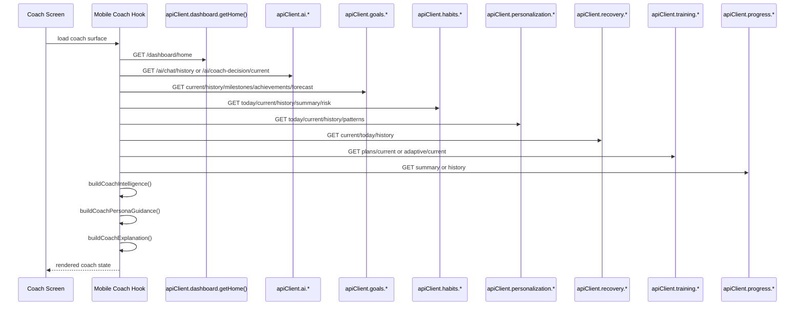
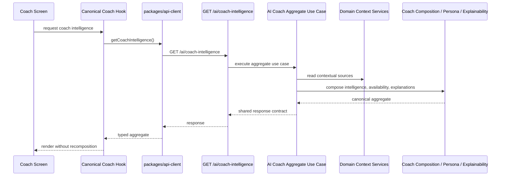

# Epic 1 - Coach Intelligence Aggregation

## 1. Epic Metadata

| Field                  | Value                                                                                                                                                                                                                                                                                                                                                                                                                                                                                                                                                                                                                                                                                                                                                                                                                                                                                                                                                                                          |
| ---------------------- | ---------------------------------------------------------------------------------------------------------------------------------------------------------------------------------------------------------------------------------------------------------------------------------------------------------------------------------------------------------------------------------------------------------------------------------------------------------------------------------------------------------------------------------------------------------------------------------------------------------------------------------------------------------------------------------------------------------------------------------------------------------------------------------------------------------------------------------------------------------------------------------------------------------------------------------------------------------------------------------------------- |
| Epic name              | Coach Intelligence Aggregation                                                                                                                                                                                                                                                                                                                                                                                                                                                                                                                                                                                                                                                                                                                                                                                                                                                                                                                                                                 |
| Epic identifier        | Epic 1                                                                                                                                                                                                                                                                                                                                                                                                                                                                                                                                                                                                                                                                                                                                                                                                                                                                                                                                                                                         |
| Status                 | Proposed                                                                                                                                                                                                                                                                                                                                                                                                                                                                                                                                                                                                                                                                                                                                                                                                                                                                                                                                                                                       |
| Owner                  | Not proven in repository                                                                                                                                                                                                                                                                                                                                                                                                                                                                                                                                                                                                                                                                                                                                                                                                                                                                                                                                                                       |
| Architectural owner    | `apps/api/src/modules/ai`                                                                                                                                                                                                                                                                                                                                                                                                                                                                                                                                                                                                                                                                                                                                                                                                                                                                                                                                                                      |
| Product owner          | Not proven in repository                                                                                                                                                                                                                                                                                                                                                                                                                                                                                                                                                                                                                                                                                                                                                                                                                                                                                                                                                                       |
| Target applications    | `apps/api`, `apps/mobile`                                                                                                                                                                                                                                                                                                                                                                                                                                                                                                                                                                                                                                                                                                                                                                                                                                                                                                                                                                      |
| Affected packages      | `packages/types`, `packages/api-client`                                                                                                                                                                                                                                                                                                                                                                                                                                                                                                                                                                                                                                                                                                                                                                                                                                                                                                                                                        |
| Related ADRs           | [docs/architecture/adrs/ADR-0001-architecture-baseline-certification.md](/Users/rodrigopaiva/Desktop/Travail/Portfolio/elev9/docs/architecture/adrs/ADR-0001-architecture-baseline-certification.md)                                                                                                                                                                                                                                                                                                                                                                                                                                                                                                                                                                                                                                                                                                                                                                                           |
| Related specifications | [docs/architecture/repository-technical-audit.md](/Users/rodrigopaiva/Desktop/Travail/Portfolio/elev9/docs/architecture/repository-technical-audit.md), [docs/architecture/engineering-principles.md](/Users/rodrigopaiva/Desktop/Travail/Portfolio/elev9/docs/architecture/engineering-principles.md), [docs/specs/GOVERNANCE.md](/Users/rodrigopaiva/Desktop/Travail/Portfolio/elev9/docs/specs/GOVERNANCE.md), [docs/specs/mobile/coach-intelligence-integration/README.md](/Users/rodrigopaiva/Desktop/Travail/Portfolio/elev9/docs/specs/mobile/coach-intelligence-integration/README.md), [docs/specs/ai/README.md](/Users/rodrigopaiva/Desktop/Travail/Portfolio/elev9/docs/specs/ai/README.md), [docs/specs/ai/create-coach-chat/README.md](/Users/rodrigopaiva/Desktop/Travail/Portfolio/elev9/docs/specs/ai/create-coach-chat/README.md), [docs/specs/ai/release-readiness/README.md](/Users/rodrigopaiva/Desktop/Travail/Portfolio/elev9/docs/specs/ai/release-readiness/README.md) |
| Date created           | 2026-07-13                                                                                                                                                                                                                                                                                                                                                                                                                                                                                                                                                                                                                                                                                                                                                                                                                                                                                                                                                                                     |
| Last updated           | 2026-07-13                                                                                                                                                                                                                                                                                                                                                                                                                                                                                                                                                                                                                                                                                                                                                                                                                                                                                                                                                                                     |
| Implementation status  | Not started                                                                                                                                                                                                                                                                                                                                                                                                                                                                                                                                                                                                                                                                                                                                                                                                                                                                                                                                                                                    |

## 2. Executive Summary

This Epic consolidates Coach intelligence composition into the backend and makes the backend the single source of truth for Coach surfaces. The current implementation still recomposes coach intelligence locally in mobile hooks such as [apps/mobile/src/hooks/use-dashboard.ts](/Users/rodrigopaiva/Desktop/Travail/Portfolio/elev9/apps/mobile/src/hooks/use-dashboard.ts), [apps/mobile/src/hooks/use-coach-home.ts](/Users/rodrigopaiva/Desktop/Travail/Portfolio/elev9/apps/mobile/src/hooks/use-coach-home.ts), [apps/mobile/src/hooks/use-coach-insights.ts](/Users/rodrigopaiva/Desktop/Travail/Portfolio/elev9/apps/mobile/src/hooks/use-coach-insights.ts), [apps/mobile/src/hooks/use-coach-daily-briefing.ts](/Users/rodrigopaiva/Desktop/Travail/Portfolio/elev9/apps/mobile/src/hooks/use-coach-daily-briefing.ts), and [apps/mobile/src/hooks/coach/coach-intelligence.ts](/Users/rodrigopaiva/Desktop/Travail/Portfolio/elev9/apps/mobile/src/hooks/coach/coach-intelligence.ts). Those hooks currently merge multiple endpoint responses into mobile-specific models for intelligence, persona, and explainability.

The backend already contains the authoritative AI runtime, expert routing, composition, persona, explainability, and observability services in [apps/api/src/modules/ai/ai.module.ts](/Users/rodrigopaiva/Desktop/Travail/Portfolio/elev9/apps/api/src/modules/ai/ai.module.ts). The repository also already exposes a dashboard read model in [apps/api/src/modules/dashboard/application/use-cases/get-home-dashboard/get-home-dashboard.use-case.ts](/Users/rodrigopaiva/Desktop/Travail/Portfolio/elev9/apps/api/src/modules/dashboard/application/use-cases/get-home-dashboard/get-home-dashboard.use-case.ts), but that read model is not the canonical Coach intelligence aggregate.

This Epic is necessary now because the current mobile-side recomposition creates duplicated composition logic, contract drift, screen inconsistency, and duplicated fallback behavior. It is a consolidation Epic, not a feature expansion Epic: it changes where Coach intelligence is assembled, not what new user-facing coach behavior exists.

## 3. Current State

### 3.1 Factual Current-State Summary

The current repository implements Coach intelligence as a distributed set of read models and local mobile composition helpers:

- The backend AI module owns `CoachDecision`, chat history, deterministic replay, expert composition, persona, explainability, observability, and chat orchestration.
- The dashboard module owns a home read model that already bundles some coach-adjacent data such as `coachDecision`, `goal`, `habits`, `notification`, `progressSummary`, `recovery`, and `nutritionGuidance`.
- The mobile app still composes a unified coach model locally by combining responses from multiple endpoints and local helper functions.
- `packages/types` contains `CoachDecision`, `DashboardHomeResponse`, `ProgressSummaryResponse`, and many context-specific contracts, but it does not contain a canonical coach intelligence aggregate contract.
- `packages/api-client` exposes separate operations for AI chat, coach decision, dashboard home, goals, habits, nutrition, notifications, personalization, progress, recovery, and training. It does not expose a canonical coach intelligence operation.

### 3.2 Current Mobile Coach Data Flow

The current mobile flow is split across several hooks:

- [apps/mobile/src/hooks/use-dashboard.ts](/Users/rodrigopaiva/Desktop/Travail/Portfolio/elev9/apps/mobile/src/hooks/use-dashboard.ts) loads `apiClient.dashboard.getHome()` and locally builds `CoachUnifiedCoachIntelligence`, `CoachPersonaProfile`, and `CoachExplanation`.
- [apps/mobile/src/hooks/use-coach-home.ts](/Users/rodrigopaiva/Desktop/Travail/Portfolio/elev9/apps/mobile/src/hooks/use-coach-home.ts) combines dashboard data with `apiClient.ai.getChatHistory({ limit: 6 })` and `apiClient.goals.getCurrentGoal()`.
- [apps/mobile/src/hooks/use-coach-insights.ts](/Users/rodrigopaiva/Desktop/Travail/Portfolio/elev9/apps/mobile/src/hooks/use-coach-insights.ts) combines dashboard data with `apiClient.goals.getCurrentGoal()`, `apiClient.habits.getTodayHabits()`, and `apiClient.personalization.getTodayPersonalization()`.
- [apps/mobile/src/hooks/use-coach-daily-briefing.ts](/Users/rodrigopaiva/Desktop/Travail/Portfolio/elev9/apps/mobile/src/hooks/use-coach-daily-briefing.ts) combines dashboard data with the same goal, habits, and personalization endpoints.
- [apps/mobile/src/hooks/use-coach-goal-guidance.ts](/Users/rodrigopaiva/Desktop/Travail/Portfolio/elev9/apps/mobile/src/hooks/use-coach-goal-guidance.ts) pulls goal history, milestones, achievements, recovery history, habit history, personalization history, progress summary, training plan, and nutrition data, then recomposes coach guidance locally.
- [apps/mobile/src/hooks/use-coach-weekly-review.ts](/Users/rodrigopaiva/Desktop/Travail/Portfolio/elev9/apps/mobile/src/hooks/use-coach-weekly-review.ts) pulls progress, training, recovery, goal, habit, consistency, personalization, and behavioral pattern data, then recomposes coach guidance locally.
- [apps/mobile/src/hooks/use-coach-memory-timeline.ts](/Users/rodrigopaiva/Desktop/Travail/Portfolio/elev9/apps/mobile/src/hooks/use-coach-memory-timeline.ts) combines chat history, personalization history, behavioral patterns, habit history, consistency summary, goal history, and progress summary.
- [apps/mobile/src/hooks/use-ask-coach.ts](/Users/rodrigopaiva/Desktop/Travail/Portfolio/elev9/apps/mobile/src/hooks/use-ask-coach.ts) combines chat history, goals, habits, personalization, and dashboard data to build Ask Coach suggestions locally.
- [apps/mobile/src/hooks/use-coach-conversation.ts](/Users/rodrigopaiva/Desktop/Travail/Portfolio/elev9/apps/mobile/src/hooks/use-coach-conversation.ts) uses dashboard-derived intelligence, persona, and explanation as conversation context, while separately loading chat history and sending chat messages.
- [apps/mobile/src/hooks/use-coach-notifications.ts](/Users/rodrigopaiva/Desktop/Travail/Portfolio/elev9/apps/mobile/src/hooks/use-coach-notifications.ts) loads notification decisions and engagement summary for notification surfaces.

The mobile local composition module [apps/mobile/src/hooks/coach/coach-intelligence.ts](/Users/rodrigopaiva/Desktop/Travail/Portfolio/elev9/apps/mobile/src/hooks/coach/coach-intelligence.ts) defines the current mobile-side coach models and builders, including `CoachUnifiedCoachIntelligence`, `CoachPersonaProfile`, `CoachExplanation`, `CoachUnifiedAssessment`, `CoachUnifiedRecommendation`, `CoachUnifiedRisk`, `CoachUnifiedConfidence`, `CoachCompositionConflict`, and `CoachCompositionMetadata`.

### 3.3 Current Endpoint Usage

The current mobile Coach experience calls multiple endpoints:

- `GET /dashboard/home`
- `GET /ai/chat/history`
- `GET /ai/chat`
- `GET /ai/coach-decision/current`
- `GET /ai/coach-decision/today`
- `GET /goals/current`, `GET /goals/history`, `GET /goals/milestones`, `GET /goals/achievements`, `GET /goals/forecast`
- `GET /habits/today`, `GET /habits/current`, `GET /habits/history`, `GET /habits/summary`, `GET /habits/risk`
- `GET /nutrition/profile`, `GET /nutrition/plans/current`, `GET /nutrition/today`, `GET /nutrition/recommendations`
- `GET /notifications/current`, `GET /notifications/today`, `GET /notifications/history`, `GET /notifications/engagement-summary`
- `GET /personalization/today`, `GET /personalization/current`, `GET /personalization/history`, `GET /personalization/patterns`
- `GET /progress/summary`, `GET /progress/daily-check-ins`, `GET /progress/workout-history`
- `GET /recovery/current`, `GET /recovery/today`, `GET /recovery/history`
- `GET /training/plans/current`, `GET /training/adaptive/current`, `GET /training/adaptive/today`

### 3.4 Current Fallback, Loading, and Error Behavior

The current mobile hooks use `Promise.allSettled` in multiple places to tolerate partial failures. They typically:

- retain the partial context they successfully loaded;
- set a screen-level error only when all relevant sources fail;
- use `isCoachOptionalEmptyState` to treat some missing data as an expected empty state;
- preserve skeleton, retry, and empty-state UI behavior in the Coach screens;
- sign out on invalid auth in conversation flows;
- preserve a draft message and offline retry state when chat send fails.

### 3.5 Current-State Sequence Diagram

## 4. Target State

The target architecture is backend-owned Coach intelligence aggregation with a single canonical shared contract and a single canonical API-client operation for Coach intelligence consumption.

### 4.1 Target-State Properties

- One canonical backend-owned Coach Intelligence Aggregate MUST exist.
- One canonical shared response contract MUST exist.
- One API-client operation MUST serve the canonical aggregate.
- One mobile consumption path MUST be used for migrated Coach surfaces.
- Backend composition, fallback, and availability semantics MUST be centralized.
- No domain or cross-context composition logic MAY remain in mobile for migrated Coach intelligence.
- Existing public endpoints MUST remain available during the initial rollout.

### 4.2 Recommended Canonical Route

The recommended canonical route is `GET /ai/coach-intelligence`.

Rationale:

- the AI bounded context already owns coach runtime, composition, persona, explainability, and observability in [apps/api/src/modules/ai/ai.module.ts](/Users/rodrigopaiva/Desktop/Travail/Portfolio/elev9/apps/api/src/modules/ai/ai.module.ts);
- current AI routes already use the `/ai/*` namespace for coach runtime and coach decision surfaces;
- `dashboard` already owns a separate read model and should remain a consumer of the aggregate, not the owner of Coach intelligence.

### 4.3 Target-State Sequence Diagram

## 5. Goals

| ID    | Goal                                                           | How it is measured or verified                                                                                                       |
| ----- | -------------------------------------------------------------- | ------------------------------------------------------------------------------------------------------------------------------------ |
| G-001 | Make backend the single source of truth for Coach intelligence | Coach intelligence surfaces consume one canonical backend aggregate in production builds                                             |
| G-002 | Reduce mobile composition logic                                | Mobile no longer calls local `buildCoachIntelligence`, `buildCoachPersonaGuidance`, or `buildCoachExplanation` for migrated surfaces |
| G-003 | Reduce contract drift                                          | Coach intelligence fields are defined once in `packages/types` and reused by `packages/api-client` and mobile                        |
| G-004 | Reduce duplicate HTTP calls                                    | Migrated Coach surfaces fetch the canonical aggregate instead of composing several coach-context requests                            |
| G-005 | Centralize partial-failure semantics                           | Backend returns section-level availability and fallback metadata consistently                                                        |
| G-006 | Centralize explainability metadata                             | Explanation summaries and evidence summaries come from backend-owned logic                                                           |
| G-007 | Centralize observability of Coach intelligence                 | Aggregate request, partial failure, fallback, and duration telemetry are emitted from the backend                                    |
| G-008 | Preserve current product behavior                              | Existing Coach screens keep their current user-visible meaning and states                                                            |
| G-009 | Preserve backward compatibility during rollout                 | Existing endpoints remain available until migration is proven safe                                                                   |
| G-010 | Preserve deterministic-first AI principles                     | Deterministic composition remains the first step before any LLM-assisted behavior                                                    |

## 6. Non-Goals

This Epic does not include:

- new AI experts;
- prompt redesign;
- a new LLM provider;
- new user-facing Coach features;
- Coach screen redesign;
- Dashboard redesign;
- removal of existing public endpoints in the first release;
- migration to microservices;
- a new persistence engine;
- event bus introduction;
- a large-scale `AiModule` refactor;
- unrelated design-system changes;
- new mobile navigation patterns;
- changes to authentication semantics;
- changes to `DashboardHomeResponse` as a breaking contract.

Additional non-goals proven by the repository:

- replacing the current `CoachDecision` endpoints before the aggregate rollout is proven safe;
- changing the existing AI chat debug routes;
- changing the current dashboard read model for non-coach data;
- introducing new public trace, prompt, or policy exposure.

## 7. User and System Outcomes

### 7.1 User Outcomes

- The Coach experience MUST remain the same or become more consistent.
- Visible Coach loading and empty states MUST remain stable.
- The user MUST not see inconsistent Coach decisions across screens because of local recomposition differences.
- The user SHOULD see fewer inconsistencies in top recommendation, risk, and confidence across Coach surfaces.

### 7.2 Mobile Engineering Outcomes

- Hooks SHOULD become simpler because they consume a canonical aggregate.
- Fewer endpoint dependencies SHOULD be required in each Coach hook.
- Local mappers SHOULD be reduced because the backend owns the aggregate shape.
- Mobile MUST stop owning cross-context orchestration for migrated Coach surfaces.

### 7.3 Backend Engineering Outcomes

- Coach aggregation ownership becomes explicit in the AI bounded context.
- Composition, fallback, and observability become centralized.
- Compatibility boundaries become clearer because one contract serves Coach intelligence.

### 7.4 Product and Operations Outcomes

- Rollout becomes easier because the backend aggregate can be activated by feature flag.
- Debugging becomes easier because the final intelligence is observable in one backend path.
- Regression risk becomes lower because fewer screens recompute the same intelligence differently.

## 8. Scope

### 8.1 Backend Scope

- Coach Intelligence Aggregate response model.
- Backend aggregation use case or service.
- Composition orchestration across current coach source contexts.
- Availability and partial-failure semantics.
- Backend-owned fallback semantics.
- Observability and replay-safe telemetry.
- Controller and route support for the canonical aggregate.

### 8.2 Shared Package Scope

- Canonical coach aggregate response contract in `packages/types`.
- Canonical API-client operation in `packages/api-client`.
- Backward-compatible type exports from `packages/types/src/index.ts`.

### 8.3 Mobile Scope

- One canonical data-access path for migrated Coach surfaces.
- Removal of local coach recomposition for migrated surfaces.
- Preservation of loading, empty, error, retry, and offline behavior.
- Preservation of existing accessibility and visual behavior.

### 8.4 Test Scope

- Shared contract tests.
- Backend unit, integration, and E2E tests.
- API-client tests.
- Mobile hook and screen regression tests.

### 8.5 Documentation Scope

- New specification and certification artifacts.
- Updates to architecture, service map, communication flow, and existing Coach specs where they mention the aggregate.

### 8.6 Operations Scope

- Feature-flag strategy.
- Rollout and rollback strategy.
- Observability requirements.
- Safe fallback semantics.

## 9. Out of Scope

The following subsystems MUST NOT be changed unless strictly required for the aggregate rollout:

- `apps/api/src/modules/ai/application/services/chat/*` except where aggregate context needs to be read;
- `apps/api/src/modules/ai/application/services/llm/*`;
- `apps/api/src/modules/ai/presentation/http/ai.controller.ts` chat routes;
- `apps/api/src/modules/ai/presentation/http/coach-decision.controller.ts` coach decision routes;
- `apps/api/src/modules/dashboard/presentation/http/dashboard.controller.ts` non-coach dashboard behavior;
- `apps/mobile/src/screens/*` navigation structure;
- `apps/mobile/src/components/*` design language;
- `apps/mobile/src/auth/*` authentication flow;
- `packages/ui` visual primitives unless an existing shared primitive already proves necessary.

## 10. Domain Ownership

### 10.1 Candidate Ownership Options

| Candidate                            | Advantages                                                                                                | Disadvantages                                                      | Coupling implications                                                           | Compatibility implications                                                              |
| ------------------------------------ | --------------------------------------------------------------------------------------------------------- | ------------------------------------------------------------------ | ------------------------------------------------------------------------------- | --------------------------------------------------------------------------------------- |
| `ai` bounded context                 | Already owns coach runtime, expert routing, composition, persona, explainability, observability, and chat | Can become too large if not kept focused                           | Lowest additional cross-context coupling because it already hosts coach runtime | Best compatibility with existing `/ai/*` route conventions and Coach-specific contracts |
| `dashboard` bounded context          | Already aggregates home read models and some coach-adjacent data                                          | Would mix dashboard read-model ownership with AI runtime ownership | Increases coupling between dashboard and coach runtime concerns                 | Risks duplicating logic already present in AI services                                  |
| New internal coach module outside AI | Clean conceptual separation                                                                               | Adds a new boundary without clear evidence of need                 | May create extra indirection and duplicated orchestration                       | Requires more migration work and likely a new ADR                                       |

### 10.2 Recommended Ownership

The canonical aggregate SHOULD be owned by the `ai` bounded context, implemented as a dedicated internal coach aggregation use case/service area inside `apps/api/src/modules/ai`.

### 10.3 Rationale

- The AI bounded context already contains the authoritative coach runtime stack in [apps/api/src/modules/ai/ai.module.ts](/Users/rodrigopaiva/Desktop/Travail/Portfolio/elev9/apps/api/src/modules/ai/ai.module.ts).
- The AI module already provides `CoachExpertCompositionService`, `CoachPersonaEngineService`, `CoachExplainabilityService`, and `CoachExpertObservabilityService`.
- `Dashboard` already has a separate read model in [apps/api/src/modules/dashboard/application/use-cases/get-home-dashboard/get-home-dashboard.use-case.ts](/Users/rodrigopaiva/Desktop/Travail/Portfolio/elev9/apps/api/src/modules/dashboard/application/use-cases/get-home-dashboard/get-home-dashboard.use-case.ts); moving ownership there would blur bounded-context boundaries.
- Creating a new bounded context is not justified by current evidence unless the Epic is expanded into a broader platform change.

### 10.4 ADR Requirement

No new ADR is required if implementation remains inside the AI bounded context and preserves the current architectural baseline.

A new ADR IS required before implementation if any of the following happens:

- ownership moves to Dashboard or another bounded context;
- the Epic introduces a new cross-cutting platform boundary;
- the Epic removes or changes public contracts in a breaking way;
- the Epic changes persistence strategy or introduces a new service boundary.

## 11. Aggregate Definition

The aggregate is a backend-owned, deterministic, user-scoped Coach intelligence read model. It MUST be constructed from current source contexts and MUST NOT be recomposed in mobile.

| Section                                 | Business purpose                                       | Source context                                               | Existing?                         | Required?                                                    | Fallback behavior                                                                           | Freshness requirement | Client visibility                        | Security classification |
| --------------------------------------- | ------------------------------------------------------ | ------------------------------------------------------------ | --------------------------------- | ------------------------------------------------------------ | ------------------------------------------------------------------------------------------- | --------------------- | ---------------------------------------- | ----------------------- |
| Contextual header / greeting            | Give the user a stable entry point into Coach surfaces | User profile, dashboard user name, personalization           | Partially proven                  | Required                                                     | Neutral greeting if no personalization context exists                                       | Request-time          | Visible                                  | Public-safe             |
| Primary Coach insight                   | Provide the main coach reading of the user state       | Coach decision / aggregate composition                       | Proven in current repo            | Required                                                     | Fall back to deterministic current coach decision if aggregate synthesis is unavailable     | Request-time          | Visible                                  | Public-safe             |
| Daily priority                          | Surface the most important action for today            | Coach decision, recovery, workout, nutrition, goals          | Partially proven                  | Required                                                     | Fall back to top recommendation or primary insight                                          | Request-time          | Visible                                  | Public-safe             |
| Training state                          | Explain training readiness and workout direction       | Training plan, adaptive training, workout logs               | Proven in current repo            | Optional in aggregate, required for training-aware surfaces  | Mark section unavailable if training data is missing                                        | Request-time          | Visible                                  | Public-safe             |
| Nutrition state                         | Explain nutrition context and readiness                | Nutrition profile, today nutrition, recommendations          | Proven in current repo            | Optional in aggregate, required for nutrition-aware surfaces | Mark section unavailable if nutrition data is missing                                       | Request-time          | Visible                                  | Public-safe             |
| Recovery state                          | Explain readiness, fatigue, and recovery trend         | Recovery snapshot/history, daily check-ins                   | Proven in current repo            | Required for safety-sensitive surfaces                       | Mark section unavailable if recovery data is missing; safety fallback remains deterministic | Request-time          | Visible                                  | Public-safe             |
| Progress state                          | Explain recent progress and streak behavior            | Progress summary, workout logs                               | Proven in current repo            | Optional                                                     | Mark section unavailable if progress data is missing                                        | Request-time          | Visible                                  | Public-safe             |
| Goals state                             | Explain current objective and progress toward it       | Current goal, history, milestones, achievements, forecast    | Proven in current repo            | Optional but strongly recommended                            | Mark section unavailable if goal context is missing                                         | Request-time          | Visible                                  | Public-safe             |
| Habits state                            | Explain consistency and adherence signals              | Habits snapshot, summary, risk signals, history              | Proven in current repo            | Optional                                                     | Mark section unavailable if habits data is missing                                          | Request-time          | Visible                                  | Public-safe             |
| Personalization state                   | Adjust communication and emphasis                      | Personalization snapshots, profile, patterns                 | Proven in current repo            | Optional                                                     | Mark section unavailable if personalization data is missing                                 | Request-time          | Visible                                  | Public-safe             |
| Notifications / engagement state        | Inform engagement and nudging priority                 | Notification decisions, engagement summary                   | Proven in current repo            | Optional                                                     | Mark section unavailable if notification data is missing                                    | Request-time          | Visible                                  | Public-safe             |
| Explainability                          | Explain why the aggregate chose its conclusions        | AI explainability service, evidence summaries                | Proven internally; not yet public | Required for coaching surfaces that expose rationale         | Fall back to safe summary-only explanation                                                  | Request-time          | Visible in safe summary form only        | Restricted              |
| Warnings                                | Surface risk or caution conditions                     | Recovery, coaching risk, habit risk, nutrition inconsistency | Partially proven                  | Required when risk exists                                    | Omit if no risk is present                                                                  | Request-time          | Visible                                  | Public-safe             |
| Availability / freshness / partial data | Tell the client what is current versus partial         | Aggregate orchestration result                               | Not proven as public contract     | Required                                                     | Section-level unavailable or partial state                                                  | Request-time          | Visible                                  | Public-safe             |
| Safe trace / correlation metadata       | Support debugging without exposing internals           | Observability and trace services                             | Proven internally; not yet public | Optional, internal-first                                     | Do not expose if not approved                                                               | Request-time          | Internal-only unless explicitly approved | Internal-only           |

## 12. Data Source Matrix

| Aggregate Section                       | Source Module                                                   | Existing Use Case                                                                                                                          | Existing Endpoint                                                                                                                                             | Existing Contract                                   | Freshness Requirement | Required/Optional             | Failure Behavior                                                                       |
| --------------------------------------- | --------------------------------------------------------------- | ------------------------------------------------------------------------------------------------------------------------------------------ | ------------------------------------------------------------------------------------------------------------------------------------------------------------- | --------------------------------------------------- | --------------------- | ----------------------------- | -------------------------------------------------------------------------------------- |
| Contextual header / greeting            | `users`, `dashboard`, `personalization`                         | `GetHomeDashboardUseCase`                                                                                                                  | `GET /dashboard/home`                                                                                                                                         | `DashboardHomeResponse`                             | Request-time          | Required                      | Fall back to neutral header; do not fail whole aggregate                               |
| Primary Coach insight                   | `ai`                                                            | `GetCurrentCoachDecisionUseCase`, `GetTodayCoachDecisionUseCase`                                                                           | `GET /ai/coach-decision/current`, `GET /ai/coach-decision/today`                                                                                              | `CoachDecision`                                     | Request-time          | Required                      | Use deterministic coach decision fallback; fail only if no safe primary insight exists |
| Daily priority                          | `ai`, `dashboard`, `goals`, `recovery`, `training`, `nutrition` | `BuildCoachDecisionUseCase`, `GetHomeDashboardUseCase`                                                                                     | `GET /ai/coach-decision/*`, `GET /dashboard/home`                                                                                                             | `CoachDecision`, `DashboardHomeResponse`            | Request-time          | Required                      | Degrade to top recommendation or current coach decision                                |
| Training state                          | `training`, `dashboard`                                         | `GetCurrentPlan`                                                                                                                           | `GET /training/plans/current`                                                                                                                                 | `TrainingPlanResponse`                              | Request-time          | Optional                      | Mark training section unavailable                                                      |
| Nutrition state                         | `nutrition`, `dashboard`                                        | `GetTodayNutrition`, `GetCurrentNutritionPlan`                                                                                             | `GET /nutrition/today`, `GET /nutrition/plans/current`, `GET /dashboard/home`                                                                                 | Nutrition response types, `DashboardHomeResponse`   | Request-time          | Optional                      | Mark nutrition section unavailable                                                     |
| Recovery state                          | `recovery`, `dashboard`                                         | `GetCurrentRecovery`, `GetTodayRecovery`, `GetRecoveryHistory`                                                                             | `GET /recovery/current`, `GET /recovery/today`, `GET /recovery/history`                                                                                       | Recovery response types, `DashboardHomeResponse`    | Request-time          | Required for safety surfaces  | Mark recovery section unavailable; safety fallbacks remain deterministic               |
| Progress state                          | `progress`, `dashboard`                                         | `GetProgressSummary`, workout history readers                                                                                              | `GET /progress/summary`, `GET /progress/daily-check-ins`, `GET /dashboard/home`                                                                               | `ProgressSummaryResponse`, `WorkoutHistoryResponse` | Request-time          | Optional                      | Mark progress section unavailable                                                      |
| Goals state                             | `goals`, `dashboard`                                            | `GetCurrentGoalUseCase`, `GetGoalHistoryUseCase`, `GetGoalMilestonesUseCase`, `GetGoalAchievementHistoryUseCase`, `GetGoalForecastUseCase` | `GET /goals/current`, `GET /goals/history`, `GET /goals/milestones`, `GET /goals/achievements`, `GET /goals/forecast`                                         | Goal response types                                 | Request-time          | Optional                      | Mark goals section unavailable                                                         |
| Habits state                            | `habits`, `dashboard`                                           | `GetCurrentHabitsUseCase`, `GetConsistencySummaryUseCase`, `GetHabitRiskSignalsUseCase`                                                    | `GET /habits/current`, `GET /habits/today`, `GET /habits/summary`, `GET /habits/risk`, `GET /habits/history`                                                  | Habit response types                                | Request-time          | Optional                      | Mark habits section unavailable                                                        |
| Personalization state                   | `personalization`, `dashboard`                                  | `GetCurrentPersonalizationUseCase`, `GetBehavioralPatternsUseCase`, `GetUserBehaviorProfileUseCase`                                        | `GET /personalization/current`, `GET /personalization/today`, `GET /personalization/history`, `GET /personalization/patterns`, `GET /personalization/profile` | Personalization response types                      | Request-time          | Optional                      | Mark personalization section unavailable                                               |
| Notifications / engagement state        | `notifications`, `dashboard`                                    | `GetCurrentNotificationUseCase`, `GetEngagementSummaryUseCase`                                                                             | `GET /notifications/current`, `GET /notifications/today`, `GET /notifications/history`, `GET /notifications/engagement-summary`                               | Notification response types                         | Request-time          | Optional                      | Mark notification section unavailable                                                  |
| Explainability                          | `ai`                                                            | `CoachExplainabilityService`                                                                                                               | Not proven in repository as public endpoint                                                                                                                   | `CoachExplanation`-shaped internal service output   | Request-time          | Required for safe rationale   | Fall back to safe summary-only explanation                                             |
| Warnings                                | `ai`, `recovery`, `habits`, `nutrition`, `goals`, `training`    | `CoachExpertCompositionService`, `DashboardAdaptiveSignalsService`                                                                         | `GET /ai/coach-decision/*`, `GET /dashboard/home`                                                                                                             | `CoachUnifiedRisk`, `DashboardHomeResponse`         | Request-time          | Required when risk is present | Mark warnings absent if no risk is present                                             |
| Availability / freshness / partial data | `ai`                                                            | Aggregate orchestration result                                                                                                             | Not proven in repository                                                                                                                                      | Not proven in repository                            | Request-time          | Required                      | Section-level `PARTIAL` or `MISSING` state                                             |
| Safe trace / correlation metadata       | `ai` observability                                              | `CoachExpertObservabilityService`, `AgentTraceService`                                                                                     | Not proven in repository as public endpoint                                                                                                                   | Internal-only observability metadata                | Request-time          | Optional                      | Do not expose to clients unless explicitly approved                                    |

## 13. Functional Requirements

| ID     | Requirement                                                                                                                                | Verification                                                                                                              |
| ------ | ------------------------------------------------------------------------------------------------------------------------------------------ | ------------------------------------------------------------------------------------------------------------------------- |
| FR-001 | The system MUST provide a single authenticated endpoint for the canonical Coach Intelligence Aggregate.                                    | An authenticated request returns the aggregate response; unauthenticated requests fail with 401                           |
| FR-002 | The aggregate MUST be owned by the AI bounded context and composed on the backend.                                                         | The implementation lives under `apps/api/src/modules/ai` and uses AI services rather than mobile mappers                  |
| FR-003 | The aggregate MUST use a shared contract exported from `packages/types` and consumed by `packages/api-client`.                             | Type exports compile and client requests are typed against the shared aggregate contract                                  |
| FR-004 | The aggregate MUST include a primary coach insight, supporting recommendations, risks, confidence, conflicts, and safe evidence summaries. | Response shape contains the defined canonical sections                                                                    |
| FR-005 | The aggregate MUST include section-level availability and freshness metadata.                                                              | Partial responses indicate which sections are available, partial, or missing                                              |
| FR-006 | The aggregate MUST centralize fallback semantics for optional source failures.                                                             | Optional source failures do not require mobile to reassemble the same fallback logic                                      |
| FR-007 | The aggregate MUST centralize deterministic priority ordering for recommendations and risks.                                               | Recommendation and risk order remains stable across repeated requests with the same input snapshot                        |
| FR-008 | The aggregate MUST centralize explainability metadata in a safe, structured form.                                                          | Explanations reference evidence and categories without chain-of-thought or prompt exposure                                |
| FR-009 | The aggregate MUST NOT expose internal policy, prompt, or runtime internals to mobile.                                                     | Response contract and tests confirm internal-only fields are absent from public payloads                                  |
| FR-010 | The mobile app MUST consume the aggregate through one canonical API-client operation for migrated Coach intelligence surfaces.             | Migrated screens call one aggregate operation instead of composing multiple coach-context requests                        |
| FR-011 | Mobile screens MUST NOT reconstruct coach domain logic for migrated surfaces.                                                              | Hooks and screen tests no longer depend on `buildCoachIntelligence` or equivalent local composition for migrated surfaces |
| FR-012 | Existing public endpoints MUST remain available during the initial rollout.                                                                | Existing `/ai/coach-decision/*`, `/dashboard/home`, and context endpoints continue to pass existing tests                 |
| FR-013 | The feature rollout MUST be controlled by feature flags with deterministic fallback to the current path.                                   | Flag-on and flag-off tests route to the correct implementation                                                            |
| FR-014 | The aggregate MUST preserve user isolation and auth scoping.                                                                               | Cross-user requests cannot read another user’s aggregate                                                                  |
| FR-015 | The aggregate MUST preserve empty, loading, offline, and retry behavior in mobile.                                                         | Screens still show loading, error, and retry states where relevant                                                        |
| FR-016 | The aggregate MUST emit observability events for request count, latency, partial responses, fallback activation, and failures.             | Telemetry assertions or log assertions verify emission                                                                    |
| FR-017 | The aggregate MUST remain deterministic for the same source snapshot and feature-flag state.                                               | Repeated replay tests produce the same aggregate output                                                                   |

## 14. Non-Functional Requirements

| ID      | Requirement                                                                                    | Target / note                                                                                                                                  |
| ------- | ---------------------------------------------------------------------------------------------- | ---------------------------------------------------------------------------------------------------------------------------------------------- |
| NFR-001 | The aggregate SHOULD reduce Coach-intelligence round-trips for migrated screens.               | Proposed target: one canonical coach request per screen state, plus only non-coach auxiliary calls when strictly necessary                     |
| NFR-002 | The aggregate SHOULD remain mobile-network efficient.                                          | Proposed target: payload should not materially exceed the combined coach payload it replaces unless the added metadata is explicitly justified |
| NFR-003 | The aggregate MUST be reliable under partial source failure.                                   | Optional source failure MUST not become a full-screen outage                                                                                   |
| NFR-004 | The aggregate MUST be secure and privacy-preserving.                                           | No prompts, chain-of-thought, auth tokens, or raw sensitive details in client payloads                                                         |
| NFR-005 | The aggregate MUST be deterministic before any LLM-assisted behavior.                          | Same inputs and flags yield the same deterministic output                                                                                      |
| NFR-006 | The aggregate SHOULD be maintainable through shared contracts and AI ownership.                | Changes should be localized to AI, `packages/types`, and `packages/api-client`                                                                 |
| NFR-007 | The aggregate SHOULD be testable at unit, integration, E2E, and client levels.                 | Every layer has deterministic tests with fixture-based coverage                                                                                |
| NFR-008 | The aggregate MUST preserve backward compatibility during rollout.                             | Older mobile builds continue to function while the new path is activated                                                                       |
| NFR-009 | The aggregate MUST preserve accessibility semantics.                                           | Existing labels, hints, and roles remain valid on migrated screens                                                                             |
| NFR-010 | The aggregate MUST support release safety.                                                     | Feature flags and rollback paths allow reverting to the current flow without data migration                                                    |
| NFR-011 | The aggregate SHOULD scale by composition of existing services rather than new infrastructure. | No new microservice or event bus is introduced                                                                                                 |
| NFR-012 | The aggregate MUST preserve observability without leaking sensitive internals.                 | Metrics and trace identifiers are internal-only unless explicitly approved for clients                                                         |

## 15. Availability and Partial-Failure Model

### 15.1 Deterministic Decision Table

| Condition                                                              | HTTP status | Aggregate behavior                                            | Client signal                                                   |
| ---------------------------------------------------------------------- | ----------- | ------------------------------------------------------------- | --------------------------------------------------------------- |
| Invalid or missing auth session                                        | 401         | No aggregate returned                                         | Standard auth error envelope                                    |
| User profile missing                                                   | 404         | No aggregate returned                                         | Standard not-found error envelope                               |
| Primary coach insight unavailable and no deterministic fallback exists | 503         | No canonical aggregate                                        | Retryable backend-unavailable error                             |
| One or more optional contexts unavailable                              | 200         | Partial aggregate returned                                    | Section-level `MISSING` or `PARTIAL` state                      |
| Safe fallback available for primary insight                            | 200         | Aggregate returned with fallback insight                      | Response marks fallback usage and freshness                     |
| Contract validation fails inside the backend aggregate                 | 500         | No aggregate returned                                         | Standard internal error envelope                                |
| Source context returns stale cached data                               | 200         | Aggregate returned with `STALE` freshness on affected section | Client sees freshness metadata and can choose a softer UI state |

### 15.2 Required Behavior

- The whole request MUST fail only when auth, user identity, or the primary coach insight cannot be made safe and deterministic.
- Optional sections MUST degrade individually.
- The client MUST know a section is unavailable through explicit metadata, not by parsing internal error text.
- Internal errors MUST NOT leak stack traces to mobile.
- Retryable conditions SHOULD be represented by a retryable server error for whole-aggregate failures or by section-level partial status for optional failures.

## 16. Backward-Compatibility Strategy

| Item                                     | Requirement                                                                                                                                                                                                                                                               |
| ---------------------------------------- | ------------------------------------------------------------------------------------------------------------------------------------------------------------------------------------------------------------------------------------------------------------------------- |
| Existing endpoints that remain available | `/dashboard/home`, `/ai/chat`, `/ai/chat/history`, `/ai/coach-decision/current`, `/ai/coach-decision/today`, `/ai/coach-decision/history`, `/goals/*`, `/habits/*`, `/nutrition/*`, `/notifications/*`, `/personalization/*`, `/progress/*`, `/recovery/*`, `/training/*` |
| Migration sequence                       | Add aggregate contract and endpoint, wire API client, migrate Coach screens, validate parity, then retire redundant mobile recomposition                                                                                                                                  |
| Mobile dual-read strategy                | The mobile app MAY temporarily keep the current path as fallback while rollout flags are off or while parity is being validated                                                                                                                                           |
| Feature-flag strategy                    | Backend aggregate activation and mobile aggregate consumption MUST be independently toggled                                                                                                                                                                               |
| Rollback path                            | Disable the mobile aggregate flag and, if necessary, the backend aggregate flag to return to the current behavior                                                                                                                                                         |
| Deprecation rules                        | No legacy endpoint removal is authorized by this Epic without separate review and rollout evidence                                                                                                                                                                        |
| Criteria for removing legacy composition | Only after aggregate parity, observability, and regression testing prove the new path is safe                                                                                                                                                                             |
| Compatibility guarantees                 | Current mobile versions MUST continue to function against the unchanged legacy endpoints                                                                                                                                                                                  |

## 17. Feature-Flag and Rollout Strategy

### 17.1 Proposed Flags

- `AI_COACH_INTELLIGENCE_AGGREGATE_ENABLED`
- `MOBILE_COACH_INTELLIGENCE_AGGREGATE_ENABLED`
- `MOBILE_COACH_INTELLIGENCE_LEGACY_FALLBACK_ENABLED`
- `AI_COACH_INTELLIGENCE_SHADOW_MODE_ENABLED`
- `AI_COACH_INTELLIGENCE_OBSERVABILITY_COMPARE_ENABLED`

### 17.2 Rollout Phases

| Phase                            | Entry criteria                                                                 | Exit criteria                                             | Rollback condition                                | Required metrics                                        |
| -------------------------------- | ------------------------------------------------------------------------------ | --------------------------------------------------------- | ------------------------------------------------- | ------------------------------------------------------- |
| 1. Implementation disabled       | Contract and endpoint exist behind flags                                       | No production traffic uses the new path                   | Any unexpected compile, test, or contract failure | Build, unit tests, contract tests                       |
| 2. Backend internal validation   | Aggregate passes backend tests and replay validation                           | Parity with current source snapshots is acceptable        | Aggregate output diverges in unsafe ways          | Aggregate duration, fallback count, parity differences  |
| 3. Shadow comparison             | Optional if complexity is acceptable; otherwise skip and use replay validation | Shadow metrics show no material mismatch                  | Large mismatch or latency regression              | Comparison diffs, latency, failure rate                 |
| 4. Limited mobile activation     | Small percentage or internal cohort uses the aggregate                         | Screens render correctly in production-like conditions    | Any user-visible regression                       | Client error rate, aggregate latency, partial responses |
| 5. Progressive rollout           | Metrics remain stable across cohorts                                           | Majority of traffic uses the aggregate                    | SLO or UX regression                              | Adoption rate, error rate, fallback rate                |
| 6. Default activation            | Aggregate is the default path                                                  | Legacy path remains only as rollback                      | New critical bug                                  | Default-path success rate, parity metrics               |
| 7. Legacy-path retirement review | Stable release history and no active rollback need                             | Remove redundant mobile recomposition only after sign-off | Regression or support need reappears              | Residual legacy usage, parity drift                     |

Shadow mode is recommended but not mandatory if the repository architecture cannot support it without disproportionate complexity. In that case, backend replay plus staged rollout is the preferred alternative.

## 18. Observability Requirements

### 18.1 What MUST Be Observable

- aggregate request count;
- aggregate latency;
- source-context latency;
- source availability;
- partial responses;
- fallback activation;
- stale-data usage;
- aggregate build failures;
- contract validation failures;
- mobile fallback usage;
- rollout flag state.

### 18.2 What MUST NOT Be Logged or Exposed

- raw sensitive user data;
- full prompts;
- private health details beyond approved metadata;
- authentication tokens;
- internal stack traces returned to clients;
- chain-of-thought;
- policy internals;
- expert execution internals in public payloads.

### 18.3 Correlation Requirements

- Each aggregate request MUST carry a request-scoped correlation identifier.
- Internal observability SHOULD correlate source-context requests, aggregate assembly, and mobile consumption.
- Safe client-visible correlation metadata MAY be exposed only if explicitly approved and filtered.

## 19. Security and Privacy Requirements

The aggregate MUST satisfy the following:

- authenticated access is required;
- user-profile isolation is enforced at request time;
- PII is minimized and redacted where not necessary;
- health-context sensitivity is treated as restricted data;
- debug metadata is internal-only by default;
- prompt-related metadata is not exposed to clients;
- internal trace identifiers are not exposed unless explicitly approved;
- response filtering MUST prevent exposure of internal policy or safety internals;
- no cross-user data leakage is permitted;
- no internal expert names are exposed in the client payload unless explicitly approved;
- no raw prompt or model reasoning appears in any public contract;
- no hidden implementation details are surfaced in a way that would create a privacy or safety issue.

## 20. Mobile Migration Requirements

### 20.1 Required Mobile Behavior

- One canonical hook or data-access path MUST serve migrated Coach intelligence surfaces.
- Screens MUST NOT recompose domain or cross-context rules locally.
- Screens MUST NOT recompute backend priority rules.
- Screens MUST NOT duplicate fallback logic.
- Loading, error, empty, retry, and offline behavior MUST remain intact.
- Visual behavior, accessibility, and navigation MUST remain unchanged.
- Rollback to the current flow MUST remain possible behind a flag.

### 20.2 Likely Affected Files

The following files are likely affected by the migration, based on current repository evidence:

- [apps/mobile/src/hooks/coach/coach-intelligence.ts](/Users/rodrigopaiva/Desktop/Travail/Portfolio/elev9/apps/mobile/src/hooks/coach/coach-intelligence.ts)
- [apps/mobile/src/hooks/use-dashboard.ts](/Users/rodrigopaiva/Desktop/Travail/Portfolio/elev9/apps/mobile/src/hooks/use-dashboard.ts)
- [apps/mobile/src/hooks/use-coach-home.ts](/Users/rodrigopaiva/Desktop/Travail/Portfolio/elev9/apps/mobile/src/hooks/use-coach-home.ts)
- [apps/mobile/src/hooks/use-coach-insights.ts](/Users/rodrigopaiva/Desktop/Travail/Portfolio/elev9/apps/mobile/src/hooks/use-coach-insights.ts)
- [apps/mobile/src/hooks/use-coach-daily-briefing.ts](/Users/rodrigopaiva/Desktop/Travail/Portfolio/elev9/apps/mobile/src/hooks/use-coach-daily-briefing.ts)
- [apps/mobile/src/hooks/use-coach-goal-guidance.ts](/Users/rodrigopaiva/Desktop/Travail/Portfolio/elev9/apps/mobile/src/hooks/use-coach-goal-guidance.ts)
- [apps/mobile/src/hooks/use-coach-weekly-review.ts](/Users/rodrigopaiva/Desktop/Travail/Portfolio/elev9/apps/mobile/src/hooks/use-coach-weekly-review.ts)
- [apps/mobile/src/hooks/use-coach-memory-timeline.ts](/Users/rodrigopaiva/Desktop/Travail/Portfolio/elev9/apps/mobile/src/hooks/use-coach-memory-timeline.ts)
- [apps/mobile/src/hooks/use-coach-notifications.ts](/Users/rodrigopaiva/Desktop/Travail/Portfolio/elev9/apps/mobile/src/hooks/use-coach-notifications.ts)
- [apps/mobile/src/hooks/use-coach-conversation.ts](/Users/rodrigopaiva/Desktop/Travail/Portfolio/elev9/apps/mobile/src/hooks/use-coach-conversation.ts)
- [apps/mobile/src/hooks/use-ask-coach.ts](/Users/rodrigopaiva/Desktop/Travail/Portfolio/elev9/apps/mobile/src/hooks/use-ask-coach.ts)
- [apps/mobile/src/screens/coach-home-screen.tsx](/Users/rodrigopaiva/Desktop/Travail/Portfolio/elev9/apps/mobile/src/screens/coach-home-screen.tsx)
- [apps/mobile/src/screens/coach-insights-screen.tsx](/Users/rodrigopaiva/Desktop/Travail/Portfolio/elev9/apps/mobile/src/screens/coach-insights-screen.tsx)
- [apps/mobile/src/screens/coach-daily-briefing-screen.tsx](/Users/rodrigopaiva/Desktop/Travail/Portfolio/elev9/apps/mobile/src/screens/coach-daily-briefing-screen.tsx)
- [apps/mobile/src/screens/coach-goal-guidance-screen.tsx](/Users/rodrigopaiva/Desktop/Travail/Portfolio/elev9/apps/mobile/src/screens/coach-goal-guidance-screen.tsx)
- [apps/mobile/src/screens/coach-weekly-review-screen.tsx](/Users/rodrigopaiva/Desktop/Travail/Portfolio/elev9/apps/mobile/src/screens/coach-weekly-review-screen.tsx)
- [apps/mobile/src/screens/coach-notifications-screen.tsx](/Users/rodrigopaiva/Desktop/Travail/Portfolio/elev9/apps/mobile/src/screens/coach-notifications-screen.tsx)
- [apps/mobile/src/screens/coach-memory-timeline-screen.tsx](/Users/rodrigopaiva/Desktop/Travail/Portfolio/elev9/apps/mobile/src/screens/coach-memory-timeline-screen.tsx)
- [apps/mobile/src/screens/coach-conversation-screen.tsx](/Users/rodrigopaiva/Desktop/Travail/Portfolio/elev9/apps/mobile/src/screens/coach-conversation-screen.tsx)
- [apps/mobile/src/screens/ask-coach-screen.tsx](/Users/rodrigopaiva/Desktop/Travail/Portfolio/elev9/apps/mobile/src/screens/ask-coach-screen.tsx)
- [apps/mobile/src/screens/dashboard-screen.tsx](/Users/rodrigopaiva/Desktop/Travail/Portfolio/elev9/apps/mobile/src/screens/dashboard-screen.tsx)
- [apps/mobile/src/screens/home-resolver-screen.tsx](/Users/rodrigopaiva/Desktop/Travail/Portfolio/elev9/apps/mobile/src/screens/home-resolver-screen.tsx)

### 20.3 Migration Rule

The mobile app MUST consume the canonical aggregate for Coach intelligence and MUST NOT reproduce domain or cross-context composition rules in screens, hooks, or helpers for migrated surfaces.

## 21. API and Contract Direction

### 21.1 Route Comparison

| Route option                       | Assessment                                                                                                                                              |
| ---------------------------------- | ------------------------------------------------------------------------------------------------------------------------------------------------------- |
| `GET /ai/coach-intelligence`       | Recommended. It matches the existing AI namespace, keeps ownership inside the AI bounded context, and aligns with current `/ai/*` coach runtime routes. |
| `GET /coach/intelligence`          | Acceptable only if the project introduces a new top-level coach bounded context, which is not justified by current evidence.                            |
| `GET /dashboard/coach`             | Weaker option. It would make Dashboard the owner of a coach aggregate that is already AI-runtime-owned.                                                 |
| Extension of `GET /dashboard/home` | Not recommended. It preserves the current coupling pattern and makes the dashboard contract even more coach-heavy.                                      |

### 21.2 Contract Expectations

- Authentication is required.
- The response MUST be owned by the AI bounded context.
- Versioning SHOULD remain backward-compatible; no breaking removal is authorized in the first release.
- The error envelope MUST hide internal prompt, policy, and runtime internals.
- Idempotency is not relevant because the endpoint is read-only.
- Caching MAY be applied if it preserves freshness semantics and user isolation.
- Freshness metadata MUST be present.
- Public fields MUST be safe for mobile display.
- Internal fields MUST remain internal unless explicitly approved.

## 22. Testing Strategy

### 22.1 Shared Contracts

- Verify type compatibility between `packages/types` and `packages/api-client`.
- Verify required versus optional fields.
- Verify enums and discriminated unions.
- Verify serialization shape.

### 22.2 Backend Unit Tests

- verify composition ordering;
- verify source availability handling;
- verify partial failure;
- verify fallback behavior;
- verify recommendation prioritization;
- verify freshness handling;
- verify explainability summary generation;
- verify feature-flag branches.

### 22.3 Backend Integration Tests

- verify controller wiring;
- verify auth guard behavior;
- verify dependency injection and module wiring;
- verify response mapping;
- verify persistence reads where applicable;
- verify that legacy endpoints remain functional during rollout.

### 22.4 Backend E2E Tests

- authenticated success;
- missing optional context;
- partial response;
- unauthorized request;
- compatibility path;
- rollout flag behavior;
- deterministic replay consistency.

### 22.5 API Client Tests

- request path correctness;
- auth propagation through existing client plumbing;
- response typing;
- error handling;
- rollback path selection.

### 22.6 Mobile Tests

- canonical hook behavior;
- loading and refreshing states;
- partial-state rendering;
- error handling;
- fallback behavior;
- rendering compatibility;
- no duplicate request behavior in migrated surfaces.

### 22.7 Regression Tests

- Coach Home;
- Dashboard;
- Coach Daily Briefing;
- Coach Insights;
- Weekly Review;
- Goal Guidance;
- Ask Coach;
- Coach Conversation;
- Coach Memory Timeline;
- Coach Notifications.

## 23. Acceptance Criteria

| ID     | Acceptance criterion                                                                                          |
| ------ | ------------------------------------------------------------------------------------------------------------- |
| AC-001 | The canonical Coach Intelligence Aggregate is defined in a shared contract and exposed by the backend.        |
| AC-002 | Ownership of the aggregate is approved for the AI bounded context and documented in the specification.        |
| AC-003 | One canonical API-client operation exists for the aggregate.                                                  |
| AC-004 | Backend composition is centralized and no longer depends on mobile recomposition for migrated Coach surfaces. |
| AC-005 | Mobile migrated surfaces consume the aggregate and no longer reconstruct Coach intelligence locally.          |
| AC-006 | Existing coach and dashboard endpoints remain available during rollout.                                       |
| AC-007 | Partial failures are handled deterministically and section-level availability metadata is returned.           |
| AC-008 | Safe explainability metadata is included and internal reasoning is not exposed.                               |
| AC-009 | Observability exists for aggregate request count, latency, fallback, partial data, and failures.              |
| AC-010 | Feature-flag rollout and rollback are documented and implemented.                                             |
| AC-011 | Shared contract tests, backend tests, API-client tests, and mobile regression tests pass.                     |
| AC-012 | No breaking contract changes are introduced for current mobile versions during the initial rollout.           |
| AC-013 | The documentation set is updated, including a final certification file.                                       |
| AC-014 | Traceability from requirements to tests and evidence is complete.                                             |
| AC-015 | The aggregate preserves existing loading, error, empty, and offline behavior on mobile.                       |

## 24. Definition of Done

The Epic is complete only when all of the following are true:

- all acceptance criteria pass;
- the aggregate contract is shared through `packages/types`;
- the backend endpoint is implemented;
- mobile consumes the aggregate;
- redundant mobile coach composition is removed where proven safe;
- tests pass at the required layers;
- rollout and rollback are documented;
- observability exists;
- security review is complete;
- documentation is synchronized;
- final certification exists at [docs/specs/coach-intelligence-aggregation/final-certification.md](/Users/rodrigopaiva/Desktop/Travail/Portfolio/elev9/docs/specs/coach-intelligence-aggregation/final-certification.md).

## 25. Risks and Mitigations

| ID    | Risk                                   | Probability | Impact | Mitigation                                                                          | Trigger                                                                      | Owner                 |
| ----- | -------------------------------------- | ----------- | ------ | ----------------------------------------------------------------------------------- | ---------------------------------------------------------------------------- | --------------------- |
| R-001 | Aggregate becomes a God Object         | Medium      | High   | Keep the aggregate limited to Coach intelligence only and reuse existing services   | Scope creep into unrelated dashboard features                                | AI module owner       |
| R-002 | `AiModule` grows too large             | Medium      | Medium | Keep the aggregate as a focused internal service area and avoid unrelated refactors | New responsibilities are added without a clear Coach justification           | AI module owner       |
| R-003 | Cross-context coupling increases       | Medium      | High   | Read from existing contexts without moving their ownership boundaries               | New direct domain dependencies appear between modules                        | Backend architect     |
| R-004 | Backend latency increases              | Medium      | Medium | Use deterministic aggregation, minimal upstream reads, and measured rollout         | Aggregate latency regresses beyond baseline                                  | Backend/SRE           |
| R-005 | Payload bloat hurts mobile performance | Medium      | Medium | Only include safe, user-visible fields and avoid duplicating raw source payloads    | Mobile render time or payload size regresses                                 | Mobile/backend owners |
| R-006 | Partial-data inconsistency             | Medium      | Medium | Include explicit availability metadata and deterministic fallback semantics         | Different screens render different conclusions from the same source snapshot | Backend owner         |
| R-007 | Mobile regression                      | Medium      | High   | Preserve loading/error/offline states and migrate incrementally behind flags        | Screen tests or production metrics regress                                   | Mobile owner          |
| R-008 | Contract drift                         | Medium      | High   | Share the contract in `packages/types` and enforce typed client usage               | Backend and mobile diverge on field shape                                    | Shared package owner  |
| R-009 | Rollout complexity                     | Medium      | Medium | Use a phased rollout with rollback conditions                                       | Flag state becomes difficult to reason about                                 | Product/backend owner |
| R-010 | Observability leakage                  | Low         | High   | Keep debug metadata internal and redact sensitive fields                            | Logs or payloads expose prompts, reasoning, or private health data           | SRE/security          |
| R-011 | Backward-compatibility failure         | Medium      | High   | Keep existing endpoints active until parity is proven                               | Current mobile versions lose access to coach data                            | Backend/mobile owners |

## 26. Dependencies

### 26.1 Existing Dependencies

- `apps/api/src/modules/ai`
- `apps/api/src/modules/dashboard`
- `apps/api/src/modules/goals`
- `apps/api/src/modules/habits`
- `apps/api/src/modules/nutrition`
- `apps/api/src/modules/notifications`
- `apps/api/src/modules/personalization`
- `apps/api/src/modules/progress`
- `apps/api/src/modules/recovery`
- `apps/api/src/modules/training`
- `packages/types`
- `packages/api-client`
- `apps/mobile`

### 26.2 New Dependencies

- The canonical coach aggregate contract in `packages/types` if not already present.
- A new canonical API-client method in `packages/api-client`.
- Backend aggregate endpoint support in `apps/api/src/modules/ai`.
- New or updated tests for the aggregate and migration paths.

### 26.3 Forbidden Dependencies

- mobile-side domain composition dependencies on `goals`, `habits`, `nutrition`, `recovery`, `training`, `personalization`, `notifications`, or `progress` for migrated Coach intelligence;
- a new microservice for coach aggregation;
- a new event bus solely for this Epic;
- a direct dependency from Dashboard into AI runtime internals that would make Dashboard the owner of Coach intelligence;
- duplicate local coach contracts that bypass `packages/types`.

## 27. Implementation Phases

1. Specification approval.
2. Detailed technical design.
3. Shared contract definition in `packages/types`.
4. Backend aggregate implementation inside `apps/api/src/modules/ai`.
5. Endpoint and observability wiring.
6. API-client support in `packages/api-client`.
7. Mobile migration to the canonical aggregate.
8. Cleanup of redundant local composition where safe.
9. Rollout validation with flags and telemetry.
10. Final certification and documentation synchronization.

## 28. Open Questions

| Question                                                               | Why it matters                                                           | Available options                                                                         | Recommended default                                                          | Blocks implementation?                         |
| ---------------------------------------------------------------------- | ------------------------------------------------------------------------ | ----------------------------------------------------------------------------------------- | ---------------------------------------------------------------------------- | ---------------------------------------------- |
| Should the public aggregate expose expert names?                       | It affects privacy and whether internal AI structure leaks to the client | Expose names, expose domain labels only, or expose nothing                                | Expose nothing in the public payload; keep expert attribution internal       | No, if the contract keeps attribution internal |
| Should shadow mode be mandatory?                                       | It affects rollout complexity and validation depth                       | Mandatory shadow mode, optional shadow mode, or replay-only validation                    | Optional shadow mode; use replay validation if shadowing is disproportionate | No                                             |
| Should stale data be returned from cache when a source is unavailable? | It affects freshness semantics and payload complexity                    | Return stale cached section, return partial/missing section only, or fail whole aggregate | Return partial/missing section unless a safe cached read already exists      | No                                             |

## 29. Traceability Matrix

| Requirement | Acceptance Criterion | Expected Test Layer                    | Source Evidence                                                                                                                                                                                                                                                                                                                                                                                                                                                                                                  |
| ----------- | -------------------- | -------------------------------------- | ---------------------------------------------------------------------------------------------------------------------------------------------------------------------------------------------------------------------------------------------------------------------------------------------------------------------------------------------------------------------------------------------------------------------------------------------------------------------------------------------------------------- |
| FR-001      | AC-001, AC-012       | Backend integration, E2E, API-client   | [apps/api/src/modules/ai/presentation/http/coach-decision.controller.ts](/Users/rodrigopaiva/Desktop/Travail/Portfolio/elev9/apps/api/src/modules/ai/presentation/http/coach-decision.controller.ts), [packages/api-client/src/ai-api.ts](/Users/rodrigopaiva/Desktop/Travail/Portfolio/elev9/packages/api-client/src/ai-api.ts)                                                                                                                                                                                 |
| FR-002      | AC-002, AC-004       | Backend unit, integration              | [apps/api/src/modules/ai/ai.module.ts](/Users/rodrigopaiva/Desktop/Travail/Portfolio/elev9/apps/api/src/modules/ai/ai.module.ts), [apps/api/src/modules/ai/application/services/experts/composition/coach-expert-composition.service.ts](/Users/rodrigopaiva/Desktop/Travail/Portfolio/elev9/apps/api/src/modules/ai/application/services/experts/composition/coach-expert-composition.service.ts)                                                                                                               |
| FR-003      | AC-001, AC-003       | Shared contract, API-client            | [packages/types/src/ai/index.ts](/Users/rodrigopaiva/Desktop/Travail/Portfolio/elev9/packages/types/src/ai/index.ts), [packages/api-client/src/index.ts](/Users/rodrigopaiva/Desktop/Travail/Portfolio/elev9/packages/api-client/src/index.ts)                                                                                                                                                                                                                                                                   |
| FR-004      | AC-001, AC-008       | Backend unit, contract                 | [apps/api/src/modules/ai/application/services/explainability/coach-explainability.service.ts](/Users/rodrigopaiva/Desktop/Travail/Portfolio/elev9/apps/api/src/modules/ai/application/services/explainability/coach-explainability.service.ts), [apps/mobile/src/hooks/coach/coach-intelligence.ts](/Users/rodrigopaiva/Desktop/Travail/Portfolio/elev9/apps/mobile/src/hooks/coach/coach-intelligence.ts)                                                                                                       |
| FR-005      | AC-007               | Backend unit, E2E                      | [apps/api/src/modules/dashboard/application/use-cases/get-home-dashboard/get-home-dashboard.use-case.ts](/Users/rodrigopaiva/Desktop/Travail/Portfolio/elev9/apps/api/src/modules/dashboard/application/use-cases/get-home-dashboard/get-home-dashboard.use-case.ts)                                                                                                                                                                                                                                             |
| FR-006      | AC-007, AC-010       | Backend unit, feature-flag tests       | [docs/specs/ai/release-readiness/README.md](/Users/rodrigopaiva/Desktop/Travail/Portfolio/elev9/docs/specs/ai/release-readiness/README.md)                                                                                                                                                                                                                                                                                                                                                                       |
| FR-007      | AC-004, AC-011       | Backend unit, regression               | [apps/mobile/src/hooks/coach/coach-intelligence.spec.ts](/Users/rodrigopaiva/Desktop/Travail/Portfolio/elev9/apps/mobile/src/hooks/coach/coach-intelligence.spec.ts)                                                                                                                                                                                                                                                                                                                                             |
| FR-008      | AC-008               | Backend unit, contract                 | [apps/api/src/modules/ai/application/services/persona/coach-persona-engine.service.ts](/Users/rodrigopaiva/Desktop/Travail/Portfolio/elev9/apps/api/src/modules/ai/application/services/persona/coach-persona-engine.service.ts)                                                                                                                                                                                                                                                                                 |
| FR-009      | AC-008               | Backend integration, contract          | [apps/api/src/modules/ai/application/services/safety/ai-safety.service.ts](/Users/rodrigopaiva/Desktop/Travail/Portfolio/elev9/apps/api/src/modules/ai/application/services/safety/ai-safety.service.ts)                                                                                                                                                                                                                                                                                                         |
| FR-010      | AC-003, AC-005       | API-client, mobile                     | [packages/api-client/src/ai-api.ts](/Users/rodrigopaiva/Desktop/Travail/Portfolio/elev9/packages/api-client/src/ai-api.ts), [apps/mobile/src/hooks/use-dashboard.ts](/Users/rodrigopaiva/Desktop/Travail/Portfolio/elev9/apps/mobile/src/hooks/use-dashboard.ts)                                                                                                                                                                                                                                                 |
| FR-011      | AC-005, AC-015       | Mobile hook and screen regression      | [apps/mobile/src/hooks/coach/coach-intelligence.ts](/Users/rodrigopaiva/Desktop/Travail/Portfolio/elev9/apps/mobile/src/hooks/coach/coach-intelligence.ts), [apps/mobile/src/screens/coach-home-screen.tsx](/Users/rodrigopaiva/Desktop/Travail/Portfolio/elev9/apps/mobile/src/screens/coach-home-screen.tsx)                                                                                                                                                                                                   |
| FR-012      | AC-006               | Backend integration, E2E               | [apps/api/src/modules/dashboard/presentation/http/dashboard.controller.ts](/Users/rodrigopaiva/Desktop/Travail/Portfolio/elev9/apps/api/src/modules/dashboard/presentation/http/dashboard.controller.ts)                                                                                                                                                                                                                                                                                                         |
| FR-013      | AC-010               | Feature-flag tests, E2E                | [docs/specs/ai/release-readiness/final-certification.md](/Users/rodrigopaiva/Desktop/Travail/Portfolio/elev9/docs/specs/ai/release-readiness/final-certification.md)                                                                                                                                                                                                                                                                                                                                             |
| FR-014      | AC-012               | Backend integration, security tests    | [apps/api/src/modules/users/presentation/http/guards/auth-session.guard.ts](/Users/rodrigopaiva/Desktop/Travail/Portfolio/elev9/apps/api/src/modules/users/presentation/http/guards/auth-session.guard.ts)                                                                                                                                                                                                                                                                                                       |
| FR-015      | AC-015               | Mobile regression                      | [apps/mobile/src/hooks/use-coach-conversation.ts](/Users/rodrigopaiva/Desktop/Travail/Portfolio/elev9/apps/mobile/src/hooks/use-coach-conversation.ts), [apps/mobile/src/hooks/use-coach-home.ts](/Users/rodrigopaiva/Desktop/Travail/Portfolio/elev9/apps/mobile/src/hooks/use-coach-home.ts)                                                                                                                                                                                                                   |
| FR-016      | AC-009               | Backend observability tests            | [apps/api/src/modules/ai/application/services/experts/observability/coach-expert-observability.service.ts](/Users/rodrigopaiva/Desktop/Travail/Portfolio/elev9/apps/api/src/modules/ai/application/services/experts/observability/coach-expert-observability.service.ts), [apps/api/src/modules/ai/application/services/agent/observability/agent-trace.service.ts](/Users/rodrigopaiva/Desktop/Travail/Portfolio/elev9/apps/api/src/modules/ai/application/services/agent/observability/agent-trace.service.ts) |
| FR-017      | AC-014               | Backend replay and deterministic tests | [apps/api/src/modules/ai/application/use-cases/replay-coach-decision/replay-coach-decision.use-case.ts](/Users/rodrigopaiva/Desktop/Travail/Portfolio/elev9/apps/api/src/modules/ai/application/use-cases/replay-coach-decision/replay-coach-decision.use-case.ts)                                                                                                                                                                                                                                               |

## 30. Compliance Review

### 30.1 Validation Against the Architectural Baseline

- This specification complies with [docs/architecture/adrs/ADR-0001-architecture-baseline-certification.md](/Users/rodrigopaiva/Desktop/Travail/Portfolio/elev9/docs/architecture/adrs/ADR-0001-architecture-baseline-certification.md) because it keeps the project as a modular monolith, preserves shared contracts, preserves mobile-first delivery, and keeps AI safety and observability as first-class concerns.
- This specification complies with [docs/architecture/engineering-principles.md](/Users/rodrigopaiva/Desktop/Travail/Portfolio/elev9/docs/architecture/engineering-principles.md) because it keeps the design deterministic-first, documentation-first, and boundary-respecting.
- This specification complies with [docs/specs/GOVERNANCE.md](/Users/rodrigopaiva/Desktop/Travail/Portfolio/elev9/docs/specs/GOVERNANCE.md) because it is spec-first and requires tests, rollout, and certification before release.

### 30.2 Conditions That Require a New ADR

A new ADR MUST be created before implementation if:

- the aggregate is moved out of the AI bounded context;
- the Epic introduces a new module boundary that changes ownership of Coach intelligence;
- the rollout removes or breaks existing public endpoints;
- the Epic changes persistence strategy or introduces a new infrastructure boundary;
- the Epic introduces a new AI architecture pattern beyond the existing deterministic-first runtime.
