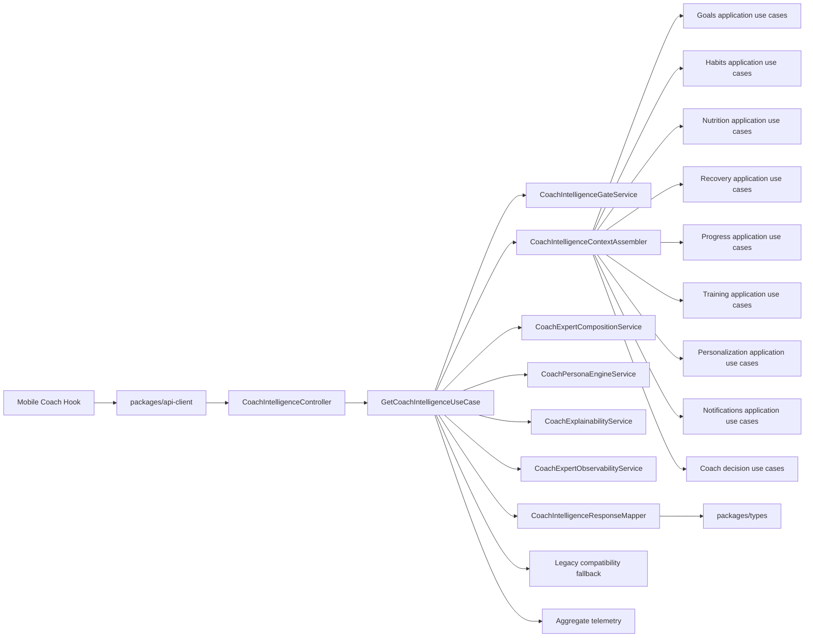
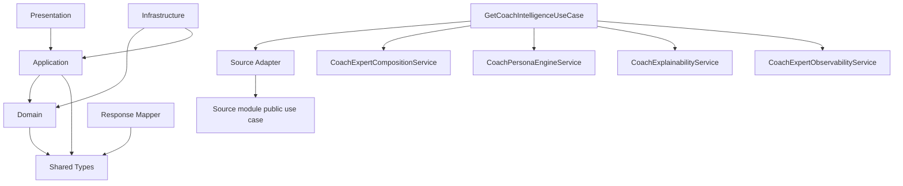
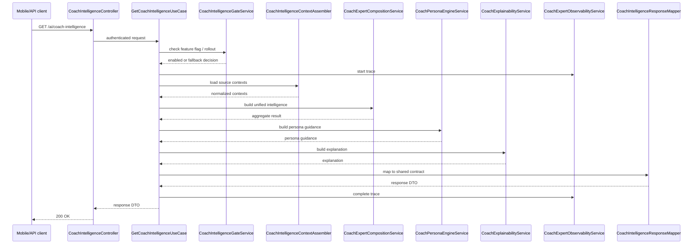
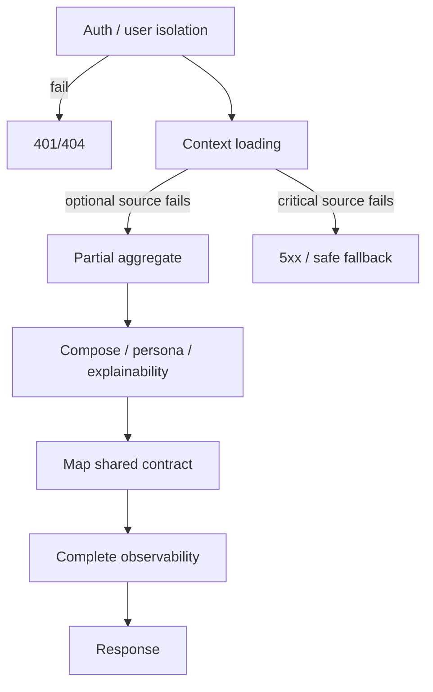

# Coach Intelligence Aggregation - Technical Architecture

## 1. Purpose

This document defines the internal architecture for Epic 1 - Coach Intelligence Aggregation. It translates the approved specification in [docs/specs/coach-intelligence-aggregation/README.md](/Users/rodrigopaiva/Desktop/Travail/Portfolio/elev9/docs/specs/coach-intelligence-aggregation/README.md) into an implementation-ready design that preserves the current repository baseline.

The design MUST remain compatible with:

- [docs/architecture/repository-technical-audit.md](/Users/rodrigopaiva/Desktop/Travail/Portfolio/elev9/docs/architecture/repository-technical-audit.md)
- [docs/architecture/adrs/ADR-0001-architecture-baseline-certification.md](/Users/rodrigopaiva/Desktop/Travail/Portfolio/elev9/docs/architecture/adrs/ADR-0001-architecture-baseline-certification.md)
- [docs/architecture/engineering-principles.md](/Users/rodrigopaiva/Desktop/Travail/Portfolio/elev9/docs/architecture/engineering-principles.md)
- [docs/specs/GOVERNANCE.md](/Users/rodrigopaiva/Desktop/Travail/Portfolio/elev9/docs/specs/GOVERNANCE.md)

## 2. High-Level Architecture

### 2.1 Current Architecture

```mermaid
flowchart LR
  Mobile[apps/mobile Coach hooks] --> ApiClient[packages/api-client]
  ApiClient --> Dashboard[/dashboard/home/]
  ApiClient --> Goals[/goals/*]
  ApiClient --> Habits[/habits/*]
  ApiClient --> Nutrition[/nutrition/*]
  ApiClient --> Recovery[/recovery/*]
  ApiClient --> Progress[/progress/*]
  ApiClient --> Training[/training/*]
  ApiClient --> Personalization[/personalization/*]
  ApiClient --> Notifications[/notifications/*]
  ApiClient --> Ai[/ai/chat and /ai/coach-decision/*]
  Dashboard --> LocalCompose[mobile-side composition helpers]
  Goals --> LocalCompose
  Habits --> LocalCompose
  Nutrition --> LocalCompose
  Recovery --> LocalCompose
  Progress --> LocalCompose
  Training --> LocalCompose
  Personalization --> LocalCompose
  Notifications --> LocalCompose
  Ai --> LocalCompose
  LocalCompose --> Screens[Coach screens]
```

Current state evidence:

- mobile Coach hooks still compose intelligence locally in [apps/mobile/src/hooks/coach/coach-intelligence.ts](/Users/rodrigopaiva/Desktop/Travail/Portfolio/elev9/apps/mobile/src/hooks/coach/coach-intelligence.ts);
- dashboard remains a read-model surface in [apps/api/src/modules/dashboard/application/use-cases/get-home-dashboard/get-home-dashboard.use-case.ts](/Users/rodrigopaiva/Desktop/Travail/Portfolio/elev9/apps/api/src/modules/dashboard/application/use-cases/get-home-dashboard/get-home-dashboard.use-case.ts);
- the AI module already owns composition, persona, explainability, and observability in [apps/api/src/modules/ai/ai.module.ts](/Users/rodrigopaiva/Desktop/Travail/Portfolio/elev9/apps/api/src/modules/ai/ai.module.ts).

### 2.2 Target Architecture



Why this target is correct:

- the AI bounded context already contains the deterministic coach runtime stack;
- the aggregate is conceptually coach-specific, not dashboard-specific;
- mobile must consume one canonical aggregate instead of recomposing cross-context signals locally;
- the design keeps the modular monolith boundary intact because the new aggregate remains internal to `apps/api` and depends only on existing module APIs.

## 3. Ownership Decision

### Decision Record DR-1 - Own the aggregate in `apps/api/src/modules/ai`

**Context**

The current AI module already owns expert routing, composition, persona, explainability, observability, chat orchestration, replay, and deterministic coach decision logic. Mobile currently recomposes these signals locally.

**Options considered**

1. Keep ownership in `ai`.
2. Move ownership to `dashboard`.
3. Create a new top-level coach bounded context.

**Decision**

Ownership MUST remain in `apps/api/src/modules/ai`.

**Trade-offs**

- Pros: zero boundary shift, best reuse of existing services, minimal new coupling.
- Cons: the AI module remains the most complex backend module and must be kept focused.

**Consequences**

- the aggregate can reuse current coach services directly;
- dashboard remains a consumer read model, not a canonical owner;
- mobile can migrate without waiting for a new module boundary.

**Future evolution**

If coach capabilities later require broader product ownership, a new ADR MUST be written before moving ownership out of AI.

### Why this does not violate the baseline

- Modular Monolith: the aggregate stays inside the existing backend deployable.
- Bounded Contexts: AI already has the domain vocabulary for coach runtime and expertise.
- AI module constraints: the aggregate is a focused coach read model, not a new general-purpose reasoning layer.

### Decision Record DR-2 - Use `GET /ai/coach-intelligence` as the canonical route

**Context**

The repository already uses the `/ai/*` namespace for coach runtime and coach decision surfaces. The aggregate MUST be reachable from the same bounded context that owns the coach runtime.

**Options considered**

1. Add `GET /ai/coach-intelligence`.
2. Add `GET /dashboard/coach`.
3. Add `GET /coach/intelligence`.

**Decision**

Use `GET /ai/coach-intelligence`.

**Trade-offs**

- Pros: consistent ownership, consistent naming, clear routing with current AI surfaces.
- Cons: the route lives in the more complex AI module, so the module must remain disciplined.

**Consequences**

- the aggregate stays aligned with existing AI coach routes;
- Dashboard stays a consumer of the aggregate rather than its owner;
- mobile migration can happen without route churn.

**Future evolution**

If future product ownership changes, a new ADR MUST reconsider the route and ownership together.

## 4. Internal Decomposition

### Decision Record DR-3 - Use a thin presentation layer and an orchestration-centric application layer

**Context**

The AI module is already rich. The aggregate MUST NOT make it into a God Module.

**Options considered**

1. Add a single large service that reads everything and returns the final payload.
2. Add a controller plus one orchestration use case that delegates to dedicated internal helpers.
3. Split the aggregate into a new module outside AI.

**Decision**

Use option 2: a thin controller, one orchestration use case, a deterministic assembler, dedicated context adapters, existing composition/persona/explainability services, a response mapper, and a telemetry boundary.

**Trade-offs**

- Pros: clear responsibility split, testability, reuse of existing services.
- Cons: more classes than a single service, but each one stays small and focused.

**Consequences**

- The AI module remains bounded and understandable.
- Business rules stay out of the controller.
- Mobile never learns source-context details.

**Future evolution**

If a later Epic adds another coach surface, new adapters can be added without changing the aggregate contract.

### Recommended internal decomposition

```text
CoachIntelligenceController
  -> GetCoachIntelligenceUseCase
    -> CoachIntelligenceGateService
    -> CoachIntelligenceContextAssembler
      -> GoalContextAdapter
      -> HabitContextAdapter
      -> NutritionContextAdapter
      -> RecoveryContextAdapter
      -> ProgressContextAdapter
      -> TrainingContextAdapter
      -> PersonalizationContextAdapter
      -> NotificationContextAdapter
      -> AiDecisionContextAdapter
    -> CoachExpertCompositionService
    -> CoachPersonaEngineService
    -> CoachExplainabilityService
    -> CoachExpertObservabilityService
    -> CoachIntelligenceResponseMapper
```

### Class responsibilities

| Class                                 | Responsibility                                                               | Inputs                                                            | Outputs                            | Dependencies                                                                 | Lifecycle                              | Allowed imports                                                | Forbidden imports                                                  |
| ------------------------------------- | ---------------------------------------------------------------------------- | ----------------------------------------------------------------- | ---------------------------------- | ---------------------------------------------------------------------------- | -------------------------------------- | -------------------------------------------------------------- | ------------------------------------------------------------------ |
| `CoachIntelligenceController`         | HTTP boundary only                                                           | request, auth session, query params, headers                      | DTO response or HTTP error         | use case, auth guard, response DTO mapper                                    | request-scoped                         | Nest HTTP decorators, auth guard, use case, DTOs, shared types | repositories, mobile helpers, prompt builder, raw Mongoose schemas |
| `GetCoachIntelligenceUseCase`         | Orchestrate the whole aggregate flow                                         | auth user id, request context, feature flags, request id          | canonical aggregate domain object  | gate, assembler, composition, persona, explainability, observability, mapper | request-scoped                         | application services, shared types, existing module use cases  | controllers, UI components, raw HTTP client, LLM provider          |
| `CoachIntelligenceGateService`        | Decide whether canonical aggregate is enabled or legacy fallback is required | feature flags, rollout state, request metadata                    | enabled/disabled/fallback decision | rollout config, feature-flag source                                          | request-scoped or singleton            | config, rollout service, shared types                          | business data sources, UI, prompt builder                          |
| `CoachIntelligenceContextAssembler`   | Load source contexts in parallel and normalize them                          | auth user id, request id, selected domains                        | normalized source snapshot map     | source adapters                                                              | request-scoped                         | application use cases, module facades, shared types            | controller, UI, prompt builder                                     |
| `GoalContextAdapter` / other adapters | Translate a source module response into aggregate-ready context              | source use case result                                            | normalized context slice           | source module use cases                                                      | request-scoped                         | public application use cases, shared types                     | direct UI, prompt builder, raw persistence                         |
| `CoachExpertCompositionService`       | Merge expert contributions into unified coach intelligence                   | expert results, policy evaluation, runtime metadata               | unified intelligence object        | routing, policy, existing composition policy                                 | request-scoped                         | shared types, coach expert types                               | HTTP, mobile, raw storage, OpenAI                                  |
| `CoachPersonaEngineService`           | Produce communication guidance                                               | unified intelligence, personalization, profile context            | persona guidance                   | persona policy                                                               | request-scoped                         | shared types, policy helpers                                   | HTTP, storage, mobile, LLM calls                                   |
| `CoachExplainabilityService`          | Produce structured explanations                                              | unified intelligence, persona guidance, evidence sources          | explanation object                 | explainability policy                                                        | request-scoped                         | shared types, policy helpers                                   | chain-of-thought, prompt contents, UI                              |
| `CoachExpertObservabilityService`     | Capture internal trace and metrics                                           | routing, execution, composition, persona, explainability metadata | trace and metrics records          | retention policy, trace store                                                | request-scoped plus internal retention | observability services, shared types                           | public response DTOs, mobile, prompt outputs                       |
| `CoachIntelligenceResponseMapper`     | Map internal aggregate into the shared contract                              | internal aggregate                                                | shared contract DTO                | shared types only                                                            | request-scoped                         | `packages/types` models                                        | source module reads, business logic, prompt builder                |

### Allowed dependency direction



Allowed direction means:

- presentation depends on application;
- application depends on domain and shared types;
- infrastructure depends on domain/application contracts;
- source adapters depend only on public source-module application services and shared contracts;
- response mapping depends only on shared contracts.

Forbidden direction means:

- mobile or UI imports into backend;
- controller importing repositories or prompt builder;
- adapter importing unrelated module internals;
- mapper performing domain logic;
- use case calling OpenAI or using UI concepts.

## 5. Contract Boundary

### Decision Record DR-4 - Keep the aggregate contract in `packages/types`

**Context**

The repository already uses shared contracts and a typed API client. The new aggregate MUST follow the same pattern and MUST not become a mobile-only shape.

**Options considered**

1. Define the aggregate only in backend DTOs.
2. Duplicate the aggregate shape in mobile.
3. Define the aggregate once in `packages/types` and consume it everywhere.

**Decision**

Use option 3.

**Trade-offs**

- Pros: one source of truth, less drift, consistent typing.
- Cons: the shared contract must stay backward-compatible during rollout.

**Consequences**

- backend, API client, and mobile compile against the same conceptual shape;
- contract changes become visible immediately;
- the mobile layer stops being the contract author.

**Future evolution**

If the aggregate needs versioned evolution later, that evolution MUST happen explicitly through the shared package and documented rollout steps.

## 6. Aggregate Lifecycle

### Decision Record DR-5 - Keep the aggregate lifecycle deterministic and backend-owned

**Context**

The aggregate will be used by multiple coach screens. If the lifecycle is not deterministic, the same user can see different coach conclusions on different surfaces.

**Decision**

The lifecycle MUST be:

```text
request
-> authentication
-> context loading
-> policy gating
-> expert composition
-> persona
-> explainability
-> mapping
-> observability completion
-> response
```



**Trade-offs**

- Pros: deterministic, observable, debuggable, and easy to replay.
- Cons: more explicit steps, but that is required for safety and clarity.

**Consequences**

- each stage can be tested independently;
- fallback can occur at the correct layer;
- failures can be bounded without leaking internals.

**Future evolution**

Later Epics MAY add new source adapters or new explainability fields, but the lifecycle order MUST remain stable.

## 7. Observability Boundary

### Decision Record DR-6 - Keep observability internal-only by default

**Context**

The repository already has internal observability and replay-style surfaces. The aggregate MUST extend this discipline, not expose it.

**Options considered**

1. Expose trace and debug metadata to mobile.
2. Keep all observability internal-only.
3. Expose a small approved debug subset later, behind explicit approval.

**Decision**

Use option 2 as the default. Any client-visible trace data would require explicit approval and filtering.

**Trade-offs**

- Pros: safe by default, privacy-preserving, less accidental leakage.
- Cons: external diagnostics are less verbose.

**Consequences**

- the aggregate can be monitored without exposing prompts or hidden reasoning;
- internal replay remains available for engineering and release validation;
- mobile payloads remain user-safe.

**Future evolution**

If a later release requires client-visible debug metadata, that must be approved separately and remain filtered.

## 8. Error Boundaries

### Decision Record DR-7 - Fail fast for identity and contract issues, degrade for optional context

**Context**

The aggregate combines several source contexts. Some failures are recoverable; others must stop the request.

**Decision**

- authentication failure, user isolation failure, and contract validation failure MUST stop the request;
- optional source context failure SHOULD degrade to partial data;
- missing primary coach insight with no safe fallback MUST fail the request;
- observability MUST always be attempted, but it MUST NOT block the response path.

**Where failures stop**

- controller validation stops at the HTTP boundary;
- auth failure stops before aggregation;
- contract validation failure stops before mapping to the client contract.

**Where failures propagate**

- optional context failures propagate into section-level `MISSING` or `PARTIAL` states;
- source-specific timeouts propagate into fallback metadata.

**Where fallback occurs**

- fallback occurs in the aggregation use case, not in mobile;
- fallback MAY choose the current coach decision, top recommendation, or safe neutral section depending on the missing source.

**Where logging occurs**

- logging occurs in observability services and backend application logs;
- logs MUST be redacted and MUST NOT include raw prompts or sensitive payloads.

**Where observability occurs**

- start trace before context loading;
- complete trace after mapping or on terminal failure.



## 9. Extension Points

The design MUST leave these extension points open without implementing them now:

- additional source adapters for new coach-relevant domains;
- additional explainability sections if new evidence categories are introduced;
- additional observability metrics or trace summaries;
- future cache strategy if freshness semantics are explicitly modeled;
- future migration of legacy mobile surfaces to the canonical hook.

Each extension point MUST preserve the current aggregate contract unless a new ADR authorizes a breaking change.

## 10. Design Constraints Summary

The architecture defined here:

- preserves the modular monolith;
- keeps the aggregate inside `apps/api/src/modules/ai`;
- reuses existing composition, persona, explainability, and observability services;
- keeps source modules as source-of-truth owners for their own data;
- keeps mobile as a consumer only;
- keeps controller and mapper thin;
- avoids new bounded contexts, microservices, CQRS, Redis, Kafka, or event sourcing;
- keeps the aggregate deterministic-first and feature-flagged.
