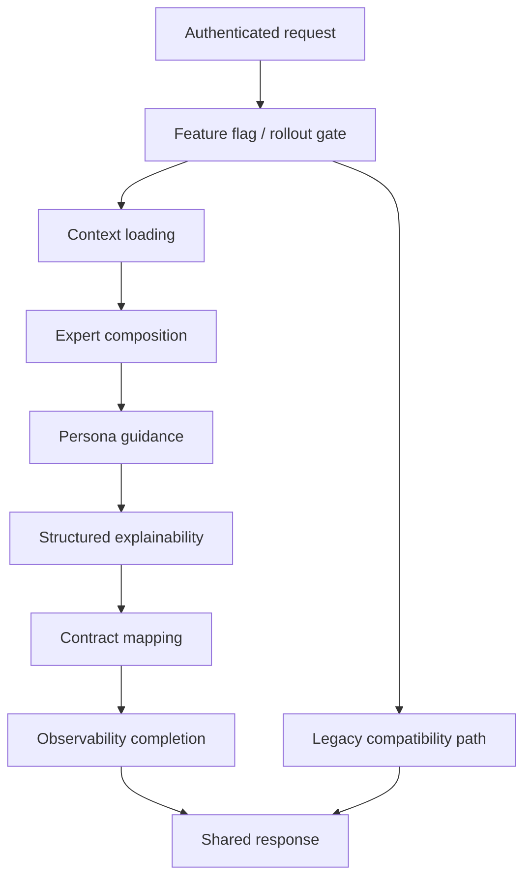
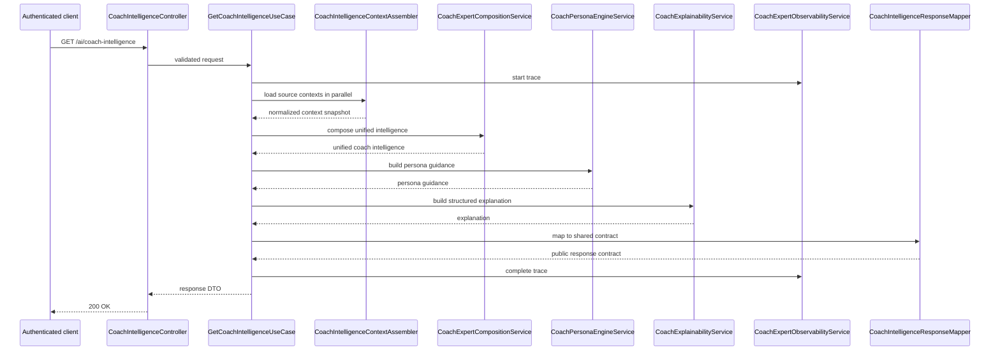
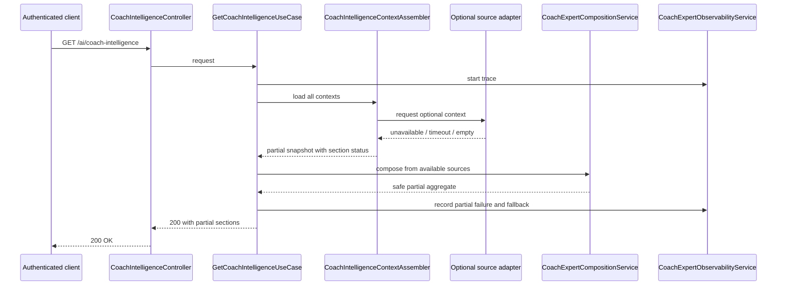
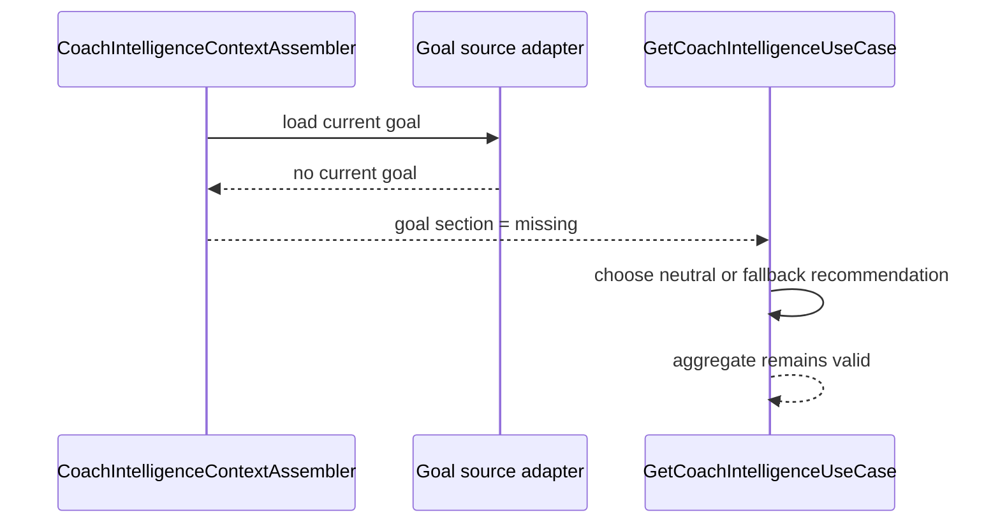
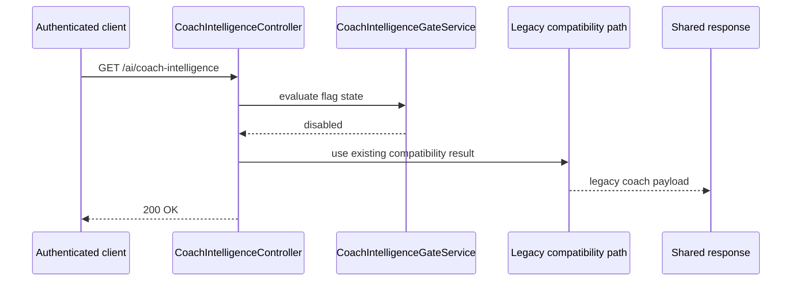
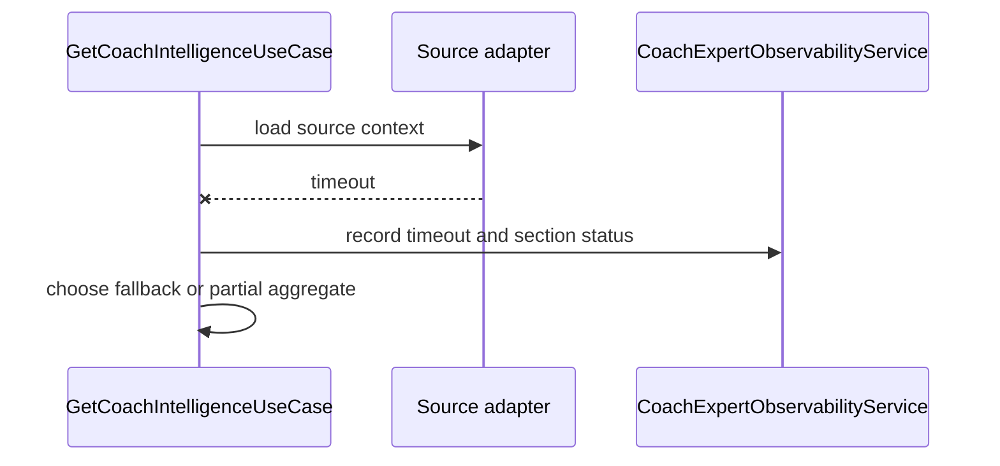
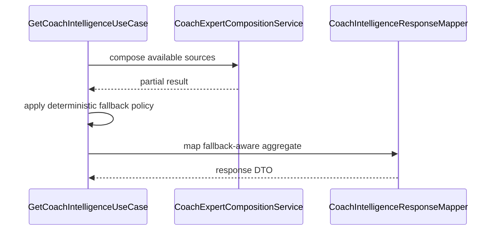
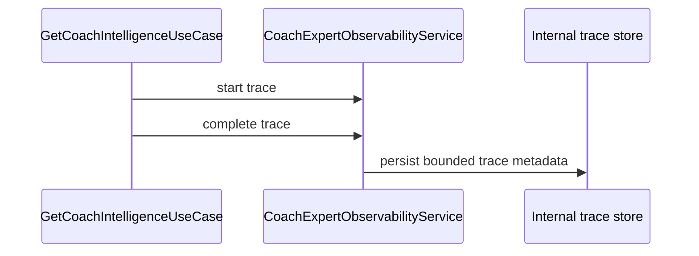
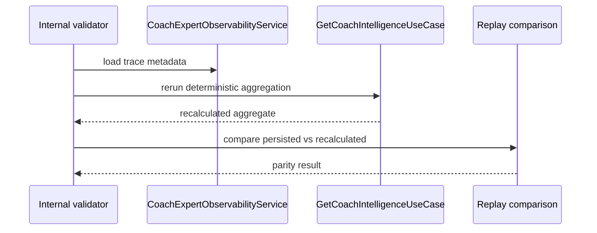

# Coach Intelligence Aggregation - Runtime Flow

## 1. Purpose

This document describes the runtime flows for the Coach Intelligence Aggregate defined in [architecture.md](./architecture.md). It is intentionally operational: the goal is to make execution deterministic, observable, and implementable without ambiguity.

## 2. Runtime Overview

## 3. Successful Request

### Actors

- Mobile Coach hook or any authenticated client
- `CoachIntelligenceController`
- `GetCoachIntelligenceUseCase`
- `CoachIntelligenceContextAssembler`
- `CoachExpertCompositionService`
- `CoachPersonaEngineService`
- `CoachExplainabilityService`
- `CoachExpertObservabilityService`
- `CoachIntelligenceResponseMapper`

### Sequence

### Expected response

- `200 OK`
- canonical Coach Intelligence Aggregate
- section-level freshness and availability metadata
- no prompt contents, no chain-of-thought, no internal policy metadata

## 4. Partial Failure

Partial failure occurs when one or more optional source contexts are unavailable but the aggregate can still be assembled safely.

### Required behavior

- the request MUST still return `200 OK` when a safe aggregate can be built;
- the missing section MUST be marked as `PARTIAL` or `MISSING`;
- fallback fields MUST be explicit;
- mobile MUST not infer missing sections by parsing internal errors.

### Sequence

### Failure behavior

- optional source failure never exposes raw infrastructure errors to the client;
- the aggregate remains deterministic for the same source snapshot and flag state;
- observability MUST record which section failed and whether fallback was used.

## 5. Missing Context

Missing context means a source domain has no data for the current user or the current time slice.

### Examples

- no current goal;
- no personalization snapshot;
- no notification history;
- no recovery snapshot for the requested period.

### Required behavior

- missing context is not an infrastructure failure;
- missing context MUST be represented as an explicit empty or unavailable section;
- the response SHOULD remain 200 if the aggregate can be safely assembled;
- the client MUST see a stable empty-state signal, not a hidden exception.

### Sequence

## 6. Feature Flag Disabled

### Required behavior

When the aggregate is disabled:

- the backend MUST use the legacy compatibility path;
- the client MUST continue to receive a valid Coach response;
- no rollout-specific metadata MUST leak to mobile;
- the aggregate implementation SHOULD still be testable through internal validation.

### Sequence

### Notes

- the disabled state is not an error;
- the disabled state is a release-control decision;
- the fallback path MUST preserve current mobile behavior.

## 7. Timeout

Timeout applies to any source adapter or internal stage that exceeds the configured budget.

### Required behavior

- timeout in optional sources SHOULD degrade to partial data;
- timeout in the primary safe insight path MAY become a 5xx if no safe fallback exists;
- timeout MUST be observed and recorded;
- timeout MUST NOT cause an infinite retry loop.

### Sequence

## 8. Fallback

Fallback is deterministic and backend-owned.

### Decision rules

- primary coach insight fallback SHOULD prefer the current coach decision if safe;
- optional section fallback SHOULD prefer explicit empty-state metadata;
- recommendation fallback MUST never invent new guidance;
- fallback MUST preserve ordering and risk semantics.

### Sequence

## 9. Observability

The runtime MUST record:

- request started;
- context loading started and completed;
- source counts and source failures;
- partial or fallback usage;
- composition duration;
- persona duration;
- explainability duration;
- response completion;
- replay parity where available.

Observability MUST be internal-only. It MUST NOT surface prompts, raw messages, or policy internals to the client.

### Sequence

## 10. Replay

Replay is an internal validation flow. It is not a new public feature.

### Required behavior

- replay MUST use the same deterministic aggregate logic where possible;
- replay SHOULD compare persisted trace metadata with recalculated output;
- replay results MUST stay internal unless explicitly approved;
- replay MUST not leak prompts or hidden reasoning.

### Sequence

## 11. Response

The response MUST:

- be stable for the same source snapshot and flag state;
- include the canonical sections defined in `contracts.md`;
- preserve safe empty and partial states;
- be consumable by the mobile app without additional cross-context composition.

The response MUST NOT:

- expose chain-of-thought;
- expose prompt contents;
- expose internal policy reasoning;
- expose raw source-module internals;
- require mobile to merge multiple coach contexts manually.

